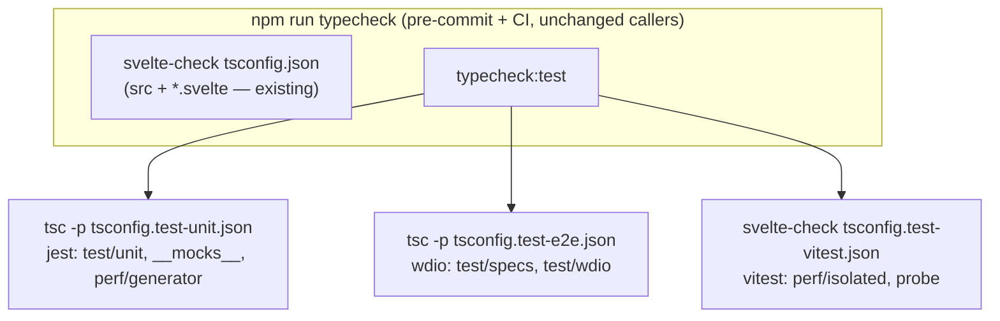

# Test-Tree Typecheck Gate - Plan

## Goal Capsule

- **Objective:** every committed test file is typechecked by a mechanical gate, closing the proven false-green class (wrong-arity calls staying green). Rank 3 of `docs/reports/2026-08-15-001-maintainability-rediagnosis.md`.
- **Authority:** this plan's Requirements and KTDs; the repo charter (AGENTS.md) on testing, review, and landing cadence; the maintainability report's rank-3 entry as the defect record.
- **Execution profile:** four units, one PR each, merged on green before the next starts. U1 carries the two session-closeout riders.
- **Stop conditions:** a type error whose only fix would weaken or delete an assertion is a finding, not a fix — surface it. A type error that reveals a production (src/) bug stops the unit for a test-first fix decision. Do not wire the gate (U4) while any program is red.
- **Tail ownership:** standard repo tail — local review layers, push, PR, CI, agent-led merge on green.

---

## Product Contract

### Summary

The repo's typecheck gate (`npm run typecheck`, run by pre-commit and CI) covers only `src` and `*.svelte`. The 220+ files under `test/` are never typechecked; four committed tests once called a function with the wrong arity and stayed green. This plan adds three TypeScript programs covering the whole committed test tree, repairs the latent type errors they surface, and wires them into the existing gate.

### Requirements

- R1. Every committed `test/**` TypeScript file (`.ts`, `.mts`) is included in exactly one typecheck program. The only exclusions are gitignored personal probes (`test/specs/_local-*.e2e.ts`), excluded by explicit pattern, never by omission.
- R2. The gate runs through the existing `npm run typecheck` script so pre-commit (`.husky/pre-commit`) and CI (`.github/workflows/ci.yml`) inherit it with no workflow edits.
- R3. Surfaced type errors are fixed by repairing the test — correct arity, awaited values, accurate types — preserving or strengthening what each test asserts. An error silenced by deleting or loosening an assertion, or by a cast that hides the drift, is a review finding.
- R4. The gate is mutation-checked before it is trusted: a planted type error in each tree makes `npm run typecheck` fail, then is removed.
- R5. Session-closeout riders land in U1's PR: the backlog append for flake run 31929397025 and the dated maintainability trend report.
- R6. Changes observable by e2e are verified by running the relevant WDIO specs (`npm run e2e:local`).

### Scope Boundaries

- **Deferred to Follow-Up Work:** ESLint coverage of `test/wdio/*.mts` (the lint half of `docs/solutions/developer-experience/mts-configs-escape-typecheck-and-lint.md`); typecheck of `scripts/*.mjs` (JavaScript, different tool); pre-commit latency optimization if the added programs prove slow.
- **Non-goals:** changing `src` strictness or the root `tsconfig.json` compiler options; refactoring test content beyond what type repair requires.

---

## Planning Contract

### Key Technical Decisions

- KTD1. **Three separate TS programs, one per test framework — with the jest program as the structural catch-all.** `@types/jest` and `@wdio/mocha-framework` both declare `describe`/`it` globals and cannot share a program. Programs: jest, e2e (`test/specs`, `test/wdio`), vitest-browser (`test/perf/isolated`, `test/perf/vitest.config.ts`, `test/probe`). The jest config includes the whole `test` tree and explicitly excludes only the e2e and vitest trees — so a test directory added later is typechecked by default and a misassigned file fails loudly instead of escaping; R1's "never by omission" holds by mechanism, not by enumeration. The sanctioned gitignored personal probes (`test/specs/_local-*`) fall inside the excluded e2e tree; the jest config carries no `_local-*` exclusion of its own, so a committed `_local-*` file anywhere else is typechecked, not silently skipped. Measured on the 2026-08-16 spike at `d74d0cc`.
- KTD2. **Test configs disable `noUncheckedIndexedAccess`; everything else inherits root strictness.** Tests index into known-shaped fixtures constantly; the flag contributed ~240 of the measured errors, and the drift classes on record — arity (TS2554), unknown property (TS2339), argument type (TS2345) — are independent of it. During U2/U3, one-pass triage the suppressed-flag diagnostics for the undefined-flows-into-matcher pattern (an out-of-range fixture index whose `undefined` passes a matcher vacuously) and record the result in the PR; a confirmed instance of that pattern reopens this decision. Uniform across all three test configs. `src` keeps the flag.
- KTD3. **The mechanism lands first; the gate lands last; never partial coverage silently.** U1 ships the configs and a runnable `typecheck:test` script outside the gate chain. U4 wires it into `npm run typecheck` only when all three programs are green. At no point does `npm run typecheck` cover part of the test tree while appearing to cover it all.
- KTD4. **The vitest tree is checked by `svelte-check --tsconfig`, not plain `tsc`.** Its files import real `.svelte` components, which `tsc` cannot resolve. The jest and e2e trees use plain `tsc --noEmit`.
- KTD5. **`wdio-obsidian-service` joins the e2e program's `types`.** It declares the `executeObsidian`/`reloadObsidian` custom commands; the spike measured this one entry removing 340 TS2339 errors and, through typed callbacks, 349 implicit-anys.
- KTD6. **The two session-closeout riders ride U1's PR, never their own micro-PR** (session-settled: user-directed — chosen over separate docs PRs: a merged micro-PR would end the working session before the unit lands).

### High-Level Technical Design

U1 creates `typecheck:test` and the three configs; U4 chains it into `typecheck`. Between U1 and U4 the script is runnable but not gating — the remediation units use it as their red/green instrument.

### Assumptions

- The measured error counts (jest 163, e2e 97 under KTD2 calibration, vitest 7) are the working size; the true count settles only when each program goes green.
- Added pre-commit latency (two `tsc --noEmit` programs plus one scoped `svelte-check`) is acceptable; if it proves painful, optimization is deferred follow-up, not a reason to weaken coverage.
- `test/probe/demo` files belong to the vitest program (they import `.svelte` and vite configs).

### Sources

- `docs/reports/2026-08-15-001-maintainability-rediagnosis.md` — rank-3 entry, false-green record, baseline commands.
- `docs/solutions/developer-experience/mts-configs-escape-typecheck-and-lint.md` — prior record that `test/wdio/*.mts` escape both gates; this plan closes the typecheck half.
- 2026-08-16 spike on branch `chore/test-tree-typecheck` (draft configs + full error inventories per tree).

---

## Implementation Units

### U1. Land the mechanism: three test tsconfigs, `typecheck:test`, vitest tree green, session riders

- **Goal:** the three programs exist and run; the vitest program is green end-to-end, proving the mechanism; the session riders land.
- **Requirements:** R1, R2 (script shape), R5. KTD1–KTD6.
- **Dependencies:** none.
- **Files:** `tsconfig.test-unit.json`, `tsconfig.test-e2e.json`, `tsconfig.test-vitest.json` (new); `package.json` (`typecheck:test` script only — `typecheck` unchanged); fixes in `test/perf/isolated/**` and `test/probe/**` (7 measured errors); `docs/backlogs/backlog.md` (flake append); `docs/reports/2026-08-16-*-maintainability-trend.md` (new).
- **Approach:**
  1. Configs extend root `tsconfig.json`, add `noEmit`, set per-framework `types` (KTD1/KTD5), disable `noUncheckedIndexedAccess` (KTD2). The jest config includes `test` and excludes only the e2e and vitest trees (KTD1 catch-all); the e2e config excludes `test/specs/_local-*.e2e.ts` (R1).
  2. Declare `expect-webdriverio` as an explicit devDependency (today it resolves only through `@wdio/globals` hoisting; the gate must not depend on lockfile layout).
  3. `typecheck:test` runs the two `tsc -p` programs and `svelte-check --tsconfig tsconfig.test-vitest.json` in sequence; it is not yet referenced by `typecheck` (KTD3). Record its measured wall-time (and projected wired `typecheck` time) in the PR so the deferred latency call is data-backed.
  4. Repair the vitest tree's 7 errors assertion-preservingly (R3).
  5. Backlog append: rerun-confirmed flake run 31929397025, context-aware-legend "before all" hook, never-became-ready class (recorded on PR #430).
  6. Trend report: run the baseline report's exact § Baseline commands (range `7949fd1..HEAD` over `src test scripts`; windowed churn share; concern counts 30→29/14/14; at-ceiling count 16) and write the dated report.
- **Patterns to follow:** root `tsconfig.json` for compiler-option style; `docs/reports/2026-08-15-001-maintainability-rediagnosis.md` § Baseline for the trend report's semantics; existing backlog entry format in `docs/backlogs/backlog.md`.
- **Test scenarios:**
  - `npx tsc -p tsconfig.test-unit.json` and `-p tsconfig.test-e2e.json` run and report the known residual errors (programs resolve types; no TS2688/config errors).
  - `npm run typecheck:test` exits non-zero while jest/e2e trees are red, and the vitest leg exits zero.
  - A listing of files in the three programs (`tsc -p <cfg> --listFilesOnly`) covers every committed `test/**/*.ts|mts` except `_local-*` (R1 proof).
  - Test expectation for the docs riders: none — documentation content, verified by review.
- **Verification:** vitest program green; the other two programs run and enumerate their residuals; `npm run typecheck` behavior unchanged; both riders present in the PR.

### U2. Jest tree green: repair `test/unit`, `test/__mocks__`, `test/perf/generator`

- **Goal:** `tsc -p tsconfig.test-unit.json` exits zero with all repairs assertion-preserving.
- **Requirements:** R3. KTD2.
- **Dependencies:** U1.
- **Files:** ~30 files under `test/unit/**`, `test/__mocks__/**`, `test/perf/generator/**` (spike inventory: 163 errors; densest `test/unit/CalendarPickerModal.test.ts` at 18).
- **Approach:** fix by error class — the 9 TS2554 wrong-arity calls first (verify each against the current implementation signature: is the test calling it wrong, or asserting stale behavior?), then property/argument mismatches (TS2339/TS2345), then annotations for implicit-anys. Batch commits by file cluster.
- **Execution note:** the type error itself is the red evidence per repair; the green proof is the program exiting zero plus the full jest suite still passing. If a repair reveals a `src/` defect, stop and surface it (Goal Capsule stop condition).
- **Test scenarios:**
  - `tsc -p tsconfig.test-unit.json` exits zero.
  - Full `npx jest` passes with identical test counts before/after (no test deleted or skipped to get green).
  - Each TS2554 fix documented in its commit: wrong call repaired to match the real signature, assertion intent preserved.
- **Verification:** jest program green; full jest suite green; diff review shows no weakened assertions.

### U3. E2E tree green: repair `test/specs`, `test/wdio`

- **Goal:** `tsc -p tsconfig.test-e2e.json` exits zero with all repairs assertion-preserving.
- **Requirements:** R3, R6. KTD2, KTD5.
- **Dependencies:** U1.
- **Files:** specs under `test/specs/**` and configs under `test/wdio/*.mts` (spike inventory: 97 errors under calibration; dominated by TS2365/TS2367/TS2488 — unawaited-promise comparisons, i.e. assertions that cannot fail as written).
- **Approach:** the unawaited-promise repairs are the core: adding the missing `await` turns a vacuous comparison into a live assertion, which may newly fail — each such failure is the test finally doing its job; diagnose whether the asserted expectation or the product is wrong before adjusting either. Re-slice seam, declared now: if the first repair pass surfaces more than a handful of newly-live failing assertions, split by spec-file cluster into U3a/U3b (each independently green and e2e-verified) rather than discovering the split under time pressure mid-unit.
- **Execution note:** after repairs, run the touched specs via `npm run e2e:local` (the mts-configs learning: static green is not evidence for this tree). A "never became ready/clickable/editable" failure is the known flake class — same-SHA rerun before diagnosing, and record each confirmed instance for the Reliability re-diagnosis denominator.
- **Test scenarios:**
  - `tsc -p tsconfig.test-e2e.json` exits zero.
  - Every spec file touched passes an `npm run e2e:local` run at the unit's tip.
  - Each formerly-vacuous comparison now awaits its value and asserts the same intended expectation.
- **Verification:** e2e program green; touched specs green in a real WDIO run; no assertion weakened.

### U4. Wire the gate and mutation-check it

- **Goal:** `npm run typecheck` runs the three test programs; a type error anywhere in the committed test tree fails pre-commit and CI.
- **Requirements:** R2, R4. KTD3.
- **Dependencies:** U1, U2, U3.
- **Files:** `package.json` (`typecheck` script chains `typecheck:test`).
- **Approach:**
  1. Re-run `npm run typecheck:test` at the branch point first; any drift repairs accumulated on `main` since U2/U3 merged are named in-scope contingency work for this unit, under the same assertion-preserving rules (R3).
  2. Chain `typecheck:test` into `typecheck` with `&&` so any program's failure fails the gate; run gates bare, never piped through a filter.
- **Execution note:** mutation-check before trusting green — plant one type error per tree (e.g. a wrong-arity call), observe `npm run typecheck` fail on each, remove the plants, observe green. This is the unit's red evidence.
- **Test scenarios:**
  - Planted wrong-arity call in `test/unit` → `npm run typecheck` exits non-zero.
  - Planted error in `test/specs` → non-zero.
  - Planted error in `test/probe` → non-zero.
  - Plants removed → `npm run typecheck` exits zero; pre-commit hook passes; CI typecheck step passes on the PR.
- **Verification:** all three mutation checks observed and reverted; CI green on the PR with the wired gate.

---

## Verification Contract

| Check | Command | Applies to |
|---|---|---|
| Jest program | `npx tsc -p tsconfig.test-unit.json` | U1 (runs), U2 (green), U4 |
| E2E program | `npx tsc -p tsconfig.test-e2e.json` | U1 (runs), U3 (green), U4 |
| Vitest program | `npx svelte-check --tsconfig tsconfig.test-vitest.json` | U1 (green), U4 |
| Full unit suite | `npx jest` (bare, never piped) | every unit before push |
| Existing gate unchanged until U4 | `npm run typecheck` | U1–U3 |
| E2E oracle | `npm run e2e:local` (touched specs) | U3 |
| Gate mutation check | planted error per tree fails `npm run typecheck` | U4 |
| Lint | `npm run lint` | every unit |

---

## Definition of Done

- All four units merged, one PR each, on green (CI + both local review receipts + zero unresolved threads).
- `npm run typecheck` fails on any type error in any committed test file; mutation-checked per tree.
- No assertion weakened, deleted, or cast-silenced anywhere in the remediation diffs.
- U1's PR contains the backlog flake append and the dated trend report.
- No leftover spike/scratch artifacts (probe configs outside the three shipped tsconfigs) in the tree.
