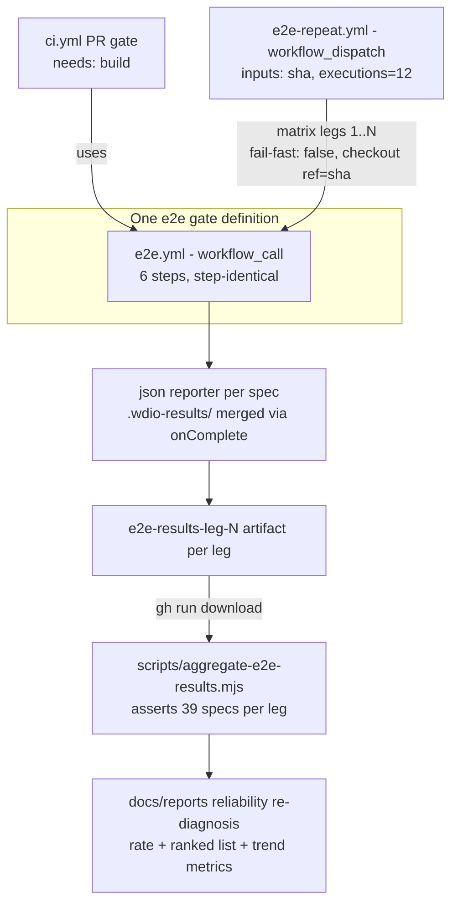

# Reliability Re-Diagnosis - Plan

## Goal Capsule

- **Objective:** Commission the reliability pillar per [STRATEGY.md](../../STRATEGY.md) § Software craftsmanship: a measured baseline e2e flake rate with an honest per-spec denominator, a ranked defect list worked top-down afterward, named trend metrics, and the pillar's metric set defined by the report itself. The report follows the shape of [docs/reports/2026-08-15-001-maintainability-rediagnosis.md](../reports/2026-08-15-001-maintainability-rediagnosis.md).
- **Product authority:** STRATEGY.md § Software craftsmanship (STRATEGY.md:95-114) names reliability next among uncommissioned pillars and states "establishing a true flake *rate* with a consistent per-spec denominator is the re-diagnosis's first job." The maintainability re-diagnosis report is the shape precedent. This plan's Product Contract governs product scope; the Planning Contract governs implementation mechanism.
- **Execution profile:** Five units, one PR per unit, merged on green before the next starts (charter E2/E3 landing cadence); dependency order U1 → U2 → U3 → U5 → U4 (U5 may land any time after U1). Branches follow the campaign pattern `chore/reliability-u<N>`. U4 contains a CI wait (the baseline legs) inside one session.
- **Stop conditions:** Surface as blocked rather than improvise if: the reusable-workflow extraction (U2) cannot reproduce the current e2e job's behavior on its own PR's CI run; the smoke dispatch (U3) cannot pin a SHA via the `sha` input; or the baseline run (U4) yields fewer than 8 valid legs after infrastructure exclusions. Never add `specFileRetries`/retry config in any form (Product Contract Scope Boundaries).
- **Open blockers:** None.

---

## Product Contract

**Product Contract preservation:** changed with maintainer approval — R3 broadened from the three named backlog entries to all e2e flake incident entries (planning research found an additional entry near `docs/backlogs/backlog.md:530` carrying runs 31842006155/31845072266), with a reference-only carve-out for the perf-workflow failure entry after line 1054 (referenced, never folded or deleted); R8 extended to name the repeat-run's denominator source (enumerated matrix-leg conclusions) alongside `run_attempt` for ordinary CI windows. All other Requirements and Key Decisions unchanged.

### Summary

Measure the e2e suite's flake rate with a controlled N-execution repeat-run of the 39-spec CI suite on a single main SHA in the real CI environment, fold in the accumulated incident record, and end at a ranked defect list. Commission a per-spec results reporter as a campaign unit so the rate stays measurable from ordinary CI runs afterward. Reliability's ranked list is then worked top-down before maintainability's resumes.

### Problem Frame

On PR #435 (2026-08-17), a docs-only PR, the e2e job failed 3 of 9 executions — a 1-in-3 failure rate, exactly counted by summing `run_attempt` across all six CI runs on that branch. The PR needed three same-SHA reruns to land. The gate is obstructing ordinary merges, not exhibiting background flake, and it taxes every workstream including the maintainability campaign's own PRs.

What exists today is an incident record (failures only) in `docs/backlogs/backlog.md` — there is no rate with a consistent denominator, because CI retains only per-diff executions: every historical run tested a different SHA, and the WDIO config emits no per-spec machine-readable results (`test/wdio/wdio.conf.mts:66` — reporters are `["obsidian", "spec"]` only). Root cause is open for every recorded failure: a docs-only diff proves that PR did not introduce them, but a latent race in `src/` or in the test harness on the base SHA fits the evidence identically. "Flake" throughout means nondeterministic, never "not a code defect".

### Key Decisions

- KD1. **The measured surface is e2e nondeterminism only.** `src/` reliability defects (error handling, retry, degradation paths) enter the ranked list solely through flake root-cause evidence, not through a separate audit. (session-settled: user-approved — chosen over a full-reliability-surface list: only e2e has an enumerable metric today; a mixed list would pair a measured rate with an unmeasured audit.) Governs R1, R7.
- KD2. **Reliability's ranked list is worked before maintainability's resumes.** (session-settled: user-approved — chosen over finishing maintainability's list first: the 1-in-3 gate taxes every merge, and STRATEGY.md already orders reliability next.) Governs R12.
- KD3. **Baseline instrument is a controlled repeat-run; trend instrument is a per-spec reporter.** (session-settled: user-approved — chosen over a historical-window-only rate or accumulate-forward-only: history mixes SHAs and cannot yield the consistent per-spec denominator STRATEGY demands; accumulation alone takes weeks while the gate keeps obstructing merges.) Governs R2, R9.
- KD4. **The pillar's mechanical gate is defined by the report, not this contract.** Per STRATEGY.md, each pillar's metric set is defined by its re-diagnosis when it lands; the reporter (R9) is the gate's seed, and CI-on-real-Obsidian plus the review-receipt gate remain the standing mechanisms meanwhile. Governs R10.
- KD5. **The six method requirements are adopted as binding method.** (session-settled: user-directed — distilled from six peer corrections in one prior session, each compressing "not ruled out" into "ruled out".) The six, each mapped to its owning requirement: (1) enumerate every failing spec in a run before characterising any distribution — R5; (2) never read a passing same-SHA rerun as exonerating a code-changing diff — R6; (3) never infer "environmental" from an inert diff — R6; (4) no harness-vs-src verdict without distinguishing evidence — R6; (5) reruns counted as evidence are counted in the denominator — R8; (6) recount from the source of record, never adjust a remembered number — R8. Governs R5, R6, R8, R11.

### Requirements

**Measurement**

- R1. The baseline is the flake rate of the 39-spec CI e2e suite, measured in the real CI environment (windows-latest, the environment where every recorded failure occurred).
- R2. The baseline rate comes from N executions of the full suite against a single main SHA, with per-spec pass/fail recorded for every execution; N is set by KTD4.
- R3. Every e2e flake incident entry in `docs/backlogs/backlog.md` — including the entries at lines 888-914, 916-957, 959-1054, and the earlier incident entry near line 530 (runs 31842006155, 31845072266) — is verified against its cited runs, folded into the report as the incident record, and deleted from the backlog. The failing scheduled perf workflow (`gantt-resultset-storm.perf.e2e.ts`, failing since 2026-07-13 on the same harness) is referenced as an adjacent unmeasured signal, not folded into the rate; its backlog entry remains in `docs/backlogs/backlog.md`.
- R4. The PR #430 instance (run 31929397025, `gantt-context-aware-legend`) is carried as a separate evidentiary category — cause-unresolved, never folded into the PR #435 incident rate and never counted as confirmed environmental flake.

**Ranked defect list**

- R5. Failures are characterised only after enumerating every failing spec in every execution; rank derives from measured evidence (per-spec failure frequency, clustering across executions), and each entry carries its numbers and the commands that reproduce them.
- R6. Each ranked entry records harness-vs-src attribution as open until distinguishing evidence lands; no entry is closed as "environmental" from an inert diff or a passing same-SHA rerun.
- R7. The report ends at the ranked list, with an explicit stopping rule naming the dimensions left unmeasured as out of scope by decision.

**Method**

- R8. Every stated failure figure is a rate with an explicit denominator counted from its source of record: `run_attempt` summed over the window's CI runs for ordinary-CI incident windows, and the enumerated matrix-leg conclusions for repeat-run executions. Reruns counted as evidence are counted in the denominator; recounts always re-derive from the source rather than adjusting a remembered number.

**Trend and instrument**

- R9. A per-spec machine-readable results reporter lands as a campaign unit, so every ordinary CI execution contributes per-spec data to the ongoing rate after the baseline.
- R10. The report names the pillar's trend metrics, re-measured at each campaign session's end, and nominates the pillar's mechanical-gate candidate.

**Campaign**

- R11. The report's Method section restates the six adopted method requirements so later sessions inherit them from the report, not from memory.
- R12. After the report lands, campaign sessions work the ranked list top-down, one unit per session per the landing cadence, before the maintainability ranked list resumes.

### Acceptance Examples

- AE1. **Covers R5.** Given a repeat-run execution whose summary reports "2 failed", when the report characterises that execution, then both failing specs are named individually before any distribution claim is made about specs or symptoms.
- AE2. **Covers R6.** Given a failure on a src-changing PR that passed a same-SHA rerun, when the report records it, then the entry states nondeterminism as proven and diff involvement as open — not exonerated.
- AE3. **Covers R2, R8.** Given the completed repeat-run, when the baseline is stated, then it reads as a rate over the exact valid-leg count per KTD5 (failures / valid legs, plus per-spec rates, with excluded legs reported), and the count reproduces from the recorded legs by a command quoted in the report.
- AE4. **Covers R3.** Given the report has landed, when `docs/backlogs/backlog.md` is read, then the folded e2e flake entries are gone and their evidence is findable in the report.

### Scope Boundaries

- No `src/` runtime error-handling / retry / degradation audit — that surface enters only via flake root-cause evidence (KD1).
- No auto-retry, `specFileRetries`, or rerun-masking as mitigation — rerun-masking weakens the gate the pillar exists to earn.
- No flake fixes inside the diagnosis unit — root-cause and fix work belongs to the ranked list's own units after the report lands.
- Performance and security pillar re-diagnoses stay uncommissioned.
- The maintainability ranked list is paused, not abandoned; its trend reporting resumes when its campaign does. *(Superseded 2026-08-23: a plan may pause new work on a pillar's ranked list, never that pillar's regression guard or trend measurement — [practices.md § Charter-owned practice items](../engineering/practices.md), per plan `2026-08-23-001` R3.)*

#### Deferred to Follow-Up Work

- A scheduled (cron) repeat-run cadence — the baseline uses manual dispatch only; scheduling is a trend-mechanism decision for the report to nominate (R10).
- A mechanical guard asserting retry config stays absent (the repo's "mechanism, not memory" idiom) — candidate for the report's gate nomination, not this campaign's tooling units.
- Refreshing the stale solutions doc `docs/solutions/developer-experience/mts-configs-escape-typecheck-and-lint.md` (its "escapes both gates" claim predates the test-tree typecheck gate, PR #433).

### Dependencies / Assumptions

- The repeat-run adds committed CI tooling — a named divergence from the maintainability method's "no committed tooling was added", justified because STRATEGY.md makes establishing the rate the re-diagnosis's first job and CI retention cannot supply it. The report argues this divergence explicitly (R11's Method section).
- CI cost is accepted: roughly N × the current e2e job duration on windows-latest (billed at 2× minutes), runnable outside working hours. Legs may queue at the account's concurrent-job cap; queued legs remain valid executions.
- The baseline SHA is current main, which already contains PR #430's src changes; if that PR introduced a race, the repeat-run surfaces it as a ranked defect. A base-vs-changed SHA comparison for #430 is run only if the ranked list justifies it.

### Sources / Research

- STRATEGY.md:95-114 — pillar contract and reliability's commissioning language.
- [docs/reports/2026-08-15-001-maintainability-rediagnosis.md](../reports/2026-08-15-001-maintainability-rediagnosis.md) — shape precedent: stopping rule (line 9), Method section with literal runnable commands, `**Measured at:** <sha>` header, named population pinned to the tree, declared blind spots, trend metrics (line 250).
- `docs/backlogs/backlog.md:888-1054` — the primary fold-in entries, including the exactly-counted 3-of-9 denominator and the per-execution clustering signal (two unrelated specs failing together in run 31997862224); earlier incident entry near line 530.
- Harness facts: WDIO v9 (`@wdio/cli ^9.19.2`), `wdio-obsidian-service`/`wdio-obsidian-reporter ^2.1.2` (console-only, writes no files); no JSON reporter installed; `maxInstances: 1` (strictly serial — per-spec result files are race-free); no hooks in `test/wdio/wdio.conf.mts`; nothing writes `test-results/` today (the CI upload path is vestigial); `.wdio-*` is covered by `.gitignore`, ESLint ignores, and the `ci.yml` artifact glob.
- CI facts: the e2e job (`.github/workflows/ci.yml:79-118`) is fully self-contained in 6 steps — `needs: build` is ordering-only, no artifact flow; no `concurrency:` groups affect it; no caching anywhere; `GITHUB_TOKEN` is required on the WDIO step because obsidian-launcher's unauthenticated GitHub API limit intermittently blocks the TaskNotes download (`ci.yml:101-108`) — itself a known CI-only nondeterminism source. `perf.yml` and `docs.yml` are the repo's only `workflow_dispatch` precedents (neither has inputs; no matrix anywhere in the repo).
- `test/specs/gantt-column-sort.e2e.ts:169-243` — `clickColumnHeader` returns true the instant the click lands (no post-click assertion), so its 10s timeout firing means no click ever landed; `ensureGanttReady` gates 90s on the specific `note.due` header. The open question for that defect: gate too weak vs an application re-render dropping and recreating the header (the latter would make the spec a correct product-defect report).
- Prior solutions: [docs/solutions/developer-experience/column-sort-e2e-first-mount-header-race.md](../solutions/developer-experience/column-sort-e2e-first-mount-header-race.md) (the resurfaced symptom's original fix), [docs/solutions/integration-issues/starter-note-steals-active-leaf-e2e-flake.md](../solutions/integration-issues/starter-note-steals-active-leaf-e2e-flake.md) (a passed-readiness-then-gone precedent), [docs/solutions/design-patterns/readiness-signal-keys-on-data-its-consumer-reads.md](../solutions/design-patterns/readiness-signal-keys-on-data-its-consumer-reads.md) (readiness must key on exactly what the consumer reads), [docs/solutions/developer-experience/gate-e2e-on-cold-index-before-measuring-render.md](../solutions/developer-experience/gate-e2e-on-cold-index-before-measuring-render.md) (the ancestor of the never-became-ready class: split index budget from render budget), [docs/solutions/best-practices/a-test-name-is-a-claim-verify-the-mutation.md](../solutions/best-practices/a-test-name-is-a-claim-verify-the-mutation.md) (make every mutation self-evidencing), [docs/solutions/developer-experience/windows-build-and-e2e-environment-setup.md](../solutions/developer-experience/windows-build-and-e2e-environment-setup.md) (a green-looking run that executed zero tests is a real failure class), [docs/solutions/tooling-decisions/secure-sonarcloud-ci-analysis-for-typescript.md](../solutions/tooling-decisions/secure-sonarcloud-ci-analysis-for-typescript.md) (SHA-pinned actions, `npm ci --ignore-scripts` rationale).
- External (load-bearing): `@wdio/json-reporter` official docs — per-session JSON files, `outputDir` + `outputFileFormat` options, and a `mergeResults` utility designed for the `onComplete` hook.

---

## Planning Contract

### Key Technical Decisions

- KTD1. **Use the official `@wdio/json-reporter`, not a custom in-tree reporter.** (session-settled: user-approved — chosen over a bespoke reporter: the repo's rule is to search the installed toolchain before building; the official package ships per-session files plus `mergeResults` for `onComplete`, and versions with WDIO v9.) Instantiates KD3; covers R9.
- KTD2. **Reporter output lands under `.wdio-results/`.** The `.wdio-*` prefix is already covered by `.gitignore` and ESLint ignores, and no untracked files land in developer working trees (a bare `test-results/` path is not gitignored). One CI change is required: `actions/upload-artifact` v4+ excludes hidden (dot-prefixed) paths by default, so the e2e upload step sets `include-hidden-files: true` or the results never reach `e2e-artifacts`.
- KTD3. **Extract the e2e job into a reusable `workflow_call` workflow instead of duplicating its steps.** (session-settled: user-approved — chosen over a standalone copy of the 6 steps: the repeat-run must be step-identical to the PR gate or the baseline measures a different environment than the one that flakes; extraction is clean because the job has no artifact dependency on `build`.) Covers R1.
- KTD4. **N defaults to 12, dispatch-parameterized, aggregatable across dispatches.** (session-settled: user-approved.) At the observed 1-in-3 execution failure rate, 12 legs expect ~4 failing executions — enough to confirm or retire the incident-window rate and expose clustering; per-spec ranking sharpens by dispatching more legs against the same SHA and aggregating, so the total-leg count, not one dispatch, is the denominator. Covers R2.
- KTD5. **A leg is valid only if it ran all 39 specs.** The aggregation asserts the expected spec count per leg (assert the value, not the absence); a leg with fewer recorded specs — a crashed worker, a zero-tests-run session, a blocked TaskNotes download — is classified infrastructure and excluded from the product denominator with its count reported. Prevents a silently-truncated leg from understating the rate. Covers R8.
- KTD6. **No caching in the repeat-run workflow.** The current CI e2e job has no caching (fresh Obsidian + TaskNotes download every run); adding caching to the measurement path would diverge from the environment where every recorded failure occurred. Covers R1.
- KTD7. **Ranked entries carry a four-way cause classification:** (a) no readiness gate, (b) gate on a signal the assertion doesn't consume, (c) infrastructure (TaskNotes download rate-limit, native-binding/zero-specs legs), (d) genuine product nondeterminism. (session-settled: user-approved.) The taxonomy is what turns a rate into an actionable ranked list, and keeps infrastructure defects from inflating the product flake rate. Covers R5, R6.
- KTD8. **`fail-fast: false` on the repeat-run matrix.** GitHub's default (`true`) cancels remaining legs on the first failure — the measurement would record "runs until first failure", not N executions. Covers R2, R8.
- KTD9. **The dispatch pins the SHA via an input passed to `actions/checkout` `ref:`,** not the dispatch branch ref, so every leg builds the identical commit regardless of where main moves. Covers R2.

### High-Level Technical Design

Prose remains authoritative: both the PR gate and the repeat-run call the same reusable workflow (KTD3); every execution emits per-spec JSON (KTD1); the aggregation validates legs (KTD5) and feeds the report.

### Assumptions

- `workflow_dispatch` on a new workflow file requires the file to exist on the default branch before it can be dispatched — U3 is dispatchable only after its PR merges; the U4 smoke evidence therefore comes from the post-merge dispatch.
- 27 stale git worktrees under `.worktrees/` and `.claude/worktrees/` shadow `ci.yml` and config files; all edits and greps target the root checkout only (see `docs/solutions/` worktree-hygiene learning, PR #435).
- If U2's pre-flight finds `e2e` in the required-status-check list, updating that list is a repo-admin settings action outside the PR; U2 blocks on the maintainer performing it (aligned with the repo rule: surface rather than bypass branch protection).
- Dispatch of `e2e-repeat.yml` is restricted to write-access users (GitHub's `workflow_dispatch` default) and the workflow token stays `contents: read` — the checkout-arbitrary-SHA surface is accepted on that basis; revisit if a scheduled cadence or broader dispatch access is later adopted.

---

## Implementation Units

### U1. Per-spec JSON reporter

- **Goal:** Every e2e execution emits machine-readable per-spec results, merged to one file per execution.
- **Requirements:** R9 (KD3, KTD1, KTD2).
- **Dependencies:** None.
- **Files:** `package.json` (+ `@wdio/json-reporter` devDependency), `package-lock.json`, `test/wdio/wdio.conf.mts` (reporter entry + `onComplete` merge).
- **Approach:**
  1. Add `['json', { outputDir: '.wdio-results' }]` alongside the existing `"obsidian"` and `"spec"` reporters.
  2. Add an `onComplete` hook calling the package's `mergeResults` to produce one merged results file per execution in `.wdio-results/`.
  3. No `.gitignore`, ESLint, or `ci.yml` changes — `.wdio-*` globs already cover the path (KTD2).
- **Execution note:** Static gates cannot prove a reporter loads (a WDIO load-time failure is invisible to typecheck/lint). Gate the unit on a full `npm run e2e:local` run, and mutation-check the instrument self-evidencingly: force one spec to fail, print the applied mutation, and prove the merged output records that spec as failed before reverting.
- **Patterns to follow:** `test/wdio/wdio.conf.mts` stays typed `.mts` (covered by `tsconfig.test-e2e.json` and ESLint); reporter config shape per the official `@wdio/json-reporter` docs.
- **Test scenarios:**
  - Full local run: merged output enumerates exactly 39 spec files, each with per-test pass/fail (assert the count 39, not absence of errors).
  - Mutation-check: one deliberately failing spec appears as failed in the merged output.
  - `npm run e2e:local -- --spec <one spec>` still works and produces a merged file for that run (the `_local-*` exclusion lift is conditional on `--spec`).
- **Verification:** `npm run e2e:local` receipt (39/39 + reporter files present), mutation-check evidence, `npm run typecheck` and full `npx jest` green, CI green on the PR with reporter output visible inside the uploaded `e2e-artifacts`.

### U2. Extract the e2e job into a reusable workflow

- **Goal:** One definition of the e2e gate, callable by the PR pipeline and the repeat-run (KTD3).
- **Requirements:** R1.
- **Dependencies:** U1 (so the reusable job already carries the reporter).
- **Files:** `.github/workflows/e2e.yml` (new), `.github/workflows/ci.yml` (e2e job body replaced by a `uses:` call).
- **Approach:**
  1. Pre-flight: read the live required-status-check list (`gh api` rulesets / branch protection) before opening the PR. Calling a reusable workflow renames the check from `e2e` to `e2e / <inner job id>`; if `e2e` is a required check, the PR would wait forever on a check that no longer reports, and the fix is a repo-admin settings edit — surface it, never bypass.
  2. Create `e2e.yml` with `on: workflow_call`, inputs `ref` (optional, default caller ref) and `artifact-name` (optional, default `e2e-artifacts`), `permissions: contents: read`, and inner job id `e2e` so the composite check name is the predictable `e2e / e2e`.
  3. Lift the 6 steps verbatim (SHA-pinned actions, `npm ci --ignore-scripts`, pwsh vault-path step, `npm run build`, `npm run e2e` with `GITHUB_TOKEN`, artifact upload), passing `ref` to checkout and `artifact-name` to the upload; set `if-no-files-found: warn` — not `ignore`, which would silence the "reporter wrote nothing" signal KTD5 depends on. `secrets: inherit` is not needed: `GITHUB_TOKEN` is auto-available in a local reusable workflow.
  4. In `ci.yml`, replace the e2e job body with `uses: ./.github/workflows/e2e.yml`; keep `needs: build`.
  5. Update the e2e-job description in `docs/engineering/practices.md` (line ~126 names the job shape).
- **Scope note:** `perf.yml` duplicates the same 6-step skeleton but runs a different WDIO config (`npm run perf:e2e`); it is deliberately not folded into `e2e.yml` here.
- **Test scenarios:** Test expectation: none — CI configuration; behavior is proven by the PR's own CI run.
- **Verification:** The PR's CI run executes the e2e job via the called workflow: 39 specs run, `GITHUB_TOKEN` reaches the WDIO step, and `e2e-artifacts` uploads with reporter output; the pre-flight check-name evidence is recorded on the PR. No other workflow consumes ci.yml's artifacts or job names (`release.yml` duplicates its gate by step, not by reference), so the extraction has no cross-workflow coupling. Edit the root checkout only (see Assumptions).

### U3. Repeat-run workflow

- **Goal:** A dispatchable N-execution measurement of one SHA (KTD4, KTD8, KTD9).
- **Requirements:** R2.
- **Dependencies:** U2.
- **Files:** `.github/workflows/e2e-repeat.yml` (new).
- **Approach:**
  1. `on: workflow_dispatch` with inputs `sha` (required) and `executions` (default `"12"`); `permissions: contents: read`.
  2. A small setup job turns `executions` into a JSON leg array — reading the input via `env:` indirection (never inline `${{ inputs.executions }}` inside `run:`) and validating it as an integer within a ceiling of 24, failing the dispatch otherwise; the measurement job uses `strategy: matrix: leg: ${{ fromJSON(...) }}` with `fail-fast: false`, calling `e2e.yml` with `ref: inputs.sha` and `artifact-name: e2e-results-leg-<leg>`.
  3. No caching (KTD6); no schedule (deferred, see Scope Boundaries).
- **Test scenarios:** Test expectation: none — CI configuration; behavior is proven by the post-merge smoke dispatch.
- **Verification:** After merge, a smoke dispatch with `executions=2` against main HEAD: both legs run all 39 specs against the identical SHA, artifacts are named distinctly per leg, and a leg's failure does not cancel the other (fail-fast disabled — observed or config-reviewed). The smoke dispatch runs at the start of U4's session (U3's session ends at its merged PR), before the full baseline dispatch.

### U5. Aggregation script and its test

- **Goal:** The leg-aggregation logic exists, tested against synthetic fixtures, before any baseline legs run — landable independently of the CI wait.
- **Requirements:** R8 (KTD5).
- **Dependencies:** U1 (the merged results-file shape it parses).
- **Files:** `scripts/aggregate-e2e-results.mjs` (new; exports its aggregation as a pure function), `test/unit/aggregateE2eResults.test.ts` (new; jest imports `scripts/*.mjs` directly — an established capability with eight precedents, e.g. `test/unit/installToVault.test.ts`; the test file must be `.ts` per the live partition guard's tracked-JS ban, camelCase-named per `test/unit/` convention).
- **Approach:** A pure function takes per-leg merged results and returns the per-spec pass/fail matrix, per-spec failure rates, per-execution failure rate, and the invalid-leg exclusion report per KTD5; a thin CLI wrapper reads downloaded artifact directories.
- **Patterns to follow:** the `checkReviewReceipts.test.ts` / `checkReviewReceiptsCli.test.ts` split — in-process tests against the exported pure function, CLI behavior separate only if needed.
- **Test scenarios:**
  - Given 12 legs × 39 specs with 4 failing entries, per-spec and per-execution rates compute as failures over the valid-leg denominator. Covers AE3.
  - Given a leg with 37 recorded specs, the leg is flagged invalid, excluded, and counted in the exclusion report. Covers R8 (KTD5).
  - Given a leg whose merged file is absent, same invalid-leg handling (a reporter that never wrote is not a pass).
- **Verification:** `npm run typecheck` and full `npx jest` green including the new test.

### U4. Baseline measurement and the re-diagnosis report

- **Goal:** Run the baseline, aggregate honestly, and land the report that commissions the pillar.
- **Requirements:** R1-R8, R10, R11 (KD1, KD4, KD5; KTD4, KTD7).
- **Dependencies:** U1, U3, U5.
- **Files:** `docs/reports/2026-08-NN-00N-reliability-rediagnosis.md` (new), `docs/backlogs/backlog.md` (delete folded entries), `CONCEPTS.md` (only if new terms resolve).
- **Approach:**
  1. Dispatch `e2e-repeat.yml` on the current main SHA with `executions=12`; dispatch further legs against the same SHA if per-spec ranking needs sharpening (total legs = denominator, per KTD4).
  2. Download per-leg artifacts (`gh run download`) and aggregate with the U5 script.
  3. Write the report in the maintainability report's shape: `Measured at` SHA, Method with literal runnable commands (including the aggregation invocation and the incident-window `run_attempt` counting command per AE3/R8), the incident record folded from all backlog entries per R3/R4, the ranked list with KTD7 classifications and per-entry reproduce commands per R5/R6, the committed-tooling named divergence (covering the workflows and the aggregation script), the six method requirements per R11, trend metrics and the mechanical-gate nomination per R10, and the stopping rule per R7.
  4. Delete the folded backlog entries; reference the perf-workflow signal per R3 (its entry stays).
- **Execution note:** The dispatch-and-wait spans hours of CI; keep the session on the report while legs run, and treat any leg with zero or partial specs as evidence for the infrastructure class, never as a pass.
- **Patterns to follow:** [docs/reports/2026-08-15-001-maintainability-rediagnosis.md](../reports/2026-08-15-001-maintainability-rediagnosis.md) section-for-section; `docs/reports/` naming `YYYY-MM-DD-NNN-<slug>.md`.
- **Test scenarios:**
  - Report content: every failing spec in every characterised execution is named individually (Covers AE1); the PR #430 instance appears only in its separate category (Covers R4); folded backlog entries are gone post-merge while the perf-workflow entry remains (Covers AE4).
- **Verification:** Report numbers reproduce by running the quoted commands at the recorded SHA; the report passes the repo's review gates as a normal PR.

---

## Verification Contract

| Gate | Command | Applies to |
|---|---|---|
| Typecheck (src + full test tree) | `npm run typecheck` | U1, U5 |
| Full unit suite | `npx jest` (entire suite, never filtered) | U1, U5 |
| Local e2e | `npm run e2e:local` (39/39 + reporter mutation-check) | U1 |
| CI green | PR CI green including the e2e job | All units |
| CI parity | The e2e job runs via the reusable workflow | U2 onward |
| Smoke dispatch | `e2e-repeat.yml` with `executions=2` post-merge | U3 |
| Reproducibility | Report commands re-run at the recorded SHA reproduce every stated number | U4 |

Review gates per repo convention: both local review layers plus the hosted final gate, zero unresolved final-gate threads, squash-merge on green, no AI attribution on commits/PRs.

---

## Definition of Done

- The baseline flake rate is published with exact denominators (valid legs; incident windows via `run_attempt`) and per-spec rates, at a recorded main SHA.
- The ranked defect list exists, each entry carrying numbers, reproduce commands, a KTD7 classification, and open harness-vs-src attribution where undecided.
- Every ordinary CI e2e run now emits per-spec machine-readable results, and the repeat-run workflow is dispatchable against any SHA.
- All folded backlog e2e flake entries are deleted; the report is their evidence home.
- The report names trend metrics and nominates the mechanical-gate candidate; the committed-tooling divergence is argued in Method.
- No retry/rerun-masking configuration exists anywhere in the WDIO or CI configs.
- No dead-end or experimental code remains in any unit's diff; each unit landed as its own squash-merged PR on green.
