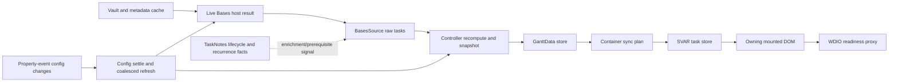
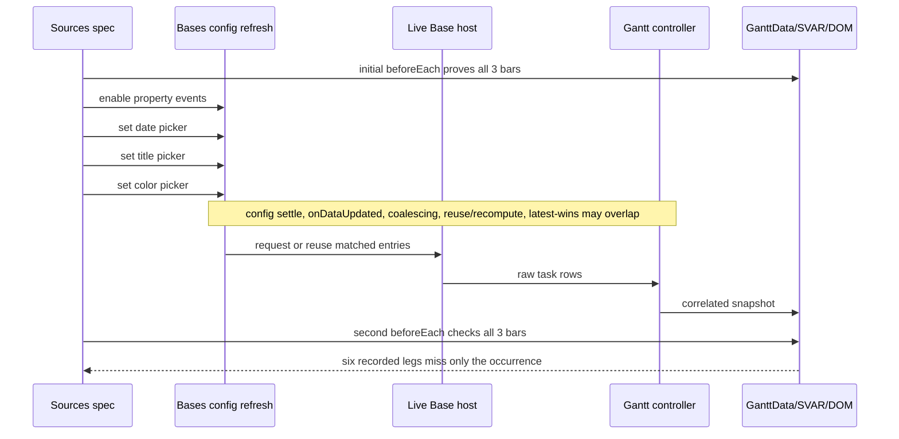
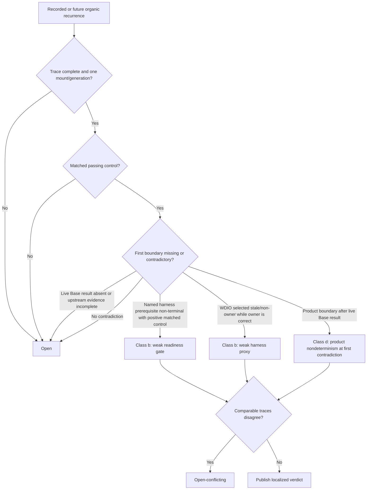

# Gantt Calendar Item Sources Nondeterminism Diagnosis - Plan

## Goal Capsule

Diagnose the six `gantt-calendar-items-sources.e2e.ts` failures recorded across the fixed 48-leg window in `docs/reports/2026-08-22-001-reliability-legend-diagnosis.md`, without changing the behavior under observation.

All six failures have the same signature: the second test's `beforeEach` reports `Gantt bars missing: ["Standup 2026-03-23.md"]`. The suite had already rendered all three expected task bars, then its property-event journey enabled property events and changed three property pickers. The daily-note timeblock journey never began. Diagnosis therefore targets the transition from those four config changes through refresh, controller delivery, Gantt/SVAR synchronization, and owning-DOM observation—not timeblock derivation.

The dated report is immutable evidence. This plan does not edit, rerun, replace, or reinterpret its 48-leg window. It adds only bounded diagnostic capability and publishes a new dated report. The acceptable result is positive evidence for a weak harness gate/proxy, positive evidence for product nondeterminism, or an explicit `open`/`open-conflicting` result. No product or harness fix is part of this plan.

Success means:

- the existing 6/48 evidence remains byte-for-byte untouched;
- U1 can distinguish a wrong-owner/proxy observation from a still-unlocalized Base-to-DOM loss; deeper boundaries are traced only when an organic recurrence activates U2 or U3, and no recurrence is a successful bounded `open` result;
- classification follows the pre-declared decision rules below and refuses unsupported attribution;
- no wait, timeout, retry, assertion cadence, readiness contract, workflow, or product behavior changes;
- the first implementation PR is a 2–4 hour test-only diagnostic unit, with a hard re-slice at four hours;
- no GitHub issue is created; this plan remains the local work-management source.

---

## Product Contract

### Evidence authority

`docs/reports/2026-08-22-001-reliability-legend-diagnosis.md` is the authoritative immutable record for the six observations. `docs/reports/2026-08-19-001-reliability-rediagnosis.md` supplies the governing R11 evidence rules and the still-open class-(b)-versus-class-(d) question. A same-SHA pass does not exonerate a failure, an inert diff does not prove an environmental cause, and no harness-versus-product verdict is available without distinguishing evidence.

Already-retained raw artifacts from those six legs may be read, cited, and copied into the new report as recorded evidence. That is neither a rerun nor a top-up, but it cannot retrospectively supply a fact the artifact did not capture, change the source report, or be labeled new verification.

Relevant durable learnings are constraints, not cause claims:

- `docs/solutions/design-patterns/readiness-signal-keys-on-data-its-consumer-reads.md`: readiness must key on the data the consumer reads.
- `docs/solutions/integration-issues/starter-note-steals-active-leaf-e2e-flake.md`: active-leaf ownership is a known proxy risk and must be observed directly.
- `docs/solutions/developer-experience/no-heavy-diagnostics-on-hot-paths.md`: diagnostics remain default-off, bounded, and cheap.
- `docs/solutions/conventions/wdio-json-reporter-output-contract.md`: reporter and terminal evidence have distinct ownership.
- `docs/solutions/conventions/window-cutoff-pattern-self-referential-measurement-reports.md`: no replacement or top-up of a fixed measurement window.

No durable learning establishes the cause of this failure.

### Requirements

| ID | Requirement |
|---|---|
| R1 | Preserve the six recorded failures, their denominator, run identities, SHA, and raw symptom text by leaving `docs/reports/2026-08-22-001-reliability-legend-diagnosis.md` unchanged. |
| R2 | Diagnose the post-property-config transition. Do not attribute the second-test hook failure to timeblock code because that journey did not execute. |
| R3 | Production-side diagnostics reuse the existing lifecycle collector in `src/debugLog.ts`. Test helpers only arm, retrieve, and classify that collector; they do not create another product-side sink. All diagnostics remain default-off, bounded, scalar/JSON-safe, monotonic, mount/generation-correlated, no-throw, and explicit about overflow or collection failure. |
| R4 | Preserve the primary WDIO error even when evidence retrieval fails. Diagnostic failure may make evidence incomplete but may not replace or downgrade the original result. |
| R5 | Do not change waits, retries, timeouts, assertions, action order, readiness behavior, config behavior, product behavior, or CI/workflow masking. |
| R6 | Require a complete same-mount causal trace and a matched passing control before a class-(b) or class-(d) verdict. Timing movement, event absence, or a later pass is insufficient. |
| R7 | Classify incomplete evidence as `open`. Classify complete, comparable causal branches supporting different classes as `open-conflicting`. |
| R8 | Commission no new reliability measurement window, repeat-run dispatch, measurement rerun, replacement, or top-up. Use the immutable 6/48 evidence plus ordinary unit and focused-e2e verification of the diagnostic capability; verification executions never enter the 6/48 denominator. |
| R9 | Land no speculative fix. Any fix requires a separate evidence-backed plan after this diagnosis settles a boundary. |
| R10 | Keep the first implementation PR within 2–4 hours. At four hours, stop at the nearest green checkpoint and split the remaining work into another unit. |

### Acceptance examples

| Example | Observed evidence | Required result |
|---|---|---|
| AE1 | At the failing checkpoint, an explicitly named harness prerequisite is non-terminal, and a matched passing control shows the target becomes observable only after that prerequisite transitions. | Class (b), weak harness readiness gate. Without that positive control, remain `open`. |
| AE2 | The owning store and owning DOM contain the occurrence, but the current global WDIO proxy selected a disconnected, stale, or non-owning root; a matched control selects the live owner. | Class (b), weak harness proxy. |
| AE3 | The live Base result contains the occurrence, the correlated controller delivery omits it without a legitimate invalidator, and a matched control preserves it through that same boundary. | Class (d), product nondeterminism, localized to controller delivery. |
| AE4 | The correlated Gantt data contains the occurrence, then the same-mount synchronization plan deletes or fails to apply it while a matched control does not. | Class (d), product nondeterminism, localized to synchronization/presentation. |
| AE5 | A trace overflows, crosses mount generations, lacks a terminal prerequisite, or has no comparable passing control. | `open`, even if the elapsed timing resembles a known failure. |
| AE6 | Two complete and comparable recurrences place the first contradiction in different classes. | `open-conflicting`; do not commission a single-cause fix. |

### Non-goals

- Changing recurrence, timeblock, calendar-item, property-event, or Gantt behavior.
- Strengthening readiness, changing the DOM selector, or increasing a timeout before evidence identifies the defective boundary.
- Reworking the general e2e harness or the repeat-run workflow.
- Buying additional recurrence opportunities after the fixed 48-leg report.
- Creating or updating a GitHub issue.
- Shipping a fix in the diagnosis PRs.

---

## Planning Contract

### Current data and control flow

The materialized `Standup 2026-03-23.md` occurrence is a Base-owned matched row. `CompositeSource` delegates task-set ownership to `BasesSource`; TaskNotes enriches recurrence/dependency facts but does not own the visible task set. A TaskNotes concrete-occurrence gate, used by the sibling recurring spec, is therefore a useful upstream fact but not proof that the Gantt consumer received the row.

### Failure lifecycle to trace

The existing config helper invokes `onConfigChanged` without awaiting its returned promise. That is a transition to observe, not a cause to assume or behavior to change during diagnosis.

### Diagnostic contract

The existing page-local lifecycle collector is the single diagnostic sink. `gantt-calendar-items-sources.e2e.ts` arms the default-off collector from inside its own `describe` for every ordinary execution of that spec; no WDIO setting, product config, or workflow enables it. A shared spec helper retrieves it through the proven bounded post-failure/CDP fallback and preserves the original failure; sources-specific helpers add phase facts and perform pure classification. U4 publishes `open — no traced recurrence` if U1's ordinary verification completes without a failure. Phase markers cover initial readiness, the start and settle observation for each of the four existing config actions, the second `beforeEach`, terminal failure capture, and teardown. Every relevant record carries short scalar identifiers sufficient to join:

- spec phase and monotonic sequence;
- mount/root identity and connectivity/ownership, derived from each root's mount token and attached Base leaf rather than from the global WDIO selector or active-leaf choice being tested;
- refresh, coalescer, recompute, controller, and synchronization generation where available;
- target presence and count at the boundary, expressed through a diagnostic watch supplied by the test rather than a fixture filename hardcoded into production code;
- settled/pending/superseded state and legitimate invalidator/remount facts;
- collector overflow or collector failure.

Do not emit raw task arrays, note contents, absolute vault paths, heavyweight snapshots, console interception, or unbounded logs. Retrieval is best-effort and saves the original hook/test error before doing diagnostic work.

A distinct passing execution is a matched control only when it uses the same full build SHA, fixture and plugin versions, Base path, ordered suite journey, four-action config history, target identity, trace schema, and boundary under comparison; reaches the same phase with terminal prerequisites; and supplies a complete single-mount trace without overflow, collector failure, remount, or unresolved supersession. Relevant boundary inputs must agree. The initial pre-config state is not a control for the post-config failure because its config history differs. An ordinary focused verification execution may qualify if all of these facts match, but it is not added to the historical measurement denominator. For a stale/non-owner class-(b) verdict only, the simultaneously observed connected owning root/store is the matched authoritative control because it shares the exact execution, checkpoint, input, and mount topology.

Trace completeness is verdict-specific:

| Verdict candidate | Mandatory checkpoints and facts | Disqualifiers |
|---|---|---|
| Weak readiness gate, class (b) | Complete ordered phase markers; named prerequisite start/terminal state; target presence before and after the prerequisite; and a distinct matched passing execution proving the target appears only after that transition. | Generic API-ready timing, an absent event, divergent config history, or no post-transition control. |
| Wrong-owner proxy, class (b) | Failing proxy root identity; every competing root's connectivity, visibility, Base ownership, mount identity, store/DOM target presence; and the correct owner observed simultaneously. | Unknown owner, disconnected authoritative root, cross-mount join, or owner/store target absence. |
| Product loss, class (d) | Complete input and output target-presence facts at the proposed first contradictory boundary; shared mount/generation keys; terminal delivery; legitimate invalidator/remount/filter/reseed/supersession facts; and a distinct matched passing execution with equivalent boundary input. | Missing boundary side, missing correlation key, pending/superseded work, legitimate invalidator, overflow, collector failure, remount, or unmatched control. |

Any mandatory fact missing from the applicable row makes the result `open`. Two complete comparable traces whose first contradictions fall into different classes make it `open-conflicting`.

### Classification algorithm

The first contradictory boundary owns the localization. Later missing states are consequences, not additional causes. Positive class-(b) evidence is a stale, disconnected, premature, or non-owning observation while the authoritative owner is correct. Positive class-(d) evidence is a same-mount product boundary that loses or contradicts a target already proven present at its input, without a legitimate invalidator, superseding generation, or remount.

### Landing strategy

The plan artifact is managed locally and is not promoted to an issue. During later execution, each activated implementation unit lands as its own squash-merged PR after local review, independent peer review, required local receipts, green CI, and zero unresolved hosted final-gate threads. The first PR is U1 only.

A work session ends at its first merged PR or, when nothing merges, its first primary work product. At four elapsed hours on any implementation unit, stop at the nearest green checkpoint and re-slice before continuing. Conditional units are not pre-authorized bundles: activate only the next unit justified by the preceding evidence.

---

## Implementation Units

### U1. Add a test-owned boundary probe (first PR, 2–4 hours)

Purpose: prove whether the failing observation is looking at the correct live owner and capture authoritative upstream facts, without touching product behavior or hot-path implementation.

Files:

- `test/specs/gantt-calendar-items-sources.e2e.ts`
- `test/specs/gantt-legend.e2e.ts`
- `test/specs/helpers/lifecycleTrace.ts` (new shared extraction)
- `test/specs/helpers/calendarItemsSourcesDiagnosis.ts` (new)
- `test/unit/lifecycleTrace.test.ts` (new)
- `test/unit/calendarItemsSourcesDiagnosis.test.ts` (new)

Work:

1. Extract the Legend spec's bounded post-failure lifecycle retrieval/report envelope into one shared test helper, migrate the Legend spec to it without behavior change, and consume it from the sources spec. Preserve its bounded CDP fallback and separate original-versus-diagnostic outcomes.
2. Add a pure sources snapshot/classification helper with an explicit schema for phase, mount/root identity, target presence, terminality, completeness, and matched-control equality.
3. At the existing checkpoints, capture whether the target file and metadata cache entry exist; whether TaskNotes exposes the concrete recurrence facts; whether the live Base leaf/host result contains the row; and whether each Gantt root is connected, visible, owning the active Base, and contains the target in its DOM.
4. Mark the start and post-action observation for the four existing config changes without awaiting, retrying, or reordering them.
5. Retrieve the bounded terminal envelope from `after` and from hook/test failure paths while preserving the primary WDIO error. Capture early hook failures, not only completed tests.
6. Unit-test refusal behavior: incomplete facts, cross-mount facts, diagnostic retrieval failure, unmatched controls, and every completeness-table disqualifier must remain `open`; a proven stale/non-owner root may satisfy only class (b).
7. Add a deterministic helper test that injects a synthetic primary hook failure, makes ordinary retrieval fail, exercises the bounded fallback, and proves the original error remains primary while the diagnostic outcome is reported separately. This is failure-path verification, not a reliability run.

Exit:

- The full sources spec still uses its original actions, waits, and assertions.
- The Legend spec still reports the same lifecycle envelope through the extracted shared mechanism.
- A passing focused run demonstrates the trace/retrieval shape through WebDriver serialization; it is verification, not new reliability measurement.
- The unit does not modify `src/`, WDIO configuration, workflows, or either dated report.
- Terminal hook-failure retrieval and primary-error preservation are mandatory in every landed U1 slice. If U1 cannot be green within four hours, defer lower-value phase detail or classifier breadth at the nearest green checkpoint; do not split away terminal retrieval or absorb U2 work.

### U2. Trace host-to-controller delivery (conditional PR, 2–4 hours)

Activation condition: U1 or a future organic recurrence proves the target is present in the live Base result, the connected owning root is correctly identified, and the target is absent from that owning DOM, leaving the host-to-controller-to-GanttData span unobserved. A stale/non-owner class-(b) result does not activate U2.

Candidate files, narrowed during implementation to the minimum needed:

- `src/debugLog.ts`
- `src/bases/register.ts`
- `src/controller/GanttController.ts`
- `test/unit/debugLog.test.ts`
- `test/unit/GanttController.test.ts`
- `test/specs/gantt-calendar-items-sources.e2e.ts`

Work:

1. Extend the existing lifecycle collector—do not add a second sink—with generic, default-off watched-item presence facts.
2. Correlate config settle, `onDataUpdated` suppression/acceptance, coalescer emission, entry signature/reuse, recompute start/settle/supersession, source task presence, controller snapshot presence, and GanttData delivery.
3. Prove boundedness, disabled-path cost, overflow/failure visibility, no-throw behavior, and generation/mount separation in unit tests.
4. Route the terminal envelope through U1's existing retrieval path.

Exit:

- The trace identifies the first contradictory boundary or explicitly records why it cannot.
- Production behavior and readiness are unchanged.
- If the required instrumentation crosses more than one independently testable boundary or reaches four hours, re-slice; do not proceed into presentation tracing in the same PR.

### U3. Trace GanttData-to-owning-DOM synchronization (conditional PR, 2–4 hours)

Activation condition: a complete U2 trace proves the occurrence reaches correlated GanttData but the owning rendered result loses it.

Candidate files, narrowed during implementation to the minimum needed:

- `src/bases/GanttContainer.svelte`
- `src/bases/ganttSync.ts`
- `src/bases/ganttSyncCoordinator.ts`
- `test/unit/ganttSync.test.ts`
- `test/unit/ganttSyncCoordinator.test.ts`
- `test/specs/gantt-calendar-items-sources.e2e.ts`

Work:

1. Reuse the same watched-item lifecycle records to correlate input GanttData, sync-plan add/update/delete decisions, application generation, SVAR task-store membership, and owning-root DOM membership.
2. Record legitimate reseed, remount, filtering, or supersession facts so their effects cannot be mistaken for loss.
3. Add unit coverage for target-presence transitions and mount/generation separation without fixture-specific production constants.
4. Retrieve evidence through the U1 terminal envelope; do not create a second WDIO reporter or console channel.

Exit:

- The first presentation boundary that contradicts its input is proven, or the result remains `open` with the missing fact named.
- `npm run probe:svar` confirms the supported SVAR surface when SVAR-facing code is touched.
- Stop and re-slice at four hours; do not author a fix.

### U4. Publish the bounded diagnosis (final documentation PR)

Activation condition: U1 and its ordinary focused verification are complete. If that verification organically reproduces the symptom, finish every evidence-activated U2/U3 unit separately before U4. If it does not recur, publish the bounded `open` report immediately and stop; do not wait for or commission an observation window. A later organic recurrence belongs to a new dated follow-up and never edits U4.

File:

- `docs/reports/YYYY-MM-DD-NNN-gantt-calendar-items-sources-diagnosis.md` (new)

Work:

1. Reproduce the immutable report's six failures, denominator, measured SHA, run/leg identities, and exact common symptom by citation and auditable accounting; do not edit the source report.
2. Document which diagnostic units landed and their verification receipts.
3. Apply the declared decision algorithm only to complete evidence. Existing failures without the new trace remain historical observations, not retrospectively localized causes.
4. Report class (b), class (d) with the first contradictory boundary, `open`, or `open-conflicting`. State explicitly when no organic recurrence supplied causal evidence.
5. List the smallest evidence-backed next planning question. Do not include or implement a speculative fix.

Exit:

- The report stands alone after ephemeral logs expire and distinguishes recorded evidence, new verification, inference, and unknowns.
- It commissions no additional measurement window and changes no earlier dated report.
- Any subsequent fix starts from a separate plan and issue creation remains out of scope unless the maintainer later changes the local-only decision.

---

## Verification Contract

No tests or measurement runs are part of creating this plan. During execution, verify at the fastest reliable tier first and run the entire focused spec because the failure depends on the preceding test journey; do not use a test-name grep that skips the property-event transition.

| Unit | Required verification |
|---|---|
| U1 | `npx jest test/unit/lifecycleTrace.test.ts test/unit/calendarItemsSourcesDiagnosis.test.ts`; `npm run typecheck`; `npm run lint`; `npm run e2e:local -- --spec test/specs/gantt-legend.e2e.ts`; `npm run e2e:local -- --spec test/specs/gantt-calendar-items-sources.e2e.ts` |
| U2 | Targeted Jest for every changed module, including `test/unit/debugLog.test.ts` and `test/unit/GanttController.test.ts`; `npm run typecheck`; `npm run lint`; `npm run build`; the full focused sources spec |
| U3 | Targeted Jest for every changed sync module; `npm run probe:svar`; `npm run typecheck`; `npm run lint`; `npm run build`; the full focused sources spec |
| U4 | `git diff --check`; link/path audit for every cited local artifact; reconcile every copied failure identity and denominator against the immutable source report |

Before each implementation PR merges:

- run the repository's full Jest suite when shared production code changes;
- preserve the original focused e2e result as the behavioral gate and the terminal trace only as diagnostic evidence;
- verify the disabled diagnostic path and failure-preservation tests;
- complete the local structured review and independent peer review required by `docs/engineering/practices.md`;
- require green CI and zero unresolved final-gate review threads.

If an ordinary verification execution organically reproduces the known symptom, preserve its original result and complete trace before any further run. A later execution required to obtain the normal green merge receipt is allowed, but it is neither a measurement rerun nor evidence that erases the failure; neither execution is added to the historical denominator. Use the recurrence to activate the next conditional diagnostic unit, not to weaken the gate.

Verification passing does not reclassify the historical 6/48 failures. A green focused run proves that instrumentation does not break the journey; a causal verdict still requires the evidence in the classification algorithm.

---

## Definition of Done

- `docs/reports/2026-08-22-001-reliability-legend-diagnosis.md` is unchanged.
- The six recorded failures remain accounted for as 6/48 with their exact shared signature and without timeblock attribution.
- U1 lands alone as a 2–4 hour PR or is re-sliced at the nearest green checkpoint by the four-hour hard stop.
- Only evidence-activated U2/U3 units run, each in a separate bounded PR.
- Production-side diagnostics reuse the existing lifecycle collector; test helpers only arm, retrieve, and classify it. The combined path is default-off, bounded, scalar/JSON-safe, correlated, no-throw, and explicit about incompleteness.
- Primary test/hook failures cannot be replaced, hidden, weakened, or corrected by diagnostic failures.
- No wait, retry, timeout, assertion, action sequence, readiness, config, product, or workflow behavior changes.
- No new repeat-run window, rerun, replacement, or top-up occurs.
- Every non-open verdict has a complete same-mount trace, a matched passing control, and a positive distinguishing fact at the first contradictory boundary.
- Incomplete or conflicting evidence is published as `open` or `open-conflicting`.
- A new dated report preserves the evidence and names unknowns without modifying the original report or proposing a speculative fix.
- No GitHub issue is created by this plan; local plan documents remain the work-management mechanism.
