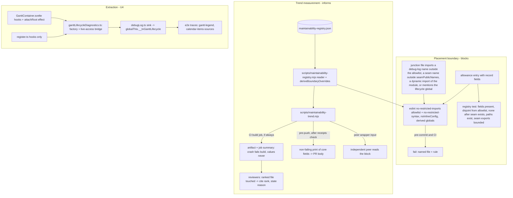

# Maintainability Guard Mechanisms - Plan

## Goal Capsule

- **Objective:** Close the planning-mechanism gap that let the reliability campaign regress the maintainability pillar's rank-1 file unnoticed: write the cross-pillar invariant where every agent and reviewer reads it, mechanize the placement rule (diagnostics behind a seam) as a lint-gate boundary, publish a per-PR trend measurement no plan can pause, add the plan-contract check, and then — guarded by those — extract the lifecycle-diagnostics cluster out of the two junction files and publish the lapsed trend report. The bar is *no unreviewed regression*: a boundary change that carries the R6 record is a reviewed deviation, not a failure.
- **Product authority:** [STRATEGY.md](../../STRATEGY.md) § Software craftsmanship and § Key metrics (amended by R15), [docs/engineering/practices.md](../engineering/practices.md) § Philosophy (*mechanism, not memory*), § Charter-owned practice items, and § Operational stopping rules. The 2026-07-30 ruling "file length is not a quality gate" (PR #355) stands and shapes KTD1. The Product Contract's Key Decisions govern product scope; the Planning Contract governs mechanism.
- **Stop conditions:** stop and consult the maintainer if a mechanism unit needs a third consecutive commit on the same tool (bounded-tooling rule), if the boundary gate cannot be expressed with installed ESLint rules, or if the extraction cannot preserve the two e2e trace contracts without changing waits or readiness.
- **Execution profile:** one PR per unit (U1–U4), merged on green before the next; U4 is the largest and lands last. Each unit is test-first where it carries behavior (gate rules, script, seam) and smoke-verified where it is text.
- **Tail ownership:** each unit's PR owns its own review receipts, CI, hosted threads, and squash-merge; U4's PR also owns the dated trend report and registry entry.
- **Product Contract preservation:** changed — R4–R7 (size ratchet → placement/import-boundary gate, maintainer-confirmed 2026-08-23 after PR #355's ruling surfaced in research); R1, R2, R9, R10, R12, R15, AE1–AE6, AE12 reworded to match; all R/AE IDs kept.

---

## Product Contract

### Summary

Land four small guard mechanisms — invariant text, a placement/import-boundary lint gate, a trend measurement script and CI artifact, a plan-contract check — then extract the lifecycle-diagnostics cluster from `GanttContainer.svelte` and `register.ts` behind its own seam and publish the trend report the reliability sessions skipped. Port the campaign invariants that lived only in agent memory into the repo.

### Problem Frame

On 2026-08-21 PR #446 added a net 678 lines (686 insertions) and 37 diagnostic call sites to `src/bases/GanttContainer.svelte` (maintainability rank 1) and a net 67 lines (76 insertions) to `src/bases/register.ts` (rank 2). The file went from 3,954 lines after the last extraction slice to 4,632 — above its 4,176 baseline — and the complexity pressure band grew from 69 to 75 functions. Every gate passed: the plan (#445) named those files explicitly and argued the instrumentation belonged there; ce-doc-review, the local reviews, the independent peer, and the hosted reviewer all reviewed *against the plan*; and the reliability plan's own text paused maintainability trend reporting "until its campaign resumes". No mechanism existed to notice — the churn/concern gate is parked and the review rubric has no line about ranked-defect files.

The executing agent (Codex) did what the plan said. The defect was upstream: the invariant "main is strictly better than the baseline after every unit" existed only as a verdict phrase in trend reports and in one agent's private memory, never as a rule in AGENTS.md, practices.md, or a plan contract; the pattern "diagnostics live behind a seam" had been practiced (`svarInterceptors.ts`) but never written down. In this repo every review layer reviews against the plan, so a defect written into a plan is invisible to every downstream reviewer — and a plan that *argues* the defect passes just as cleanly as one that omits it. What failed was cohesion — a concern welded into junction files — and its first visible act was an import of the lifecycle-capture API into both files.

### Key Decisions

- **Mechanisms land first; the extraction follows.** (session-settled: user-approved — chosen over extract-first and over recording the learning only: the extraction then lands guarded by the very mechanisms that were missing.) Governs R11, R12.
- **The root cause is recorded as a planning-mechanism gap, not a vendor failure.** (session-settled: user-approved — the maintainer asked whether Codex neglected the guidelines; the trace shows the plan named the files and the guard was paused by plan text.) Governs R13.
- **Placement is the blocking invariant; size is feedback.** (session-settled: user-approved — chosen over a downward-only line ratchet and over superseding the 2026-07-30 ruling: a line ceiling measures the symptom, invites compression and module-spraying, taxes legitimate feature growth with an approval loop, and was already built and removed once in PRs #349/#355; the dependency boundary "junction files do not import the lifecycle-capture API" is binary, lint-enforceable, not gameable by formatting, and would have failed #446 at pre-commit.) Governs R4, R5, R6, R7, R8.
- **The trend measurement informs; the boundary blocks.** Enumerated concern counts cannot be mechanized and size is not a gate, so both are published for review; concern counts are a session-level record with a named owner (R3). Governs R1, R8, R9.
- **An exception to the boundary is a record, not a sentence.** A new allowed import into a junction file is admissible only with the measured delta, why the seam cannot carry it, the alternatives considered, and the maintainer's recorded approval — a boundary change is a maintainer-arbitration point like a complexity-ceiling breach. Net line growth on a ranked file owes only a stated reason in the PR, checked against the trend line. Governs R1, R6, R10.
- **The reliability plan's KD2 (reliability list before maintainability resumes) is left untouched.** The extraction undoes residue the reliability campaign introduced; it is not the maintainability ranked list resuming, and this plan authorizes only the extraction. Governs R11.

### Requirements

**Invariant text (mechanism: every reader sees it)**

- R1. AGENTS.md § Review guidelines and practices.md § Charter-owned practice items state the cross-pillar invariant: no PR moves a diagnostics or instrumentation concern into a ranked-defect file except through the seam (R2), and a PR that grows a ranked-defect file's line count or concern count states the reason in its description. The AGENTS.md line names the trend measurement's output (R8) as the reviewer's source: the independent peer layer embeds it in its review input, the pre-push hook prints it for the author to paste into the PR body for the hosted gate, and CI publishes it for the human.
- R2. The same text states the placement rule: instrumentation and diagnostics live in their own module behind a seam; views and junction files keep only the call hooks, and the lifecycle-capture names of the debug-log module are imported only by the seam module — the rule is keyed on the names, from any source path and any import form, not on one import specifier.
- R3. practices.md carries the campaign rule that a plan may pause new work on a pillar's ranked list but never that pillar's regression guard or trend measurement; the reliability plan's sentence "its trend reporting resumes when its campaign does" is named as superseded by this rule. A plan whose Files touch a ranked-defect file owes, at its close, a dated trend report that re-enumerates that file's concern count — the evidence for its Definition of Done statement (R10) — whichever pillar the plan serves; planless PRs rely on the R8 measurement.

**Placement boundary (mechanism: blocks)**

- R4. The lint gate refuses, in the ranked junction files `src/bases/GanttContainer.svelte`, `src/bases/register.ts`, `src/controller/GanttController.ts`, `src/bases/services/BasesDataAdapter.ts`: every named import of the debug-log module at any path depth except `dlog`, `isGanttDebugEnabled`, and dated allowances; any import of the seam module outside the seam's declared public names; any dynamic import expression or inline import type naming the debug-log module; any mention of the `__tnGanttLifecycle` global as an identifier, string, or static template literal; and any re-export of a restricted name from a module other than the seam. Inline lint directives are ineffective in those files.
- R5. The gate lands before the extraction with a dated interim allowance naming exactly the symbols the two junction files import today and naming U4 as the remover; a test fails once the seam module exists while any interim allowance remains.
- R6. A boundary change — a new allowed import into a junction file — is admissible only with an exception record (the measured delta, why the seam cannot carry it, the alternatives considered, the maintainer's recorded approval) carried in the governing plan when one exists and otherwise in the PR description, and the allowance is a structured, reviewable entry in the registry; a test fails on an allowance lacking the record fields or duplicating the base allowlist.
- R7. The boundary is mutation-checked at landing: a planted forbidden import in a `.svelte` file, a planted deeper-path import in `BasesDataAdapter.ts`, a planted type-only import (with its interim allowance removed first), a planted inline disable comment, a planted dynamic import and inline import type, planted member, bracket-string and template-literal accesses of the global, a planted barrel re-export, a planted restricted import from the seam path, and a registry edit dropping one interim allowance are each observed failing pre-commit and CI, with the applied change printed, then reverted.

**Trend measurement (mechanism: informs, cannot be paused)**

- R8. A repo-owned script reproduces the maintainability report's trend measurements — windowed churn share with the window ending at the PR's merge-base with main, ranked-file sizes, at-ceiling complexity count — plus per PR: the ranked files the PR's own commits touch with added and removed line counts and an explicit "ranked file touched — cite its rank" line. Enumerated concern counts are carried by the dated per-session trend report; the output names the latest dated report's date and counts beside the baseline and the number of ranked-file-touching PRs merged since it (squash commits on main after the report's anchor whose changed paths include a ranked file). The ranked-file list, baseline anchor, dated-report entries, seam module path, seam public names, base allowlist, and boundary allowances live in one committed registry read through one reader module by the lint config and the script.
- R9. CI runs the script on every PR — including PRs whose earlier gates failed — and publishes its output as the trend artifact and job summary inside the required `build` job: a crash fails the job, the measured values never do. The pre-push hook prints the same core fields after the receipts check without failing; the at-ceiling count is CI-only and the print says so when it is skipped.

**Plan contract (mechanism: spec-time review)**

- R10. The plan contract and AGENTS.md § Review guidelines require a plan whose Files touch a ranked-defect file to cite the ranking entry, carry the invariant and the R2 placement rule in its review contract, and argue the touch; ce-doc-review tests the argued touch against R2 and flags a plan that places instrumentation or diagnostics inside a ranked-defect file rather than behind a seam; such a plan's Definition of Done states that no ranked-file metric regresses or that the regression carries the R6 exception record, backed by the dated report R3 names. The boundary gate (R4–R7) is this rule's mechanical backstop. At landing the guard is mutation-checked: two scratch plans — one listing `src/bases/GanttContainer.svelte` without citing the ranking, one arguing in-file diagnostics — are run through ce-doc-review, the resulting findings recorded in the PR, and the scratch plans discarded.

**Extraction (after the mechanisms)**

- R11. The lifecycle-diagnostics cluster leaves `src/bases/GanttContainer.svelte` and `src/bases/register.ts` for its own module behind a seam; the view and registration keep only call hooks; the Legend and calendar-sources e2e traces still record; the destination module is measured in the R8 artifact.
- R12. The extraction PR removes the interim allowance (R5), reports the two files' before-and-after sizes with the retained hook-line count and the destination module's size and complexity, and publishes the trend report against the 2026-08-15 baseline that lapsed for the #446 and #448 sessions.

**Persistence and housekeeping**

- R13. A `docs/solutions/workflow-issues/` learning records the failure class: a plan is the single point of failure for every review layer that reviews against it, and a guard kept by ritual can be paused by plan text.
- R14. Closeout rider of the rank-3 typecheck campaign (not a goal of this plan): the stale backlog entry "Test code is never typechecked" (closed by PRs #431–#434) is deleted.
- R15. A maintainer-approved amendment to STRATEGY.md § Software craftsmanship and § Key metrics names the placement boundary as maintainability's second mechanized dimension and the per-PR trend measurement as the pillar's trend instrument that feeds — but does not replace — the dated per-session trend reports, which remain the record for enumerated concern counts; the parked churn/concern CI-gate backlog entry is updated to say its trigger fired on 2026-08-21 and its churn-in-CI half lands as R8, and the parked import-boundary lint-gate entry is updated to record that its first instance — the lifecycle-capture placement boundary — lands as R4 while the broader views-never-import-the-data-layer candidate stays parked with its existing trigger.

**Provenance — withdrawn requirements.** The brainstorm's R4–R7 specified a downward-only per-file line ceiling ("size ratchet") on the ranked files. Planning research found PR #355 (2026-07-29) removed that exact mechanism (`scripts/check-size-ratchet.mjs`, ESLint `max-lines`, their tests) under the 2026-07-30 ruling "file length is not a quality gate … not instructions to rebuild it". The maintainer confirmed on 2026-08-23 that the ruling stands; R4–R7 now carry the placement boundary instead, and size is informational under R8.

### Acceptance Examples

- AE1. **Covers R4, R7.** Given the boundary is landed, when a commit adds `import { captureGanttLifecycle } from '../debugLog'` to `GanttContainer.svelte` outside the allowance, then pre-commit fails on the boundary rule naming the file, and CI fails on the same rule; reverting restores green.
- AE2. **Covers R4, R7.** Given the same commit adds an inline `eslint-disable` comment for the rule, when pre-commit runs, then the gate still fails — the rule error plus the "directive has no effect" warning, which `--max-warnings 0` already makes red.
- AE3. **Covers R6.** Given a PR adds an allowance entry carrying all record fields and the maintainer's recorded approval, when the gate and the registry test run, then both pass and the entry is one visible diff line.
- AE4. **Covers R4, R7.** Given the registry's interim allowance for `GanttLifecycleFacts` in `register.ts` is removed, when pre-commit runs on the file's existing `import { type GanttLifecycleFacts } from '../debugLog'`, then the gate fails; given `import { ganttLifecycleControl } from '../../debugLog'` is added to `BasesDataAdapter.ts`, then the gate fails; importing the type from the seam module passes.
- AE5. **Covers R5.** Given the seam module exists, when any interim allowance remains in the registry, then the registry test fails.
- AE6. **Covers R8, R9.** Given a docs-only PR, when CI runs, then the trend artifact and job summary are published, the per-path touch counts equal those measured at the PR's merge-base, the per-PR line shows zero ranked files touched, and the at-ceiling section reads "not run — no `src`/`test`/`scripts` change".
- AE7. **Covers R10.** Given a plan lists `src/bases/GanttContainer.svelte` under Files without citing the ranking, when ce-doc-review runs, then it reports the missing argument as a finding.
- AE8. **Covers R10.** Given a plan cites the rank-1 entry and argues adding diagnostic call sites directly to `GanttContainer.svelte`, when ce-doc-review runs, then it reports the placement-rule violation as a finding.
- AE9. **Covers R11.** Given the extraction has landed, when `gantt-legend.e2e.ts` runs with capture armed, then the owning-mount trace records the same product event identities in the same ordered steps as the stable set common to three pre-extraction baseline dumps, frame and pending counts excluded, any intentionally untraced site enumerated.
- AE10. **Covers R11.** Given the extraction has landed, when `gantt-calendar-items-sources.e2e.ts` runs with its boundary probe armed, then the sink and the lifecycle control still exist and the spec's own records are captured as before.
- AE11. **Covers R2, R11.** Given the extraction has landed, when the named structural jest test runs, then the destination module owns the lifecycle-diagnostics implementation, the two junction files contain none of the forbidden tokens or `capture*` definitions, the live-access census matches the bindings the seam reads, and the hook-site count (including the listener-attach `$effect`) equals the named constant.
- AE12. **Covers R12.** Given the extraction PR, when it is reviewed, then the interim allowance is gone, the before-and-after sizes with retained hook-line count and the seam's size and complexity are in the PR, and a trend report against the 2026-08-15 baseline plus its registry entry are in the diff.

### Scope Boundaries

- The reliability ranked list (Legend, calendar-sources, column-sort), the nominated spec-count/no-retry gate, and the perf/security pillar baselines — separate plans.
- The maintainability ranked list's next slices (style block, diff-sync coordination, `register.ts`, `GanttController.ts`) — this plan authorizes only the extraction; those slices may resume under a later plan only after an explicit decision on superseding the reliability plan's KD2.
- Any line-count gate — withdrawn under the 2026-07-30 ruling; the parked churn/concern *blocking* gate stays parked.
- The rank-4 `#161` debug instrumentation (`dlog` sites in `GanttController.ts`) — pre-existing debug logging is outside the boundary; its removal is a later maintainability slice.
- The 6-week-red scheduled perf job and open-issue housekeeping beyond R14/R15.
- Superseding the reliability plan's KD2 sequencing.

#### Deferred to Follow-Up Work

- A PR-time check comparing changed paths to the ranked list (see Deferred / Open Questions) — the R8 "ranked file touched" line prompts the reviewer; a blocking touch check is a second mechanism for the maintainer to weigh.
- Recording the diagnostics module's closure condition (when the open reliability diagnoses retire) — a reliability plan's call.
- A `docs/solutions/` learning for the #355 ratchet removal itself (no learning records it today).
- Adopting eslint-plugin-svelte's flat `recommended` config with its processor would re-enable HTML-comment directives in `.svelte` files; the boundary's `noInlineConfig` covers script directives, and a later adoption must re-check that bypass.
- Declaring the seam's public surface from the registry so later instrumentation units extend it by a registry line — decided at U4 from how the next reliability unit wants to add capture helpers.

<!-- ce-section: work-relationships -->
### How This Work Fits Together

This plan owns the guard mechanisms and the diagnostics extraction. The surrounding breakdown is the current understanding, not a committed roadmap.

- Reliability ranked list work (top-down per `docs/reports/2026-08-19-001-reliability-rediagnosis.md`)
  - Can proceed independently of this plan except in the U2→U4 window: once the boundary lands and until the seam exists, no unit may add lifecycle-capture calls to the junction files (the gate blocks it; an allowance owes the R6 record). Future instrumentation units add capture helpers to the seam module, never to the junction files; U4 is therefore on the critical path of the next Legend instrumentation unit.
- Reliability mechanical gate adoption (spec-count assertion + no-retry config check)
  - Can proceed independently of this plan; recommended as the next reliability unit.
- Maintainability ranked list, next slices (style block first)
  - Depends on this plan: the boundary and trend measurement guard every later slice.
  - Still to decide: whether the reliability plan's KD2 is superseded so these resume while reliability ranks 1–2 await organic recurrence; until decided, they do not start.
- Performance and security pillar baselines
  - Still to decide: commissioning order; both remain unmeasured.

### Sources

- `docs/reports/2026-08-15-001-maintainability-rediagnosis.md:225-275` — ranked list, baseline commands (`range=7949fd1…`, `--no-renames` churn loop, threshold-10 sweep), concern counts 30/14/14, at-ceiling 16, 69 in band.
- `docs/reports/2026-08-19-001-reliability-rediagnosis.md` — reliability ranked list and gate nomination.
- `docs/plans/2026-08-17-001-chore-reliability-rediagnosis-plan.md:42,89` — KD2 and the sentence that paused maintainability trend reporting (superseded by R3).
- `docs/plans/2026-08-20-0752-chore-reliability-legend-diagnosis-plan.md:101-107` — U1 naming the junction files as instrumentation files; no maintainability metric in its DoD.
- PR #445 (plan; ce-doc-review clean), PR #446 (`src/bases/GanttContainer.svelte` +686/−8, `src/bases/register.ts` +76/−9, `src/debugLog.ts` +446; five hosted threads, none on placement), PR #448 (test-only).
- PR #349 (`639d843`, built `scripts/check-size-ratchet.mjs`), PR #355 (`d3f2a8d`, removed it and ESLint `max-lines`), `docs/plans/2026-07-27-001-refactor-drag-derivation-authority-plan.md:23-31` (2026-07-30 supersession note), `docs/solutions/workflow-issues/run-behavior-neutral-refactoring-as-releasable-reviewed-slices.md` ("do not add … a custom ratchet").
- `docs/engineering/practices.md:20` (mechanism, not memory), `:122-135` (gates; review layers review against the plan; pre-push layers run before CI), `:146` (stopping rules), `:169-175` (charter-owned items; complexity ceiling = hard stop + maintainer arbitration).
- `docs/solutions/tooling-decisions/layered-pre-push-review-gate.md` (perception is the hard part of a gate; keep it thin), `docs/solutions/workflow-issues/bound-work-on-the-review-tool-itself.md` (stopping rule by finding class), `docs/solutions/best-practices/a-test-name-is-a-claim-verify-the-mutation.md` (self-evidencing mutation checks), `docs/solutions/tooling-decisions/orchestrate-existing-tool-over-rebuilding.md`.
- `docs/solutions/developer-experience/failure-safe-wdio-lifecycle-diagnostics.md` (collector on `globalThis` null until started; scalar-only call sites; harness owns transport), `docs/solutions/developer-experience/no-heavy-diagnostics-on-hot-paths.md`.
- ESLint 9.36.0 (`node_modules/eslint/lib/rules/no-restricted-imports.js` — `paths[].name` is an exact specifier match; `patterns[]` takes `group`/`regex` + `importNames`/`allowImportNames`, built with `ignore({ allowRelativePaths: true })`; the rule visits only static import/export declarations, so dynamic `import()` and `import('…').Type` need `no-restricted-syntax`; no `allowTypeImports` in core, so type-only imports are matched by name; `lib/linter/linter.js:447-460,794` — `linterOptions.noInlineConfig` merges per file and reports every directive kind, `/* global */` included, as a no-effect warning and stops applying it), eslint-plugin-svelte 3.12.4 (HTML-comment directives need the `svelte/svelte` processor, which this config does not use).
- `eslint.config.mjs` (168 lines; flat array of `{ files, rules }` blocks; `.svelte` via `svelte-eslint-parser`; `sonarjs/cognitive-complexity` 15 in all blocks; `no-undef` on via `js.configs.recommended`; no `max-lines`, no local rule plugin; `*.config.mjs` block has `process`/`URL` globals), `package.json` (`lint: eslint . --max-warnings 0`, `engines >=18`; CI `setup-node` 22; local Node 22), `jest.config.mjs` (CJS mode, `node_modules` untransformed, `moduleFileExtensions` without `json`; `.mjs` via `@swc/jest`; `roots` include `scripts`), `.husky/pre-commit` (lint + typecheck + volatile-ref comment guard on `src test`), `.husky/pre-push` (`check-review-receipts.mjs check`, reads git's ref lines from stdin; `.husky/_/h` runs hooks under `sh -e`), `.github/workflows/ci.yml` (single `build` job on `windows-latest`, `pull_request` trigger only, no `fetch-depth`, `shell: bash` precedent at `:27`, `upload-artifact` with `if: always()`), `.github/workflows/sonar.yml:44-48,66` (`if-no-files-found: error`, `fetch-depth: 0` precedents), `scripts/check-review-receipts.mjs:187-230,276` + `test/unit/checkReviewReceipts*.test.ts` (script conventions: pure exports, `isDirectRun` guard, CLI test against a throwaway git repo with scrubbed `GIT_DIR`), `scripts/version-bump.mjs:49-50` (`JSON.parse(readFileSync)` precedent), `scripts/cross-model-peer-review.sh:314-380` (peer prompt assembly — the layer-3 input), `test/unit/noBarePluginConfigKeys.test.ts` (source-reading config guard).
- `src/bases/svarInterceptors.ts` + `test/unit/svarInterceptors.test.ts:1002-1056` (live-access bridge; the named grep-gate test reading the view source) + `docs/plans/2026-08-15-002-refactor-svar-interceptor-extraction-plan.md`; `@svar-ui/svelte-gantt/types/index.d.ts` exports `IApi`.
- `src/debugLog.ts:97-281` (exports incl. `ganttLifecycleControl`, `createGanttLifecycleCollector`, `buildGanttLifecycleReport`, `readDiagnosticsPreservingPrimary`, `withGanttDiagnosticDeadline`), `:269` (`globalThis.__tnGanttLifecycle`); `src/bases/GanttContainer.svelte:2` (`/* global … */`), `:135-145` (imports: six restricted values, `dlog`, two types), `:174-176` (`import('obsidian').App` idiom), `:1334` (`no-explicit-any` directive over `type GanttAPI = any`), `:1359-1957` (diagnostics block; `$effect` listener attach at `:1890-1939`; `onDestroy` at `:1942-1957` also calls `deactivateLegendEscapeScope()` at `:1955`), hook sites `:471`, `:529-562`, `:2037-2123`, `:2529-2537`, `:2897`; `src/bases/register.ts:10` (`/* global MouseEvent */`), `:182-188` (imports), `:281-300` (`createMountTokenLifecycle`, product logic, imported by `test/unit/debugLog.test.ts:27`), `:431-446` (`captureMountLifecycle`) and 8 hook sites; `src/controller/GanttController.ts:57` (`/* global clearTimeout */`), `:125` (`dlog`/`isGanttDebugEnabled` only); `BasesDataAdapter.ts` imports nothing from the debug-log module; `test/specs/gantt-legend.e2e.ts:180-276,2600-2685`, `test/specs/helpers/lifecycleTrace.ts:184-200` (`[OG-LIFECYCLE] {json}` on stderr), `test/specs/helpers/calendarItemsSourcesLifecycle.ts:77-112`; `test/perf/isolated/GanttPerfHost.svelte` and `test/probe/*Host.svelte` mount the view under Vitest browser mode (`perf:isolated`, `probe:svar` CI gates).
- `docs/backlogs/backlog.md:454-457` (parked churn/concern gate), `:514-528` (stale typecheck entry), `:708-715` (parked import-boundary gate); `STRATEGY.md:56-58,103-107`; `AGENTS.md:51-58`; `CONCEPTS.md` § Pillar measurement. Branch ruleset required contexts on `main`: `build`, `e2e / e2e`, `Test + coverage`, `Analyze`, `SonarCloud Code Analysis` (job-level; no per-step status).
- Measured 2026-08-23 at main `1085349`: `GanttContainer.svelte` 4,632 lines, `register.ts` 1,939, `GanttController.ts` 2,431; threshold-10 sweep 75 findings (16 at 15); windowed churn 23 commits since baseline; CI checkout ≈6 s (pack 13.65 MiB), Lint ≈21 s.

---

## Planning Contract

### Key Technical Decisions

- KTD1. **The boundary is ESLint core `no-restricted-imports` in allowlist form keyed on names, plus `no-restricted-syntax` for the dynamic-import forms and the lifecycle global, in registry-derived per-file flat-config overrides; no new script and no new plugin.** (session-settled: user-approved — chosen over a line ratchet and over superseding the 2026-07-30 ruling: the installed tool expresses the invariant exactly; a bespoke checker would repeat the #349/#355 cycle.) Mechanics: two `patterns` entries per ranked file — one matching the debug-log module at any depth (including a `.ts`-suffixed specifier) with `allowImportNames` = the registry's base allowlist (`dlog`, `isGanttDebugEnabled`) plus that file's dated allowances, one matching the seam module path with `allowImportNames` = the registry's `seamPublicNames`; `no-restricted-syntax` selectors for `ImportExpression` and `TSImportType` whose source names the debug-log module, and for `Identifier`, `Literal`, and static `TemplateLiteral` nodes carrying `__tnGanttLifecycle`; `linterOptions.noInlineConfig: true` on each object, which makes every directive comment — disables and `/* global */` alike — a no-effect warning (red under `--max-warnings 0`) and stops applying it, so the four files carry no directives at landing and the globals those comments declared move into the override objects' `languageOptions.globals`. Type-only imports are caught by name (core rule has no type exemption), so the seam re-exports the types the view needs. A registry test guards the rest of R4: no module other than `src/debugLog.ts` and the seam exports or re-exports a restricted name, and the seam exports nothing restricted outside `seamPublicNames`. Governs R4, R7.
- KTD2. **One committed registry, one reader module, one derivation.** `maintainability-registry.json` (repo root) holds `rankedFiles` (path + rank), `baseline` (sha, date), `reports` (date, anchor sha, concern counts), `boundary` (`module`, `seamModule`, `seamPublicNames`, `allowedImportNames`, `allowances[]` with `file`, `importName`, `dated`, `removedBy`, `record`). `scripts/maintainability-registry.mjs` reads it with `readFileSync` + `JSON.parse` resolved from `import.meta.url` (no JSON import attributes — `jest.config.mjs` resolves no `.json`, and `engines` spans Node 18/22), validates the schema, and exports `deriveBoundaryOverrides()` returning the per-file override objects (files, rules, `linterOptions`, `languageOptions.globals`); `eslint.config.mjs` spreads that result after the `.svelte` block and `scripts/maintainability-trend.mjs` imports the same reader (principle 4 — one reader, one source; the config file itself is never imported by a test, since jest runs CJS and the svelte plugin and parser are ESM-only). The registry test asserts every `rankedFiles` path and the `boundary` paths exist on disk (a rename is a registry diff line, else an ESLint `files` glob silently matches nothing), allowances name a ranked file and are disjoint from the base allowlist, record fields are present, and no allowance outlives the seam; a source-reading assertion checks the config file contains the spread. Governs R5, R6, R8.
- KTD3. **The interim allowance is the landing bridge.** The gate lands in U2 with allowance entries for exactly the symbols the two files import today (`dated`, `removedBy: U4`); U4 deletes them; the registry test fails if the seam module exists while an allowance remains. Alternative rejected: landing U2 and U4 as one PR — a cohesion reason exists, but the gate should prove itself independently and the extraction is the largest unit. Governs R5.
- KTD4. **The trend script is a thin wrapper over the baseline report's published commands, with the measurement window ending at the merge-base.** CI runs the step `if: always()` (so failing PRs are still measured) but not `continue-on-error`, passing `--base <merge-base(base.sha, head.sha)> --head <pull_request.head.sha>` (never `github.sha`, the synthetic merge ref); per-PR touches are computed over `base..head`; the windowed loop reuses the report's `--no-renames` command; "PRs merged since the latest report" are squash commits on main after the report's anchor whose changed paths include a ranked file (git only, no API); the at-ceiling count is a named sub-command (a second full ESLint pass at threshold 10, counted by rule id) that runs only when the PR touches `src`, `test`, or `scripts` and prints an explicit "not run" marker otherwise, with the ESLint runner injected so the CLI test never lints the repo. Locally, with no flags, the range defaults to the merge-base of `HEAD` with `origin/main` as base and `HEAD` as head; on `main` itself the per-PR table is empty. Output is plain text plus a job summary; values never affect the exit code; a crash (shallow clone, malformed registry, failed sub-command) exits non-zero with an actionable message. Governs R8, R9.
- KTD5. **Local surfacing reaches the layers that run before CI through the layers' own inputs.** The pre-push hook runs *after* the receipts check — `sh -e` and a stdin-reading `check` mean the print must come second, with stdin redirected and its exit status ignored — and prints the same core fields as CI (at-ceiling marked CI-only), so its consumer is the author's PR-body paste (hosted gate + human), not the two local review layers, which are receipted before pre-push runs. The independent peer wrapper (`scripts/cross-model-peer-review.sh`) embeds the trend block in its review input so layer 3 reads it by mechanism; layer 2 (ce-code-review) reads the rubric line and the same block pasted in the PR body. Alternative rejected: `npm run trend` the review skill must remember — memory again. Governs R1, R9.
- KTD6. **The seam is a module-level factory with a live-access bridge, mirroring `svarInterceptors.ts`.** `createGanttLifecycleDiagnostics(access, deps)` owns the 1359–1957 block's implementation (helpers, viewport-source bookkeeping, settlement observation, the `tn-gantt-lifecycle-*` listener closures and their teardown behind `attachRoot(root) → disposer`) and exposes the hook functions the view calls; the view keeps the accessor literal, the hook calls, and the `$effect` that calls `attachRoot(rootEl)` and returns its disposer — runes cannot leave the `.svelte` file, so that `$effect` is one more hook site; `onDestroy` keeps its product lines (`deactivateLegendEscapeScope(); destroyed = true; hostGeneration += 1`) while only the diagnostic captures and viewport aborts move to the seam's teardown. `createMountLifecycleCapture(access)` owns `register.ts`'s `captureMountLifecycle`. `createMountTokenLifecycle` is product logic and stays in `register.ts`. Governs R11.
- KTD7. **"Only call hooks remain" is mechanical.** A named structural jest test reads the two source files and asserts: none of the R4 forbidden tokens, no `function capture*` / `interface Diagnostic*` definitions, the accessor literal's getters return same-named bindings (the live-access census), and the hook-site count — including the listener-attach `$effect` — equals a named constant; the `svarInterceptors.test.ts` R1 grep-gate shape. Governs R11, AE11.
- KTD8. **Trace parity is identity + ordered steps across a stable baseline, not counts.** Before U4, take three dumps per spec of the owning-mount event-name sequences from `npm run e2e:local` on main (the Legend spec is reliability rank 1 and varies run to run); parity is the event identities and product-step order common to all three, with any between-baseline variance recorded in the PR as excluded; after the move, compare the post-extraction run against that stable set, excluding `viewport-frame`/pending counts; the spec-owned `sources-*` records of the calendar spec are asserted present. Any PR that edits the 1359–1957 block or the eight `register.ts` hook sites before U4 invalidates the baseline dumps, which are re-taken. Governs AE9, AE10.
- KTD9. **Bounded tooling.** Each mechanism unit names its stopping condition before it starts: findings about the accident the tool catches are fixed; findings about configurations outside this repo's operating context are recorded in the backlog and stopped; a third consecutive commit on the same tool is the consult-the-maintainer trigger. Governs Goal Capsule stop conditions.

### High-Level Technical Design

### System-Wide Impact

- **Every PR's required `build` job** gains the trend step (`if: always()`, after Lint, Typecheck, Unit tests so a measurement crash never masks product-gate signal) and `fetch-depth: 0` on checkout (≈ +0 s on a 13.65 MiB pack); the at-ceiling sub-command adds a second full ESLint pass (≈ +20–25 s) only on PRs touching `src`, `test`, or `scripts` — docs-only, Dependabot, and release-notes PRs publish the lightweight artifact with a "not run" marker. There is no per-step required status; presence is enforced because the step is not `continue-on-error` and the upload uses `if-no-files-found: error`.
- **The four junction files accept no inline ESLint directives from U2 on** — a permanent constraint on every future PR touching them; today they carry four (the `no-explicit-any` disable at `GanttContainer.svelte:1334` and `/* global */` comments at `GanttContainer.svelte:2`, `register.ts:10`, `GanttController.ts:57`), all retired in U2 with the declared globals moved into the derived overrides.
- **The pre-push hook** grows a second, non-failing line after the receipts check; `check` keeps stdin. Every push prints the trend block's core fields; the author pastes it into the PR body.
- **The peer review wrapper** embeds the trend block in its prompt — the rank-7 cluster grows by one bounded input; the block is read-only text.
- **The U2→U4 window** freezes lifecycle instrumentation in the junction files: the reliability campaign's next Legend unit must wait for the seam or carry an R6 allowance; any pre-U4 edit to the diagnostics block invalidates the KTD8 baseline dumps.
- **Renames of ranked files** (the maintainability slices' own next work) must touch the registry in the same PR, or the boundary override and the trend row for that file silently vanish; the registry test's path-existence assertion makes the omission red.
- **Vitest browser hosts** (`perf:isolated`, `probe:svar`) mount the view, so the seam's listener and global code runs there; U4 verification names both gates.
- **Sonar** sees `src` only: U3 adds no coverage burden; U4 moves ~600 lines from coverage-excluded `.svelte` into covered `.ts` — carried by the seam's unit tests.

### Sequencing and landing strategy

U1 (docs: invariant text, learning, STRATEGY, backlog, CONCEPTS) → U2 (registry + reader + boundary gate + interim allowance + the four-directive retirement) → U3 (trend script + CI + pre-push print + peer-wrapper input) → U4 (extraction + report). U1–U3 are independent of each other in code; the named order puts the reader-facing rule first so U2/U3's reviewers read it, and lands the measurement before the extraction so U4's report is script-produced. One PR per unit, merged on green before the next; U1 clusters several documentation files under one cohesion reason: one invariant, many homes. U4 is a single behavior-neutral extraction PR — move-only plus the structural test, the seam's unit tests, the report and registry entry — kept whole because a partial move would break the before/after size comparison and the KTD8 trace-parity contract; reshaping inside the seam is a later commit under the same tests. Between U2 and U4 merges, no reliability unit adds lifecycle-capture calls to the junction files.

### Risks & Dependencies

| Risk | Mitigation |
|---|---|
| Core `no-restricted-imports` behaves differently on `.svelte` script blocks than on `.ts` | U2's mutation check plants in both file types; research verified `svelte-eslint-parser` runs the same rule set and `patterns` matches relative specifiers |
| The registry is decorative — the config hardcodes names and every plant passes anyway | R7's registry-edit plant: dropping one interim allowance must make the existing `register.ts` import fail |
| Allowance becomes a permanent back door | R5 registry test fails once the seam exists; R6 record fields required; disjointness from the allowlist asserted |
| Trend script is perception-heavy (merge-base, PR refs, Windows runner) | KTD4: wrapper over published commands; crash = red, values never red; `fetch-depth: 0` and `shell: bash` per precedent; CLI test against a throwaway git repo with a planted registry and an injected ESLint runner |
| Added CI and pre-push wall time | Stated cost: ≈ +20–25 s CI for the at-ceiling pass on code PRs only; pre-push skips it |
| Sonar new-code coverage on ~600 moved lines | The live-access bridge makes the pure helpers unit-testable; U4 Files name the seam's jest tests |
| Extraction changes hook ordering or listener teardown | KTD8 parity procedure over a three-dump stable set; listeners behind `attachRoot`; `onDestroy` product lines stay in the view; `perf:isolated`/`probe:svar` green |
| `GanttAPI` retirement is a small multi-site edit, not one line | Budget it in U2; prefer SVAR's exported `IApi`; state the reason in the PR as "typed the SVAR api binding" |
| A third same-tool commit loop on U2/U3 | KTD9 stopping rule; acknowledged-findings receipt terminates review loops |
| Reliability units keep adding to the view via `dlog` (not fenced) | Scope boundary states `dlog` is pre-existing debug logging; R8 per-PR line + R10 catch growth by review |

### Deferred / Open Questions

- Whether the trend artifact also drives a future blocking concern-count gate — parked under the 2026-07-30 ruling's spirit and the informs/blocks decision.
- Whether the reliability plan's KD2 is superseded for the next maintainability slices — maintainer call, not this plan's.
- Whether the hosted Codex reviewer reads PR comments — if yes, a CI-posted trend comment (needs `pull-requests: write` on the build job) replaces the author paste and the pre-push print; open with the maintainer.
- Deferred to implementation: the exact registry JSON field names beyond those in KTD2; whether the job summary renders a table or preformatted text.

### From 2026-08-23 review (deferred finding)

- **A plan can dodge the plan-contract check by not listing the ranked file** — Requirements R10 / R1 (P1, cross-model whole-doc reviewer, confidence 75)

  A plan that omits a ranked-defect file from its Files list never triggers the R10 citation requirement, while the invariant binds every PR; nothing compares a PR's changed paths against the ranked list. The proposed remedy is a PR-time check requiring every ranked-file touch to be named and justified by the governing plan — surfaced here rather than applied because the invariant forbids regression, not touch: the R8 "ranked file touched" line prompts the reviewer, and a blocking touch check would be a second mechanism for the maintainer to weigh.

### From 2026-08-24 pre-push peer review (deferred findings)

Recorded during U1's review rounds — the independent cross-model peer pre-push and the hosted final-gate reviewer on the PR (each entry names its source); deferred here because each binds a later unit's implementation, not U1's text. The unit that resolves each states its resolution in its PR.

- **U2 has no passing registry state as literally specified** — KTD2/KTD3, R5 (P1, cross-model peer). KTD2's registry test asserts "the `boundary` paths exist on disk", but `seamModule` is created only in U4, while KTD3/R5 make a placeholder seam trigger the no-allowance-after-seam failure. U2's implementer must scope the path-existence assertion so `seamModule` existence is asserted only once the seam is due (e.g. exists-on-disk required for `rankedFiles` and `boundary.module`; `seamModule` asserted existent iff any allowance has been removed or the file exists), keeping KTD3's condition intact. Resolution shape for U2 to settle and state in its PR — it narrows KTD2's stated assertion, so the narrowing is argued there, not decided here.

- **The gate as enumerated can be laundered through a helper module** — R2/R4, KTD1 (P1, cross-model peer). The per-file overrides patrol only the four junction files, and the registry test prohibits only re-exporting a restricted *name*; a helper that imports `captureGanttLifecycle` and exports a differently named wrapper (`recordLifecycle`) importable by `GanttContainer.svelte` passes both. R2's own text ("the lifecycle-capture names ... are imported only by the seam module") is the wider contract: U2 must add the wider half — no `src/` module other than `src/debugLog.ts` and the seam imports a restricted name (expressible as a scoped `no-restricted-imports` entry or a registry-test import census; e2e helpers under `test/specs/helpers/` legitimately import lifecycle names today and need the scope or a carve-out) — so the junction-file overrides are the hard edge of a closed boundary, not its whole extent.

- **The at-ceiling trigger omits the measurement's own inputs** — R8/KTD4, U3 (P2, cross-model peer and the hosted final-gate reviewer, independently). KTD4 runs the at-ceiling sub-command only when the PR touches `src`, `test`, or `scripts`, so a PR changing only `eslint.config.mjs`, the registry, or the ESLint/parser dependencies (manifest or lockfile) — precisely the mechanism-changing PRs reviewers most need measured — prints "not run". U3 widens the trigger to every input of that ESLint pass (lint config, registry, ESLint/parser dependency changes) or runs the sub-command unconditionally, and states the choice in its PR.

- **The registry conflates the full ranked list with the boundary junctions** — KTD1/KTD2, R4/R8, U2 (P1, hosted final-gate reviewer, citing the AGENTS.md rubric). `rankedFiles` must stay complete for R8's trend touches (the baseline list reaches beyond the four junction files — rank 6 is an e2e spec, rank 7 the review-script cluster), but deriving the boundary overrides from that same collection would wrongly apply `noInlineConfig` and the import restrictions to non-junction entries, while trimming it to the four junctions would blind the trend output. U2 gives the registry a distinct boundary-files collection (the four junction files) that `deriveBoundaryOverrides()` reads, keeps `rankedFiles` complete, and states the split in its PR.

- **U3 touches the rank-7 cluster but no specified report re-enumerates it** — R3/R12, DoD, U3/U4 (P1, hosted final-gate reviewer, citing the AGENTS.md rubric). U3's Files include `scripts/cross-model-peer-review.sh` (rank-7 entry, enumerated concerns recorded), yet R12's dated report re-enumerates only the two junction files, so the plan's own Definition of Done — every ranked-file metric this plan touches shows no regression at close — cannot be substantiated for rank 7. U4's closing report re-enumerates the recorded metrics of every ranked file this plan's units touched (the rank-7 wrapper included), or U3 publishes its own dated entry; the executing unit states the choice in its PR.

- **The threshold-10 sweep counts the pressure band, not the ceiling** — R8/KTD4, U3 (P1, hosted final-gate reviewer, citing the AGENTS.md rubric). KTD4 specifies the at-ceiling count as "a second full ESLint pass at threshold 10, counted by rule id" — but at threshold 10 every function of complexity 11–15 fires the same `sonarjs/cognitive-complexity` rule id (the plan's own re-measurement records 75 such findings against 16 at the ceiling), so a rule-id count reports the whole pressure band as the at-ceiling number and corrupts the trend artifact. U3 counts only findings whose reported complexity equals the ceiling (or runs the sweep at threshold 14), and its CLI test uses a fixture holding both a sub-ceiling and a ceiling function, asserting only the ceiling one is counted.

- **The "PRs since latest report" count includes the report-landing PR itself** — R8/KTD4, U4 (P1 as filed; informational-value class). The report and its registry entry land inside U4's PR, whose squash SHA cannot be recorded beforehand, so the next PR reads "1 PR since" for a change the report already covers. U3/U4's implementer picks the anchor semantics that avoid the off-by-one (e.g. exclude squash commits whose changed paths include the dated report itself, or record the anchor as the report's parent and let the script skip the report-bearing commit). Values are informational and never fail; the fix is accuracy, not gating.

---

## Implementation Units

### U1. Write the invariant where every reader sees it

- **Goal:** Land R1–R3, R10's text, R13, R14, R15 and the vocabulary, so every agent and reviewer reads the invariant and the placement rule before U2–U4 land.
- **Requirements:** R1, R2, R3, R10, R13, R14, R15.
- **Dependencies:** none.
- **Files:** `AGENTS.md` (§ Review guidelines, one rubric line per mechanism: invariant + trend output as reviewer source; placement rule; plan-contract citation), `docs/engineering/practices.md` (§ Binding gates sentence; § Charter-owned practice items: invariant, name-keyed placement rule, "the four junction files accept no inline ESLint directives", campaign rule superseding the reliability plan's line-89 sentence, exception-record shape, dated-report obligation; § Operational stopping rules cross-reference to KTD9), `STRATEGY.md` (§ Key metrics, § Software craftsmanship per R15 — flagged for maintainer review in the PR), `docs/backlogs/backlog.md` (update the parked churn/concern gate entry and the parked import-boundary entry per R15; delete the stale typecheck entry), `CONCEPTS.md` ("Ranked-defect file" and "Placement boundary" entries under § Pillar measurement), `docs/solutions/workflow-issues/plan-is-the-single-point-of-failure-for-plan-reviewing-gates.md` (R13, frontmatter per the folder's shape).
- **Approach:**
  1. AGENTS.md carries one line per mechanism and points to practices.md for the record shape and reading procedure (AGENTS.md stays short).
  2. practices.md states each rule in full at one owning place; other docs cite it.
  3. The learning names the failure class, the evidence (PRs #445/#446, the paused-trend sentence), and the mechanisms that close it.
  4. STRATEGY edits are the maintainer's by approval: the PR body names them as the R15 amendment.
- **Execution note:** text-only unit; the one behavioral proof is R10's mutation check — run ce-doc-review on two scratch plans (AE7, AE8) and paste the findings into the PR, then discard the scratch plans. A clean run on either scratch plan is a U1 red: tighten the AGENTS.md rubric line once and re-run; a second clean run stops the unit under KTD9 and records in the PR and the R13 learning that the plan-contract check is review-discretionary, with R4–R7 as the only mechanical guard, for maintainer arbitration.
- **Patterns to follow:** `docs/engineering/practices.md:169-175` wording for a charter-owned hard stop; `docs/solutions/workflow-issues/bound-work-on-the-review-tool-itself.md` frontmatter.
- **Test scenarios:**
  - Covers AE7. Scratch plan listing `src/bases/GanttContainer.svelte` without a ranking citation → ce-doc-review reports the missing argument.
  - Covers AE8. Scratch plan citing rank 1 and arguing in-file diagnostics → ce-doc-review reports the placement-rule violation.
  - The pre-commit volatile-ref guard passes (no plan paths or IDs in `src`/`test` comments are touched by this unit).
- **Verification:** both findings recorded in the PR (or the bounded-stop record); `npm run lint` and `npm run typecheck` green (docs-only); CI green; receipts recorded; zero unresolved hosted threads.

### U2. Land the registry, its reader, and the placement boundary gate

- **Goal:** Make R2 binary: the four junction files cannot import a debug-log name outside the allowlist, import a seam name outside its public surface, dynamically import the module, re-export a restricted name, or mention the lifecycle global, except through dated allowance entries with record fields; mutation-checked in both gates and proven registry-driven.
- **Requirements:** R4, R5, R6, R7. Covers AE1–AE5.
- **Dependencies:** U1 (the rule text exists for reviewers).
- **Files:** `maintainability-registry.json` (new, repo root; shape per KTD2), `scripts/maintainability-registry.mjs` (new: reader + schema validation + `deriveBoundaryOverrides()` + direct-run guard), `eslint.config.mjs` (spread the derived override objects after the `.svelte` block), `src/bases/GanttContainer.svelte` (retire the `no-explicit-any` directive at `:1334` — type the SVAR api binding with the vendor `IApi` or a structural slice, guarding the closure reads that relied on `any` — and the `/* global */` comment at `:2`), `src/bases/register.ts` (retire the `/* global */` comment at `:10`), `src/controller/GanttController.ts` (retire the `/* global */` comment at `:57`), `test/unit/maintainabilityRegistry.test.ts` (new), `test/unit/maintainabilityBoundaryConfig.test.ts` (new: the derived override objects via the reader, the re-export guard, the seam-export bound, the no-directive grep, the config-spread source assertion).
- **Approach:**
  1. Registry first, with today's interim allowances (GanttContainer: the eight non-allowlisted names it imports today — six values `captureGanttLifecycle`, `classifyViewportSettlement`, `currentGanttLifecycleCaptureGeneration`, `currentGanttLifecyclePhase`, `isGanttLifecycleCaptureActive`, `renderedScaleCellIdentity` and the `GanttLifecycleFacts` and `ViewportObservation` types; register: `captureGanttLifecycle`, `ganttLifecycleErrorFacts`, the `GanttLifecycleFacts` type), each `removedBy: "U4"` with a record naming PR #446 as the delta source; `seamModule` and `seamPublicNames` seeded for the U4 module.
  2. The reader validates the registry and derives one override object per ranked file (`files`, the two `patterns` entries, the syntax selectors, `noInlineConfig`, `languageOptions.globals` = the names the retired `/* global */` comments declared); `eslint.config.mjs` spreads the result after the `.svelte` block without redeclaring parsers.
  3. Retire the four inline directives first so the files carry none at landing (grep asserted in the config test, covering `eslint-disable*`, `/* global`, `/* globals`, `/* exported`, `/* eslint`, `eslint-env`).
  4. Mutation-check each plant in turn and print the observations into the PR: forbidden import in the `.svelte` file; deeper-path import of `ganttLifecycleControl` in `BasesDataAdapter.ts`; type-only import in `register.ts` with its interim allowance removed from the registry first, then restored; inline disable comment; dynamic `import('../debugLog')` in `register.ts`; inline `import('../debugLog').GanttLifecycleFacts` type query in `GanttContainer.svelte`; `globalThis.__tnGanttLifecycle` member access, bracket-string access, and static template-literal access; a barrel re-export of a restricted name from a helper module; a restricted name imported from the seam path into `GanttController.ts`; and a registry edit dropping one interim allowance (the existing `register.ts` import must fail) — each observed at pre-commit and CI, `git diff --stat` clean after revert.
- **Execution note:** test-first — write the registry and config tests (schema, path existence, allowance-record guard, disjointness, allowance-retired guard, re-export guard, seam-export bound, no-directive grep, config-spread assertion) before the config; the gate's own proof is the printed mutation check, not a green run.
- **Patterns to follow:** `eslint.config.mjs` `{ files, rules }` block shape; `scripts/check-review-receipts.mjs:276` direct-run guard; `scripts/version-bump.mjs:49-50` for `readFileSync` + `JSON.parse`; `test/unit/svarInterceptors.test.ts:1002-1056` and `test/unit/noBarePluginConfigKeys.test.ts` for source-reading guards; `docs/reports/2026-08-17-002-rank3-u4-trend-report.md` for the mutation-check write-up.
- **Test scenarios:**
  - Registry schema: a ranked file without a rank, a `rankedFiles`/`seamModule` path absent on disk, an allowance missing any record field or `removedBy`, an allowance naming a non-ranked file, or an allowance duplicating the base allowlist → test fails naming the entry.
  - Allowance-retired guard: seam module absent → allowances permitted; seam module present (path from the registry) → any allowance → fail.
  - Re-export guard: a module other than `src/debugLog.ts` and the seam exporting or re-exporting a restricted name → fail; the seam exporting a restricted name outside `seamPublicNames` → fail.
  - No-directive grep: any inline directive in the four junction files → fail (negative control passes after the retirements).
  - Config spread: `eslint.config.mjs` contains the reader's spread after the `.svelte` block → pass; removed → fail.
  - Covers AE1. Planted forbidden import in `GanttContainer.svelte` → lint fails with the rule id; reverted → green.
  - Covers AE2. Planted `eslint-disable-next-line` for the rule → lint still fails (rule error + no-effect warning).
  - Covers AE4. Type-only import in `register.ts` with its allowance removed → lint fails; planted `ganttLifecycleControl` import via `'../../debugLog'` in `BasesDataAdapter.ts` → lint fails.
  - Planted dynamic import and inline import type naming the module → lint fails on the syntax rule.
  - Planted member, bracket-string, and template-literal access of `__tnGanttLifecycle` → lint fails on the syntax rule.
  - Planted barrel re-export → the re-export guard fails; planted restricted import from the seam path into `GanttController.ts` → lint fails.
  - Registry-drop plant: removing `captureGanttLifecycle` from `register.ts`'s allowance → the existing import fails lint (derivation is live).
  - Covers AE3. Allowance entry with all record fields → lint passes for that name; registry test passes.
  - Negative control: `dlog` import in any junction file → lint passes; `no-undef` stays green on the names the retired `/* global */` comments declared.
- **Verification:** all scenarios observed (the plants printed and reverted); full `npx jest` green; CI green; the PR description states the rank-1, rank-2 and rank-4 touches and their reason (directive retirement; typed the SVAR api binding) per R1 — the R8 measurement does not exist until U3.

### U3. Publish the trend measurement on every PR, at pre-push, and in the peer review input

- **Goal:** Make the maintainability trend a measurement no plan can pause: a repo script CI runs and publishes inside the required job on every PR, the pre-push hook prints, the peer wrapper embeds, and reviewers read.
- **Requirements:** R8, R9, R1 (reviewer source). Covers AE6.
- **Dependencies:** U2 (registry and reader).
- **Files:** `scripts/maintainability-trend.mjs` (new), `test/unit/maintainabilityTrend.test.ts` (new; pure functions with injected git output and an injected ESLint runner), `test/unit/maintainabilityTrendCli.test.ts` (new; runs the script in a throwaway git repo with a planted baseline commit and a planted registry via `--registry`), `test/unit/prePushHook.test.ts` (new; source-reading guard that the hook's second line runs after `check`, redirects stdin, and ignores its status), `.github/workflows/ci.yml` (`fetch-depth: 0` on checkout; a `Maintainability trend` step with `if: always()` and `shell: bash` after Lint/Typecheck/Unit tests computing the merge-base from `pull_request.base.sha`/`head.sha` and passing `--head <head.sha>`, appending to `$GITHUB_STEP_SUMMARY`; `upload-artifact` with `if: always()` and `if-no-files-found: error` with the one-line rationale comment the e2e workflow uses), `.husky/pre-push` (second line after `check`: run the script with stdin redirected and `|| true`), `scripts/cross-model-peer-review.sh` (embed the trend block in the assembled prompt), `maintainability-registry.json` (baseline anchor `7949fd1…`, 2026-08-15 report entry with concern counts 30/14/14 and at-ceiling 16), `docs/engineering/practices.md` (gates sentence names the step — one line).
- **Approach:**
  1. Script sections mirror the baseline report: windowed churn over `baseline..merge-base` with the report's `--no-renames` command; ranked-file sizes; at-ceiling count behind a named flag via the injected ESLint runner (threshold-10 pass, counted by rule id), run only when the PR touches `src`/`test`/`scripts` and printed as "not run" otherwise; per-PR table over `base..head` with +/− per ranked file and the "ranked file touched — cite rank N" line; registry facts (latest report date/counts; ranked-file PRs since = squash commits on main after the anchor touching a ranked file).
  2. Exit 0 whenever measurements complete; exit non-zero on shallow clone (baseline unknown), malformed registry, or a failed sub-command, with an actionable message.
  3. CI: `if: always()`, not `continue-on-error`; the artifact upload uses `if-no-files-found: error`; the summary mirrors the artifact.
  4. Pre-push: print-only, second line, stdin redirected, status ignored; default range merge-base(`HEAD`, `origin/main`)..`HEAD`; the AGENTS.md line asks the author to paste the block into the PR body.
  5. Peer wrapper: the block is appended to the prompt as read-only text; the wrapper's receipts and guards are untouched (KTD9 stopping rule applies if this grows).
- **Execution note:** test-first on the pure functions (window math, table assembly, touched-line detection, PR counting) with fixture git output; then the CLI test against a temp repo; keep the script under the complexity ceiling (scripts are linted).
- **Patterns to follow:** `scripts/check-review-receipts.mjs` + `test/unit/checkReviewReceipts*.test.ts` (scrubbed `GIT_DIR`, `jest.setTimeout(30_000)`); `scripts/update-release-index.mjs --check` as a CI guard step; `.github/workflows/sonar.yml:44-48,66`; `test/unit/noBarePluginConfigKeys.test.ts` for a source-reading config guard.
- **Test scenarios:**
  - Window ends at merge-base: given a temp repo with baseline → main commits → a branch with one `src` touch, churn counts exclude the branch commit and the per-PR table shows it.
  - Covers AE6. Docs-only branch → per-PR table empty, "0 ranked files touched", windowed figures equal the merge-base's, at-ceiling "not run".
  - Ranked file touched → the explicit "ranked file touched — cite rank 1" line with +/− counts.
  - Shallow clone (baseline sha absent) → non-zero exit with the `fetch-depth: 0` hint.
  - Malformed registry → non-zero exit naming the field.
  - Latest report facts: registry with two report entries → the newer one's date and counts printed; "PRs since" counts squash commits after the anchor touching a ranked file and ignores others.
  - At-ceiling sub-command: injected runner returning a fixture → count printed (by rule id); flag absent or no code change → "not run" marker.
  - Local default range: no flags → merge-base with `origin/main`; on `main` → empty per-PR table.
  - Pre-push hook guard: the hook file's second line follows `check`, redirects stdin, ignores status.
- **Verification:** CI run on the U3 PR shows the artifact and summary, including on a deliberately failing earlier step in a scratch commit (then reverted); a deliberately shallow local run reproduces the hint; full `npx jest` green; the step's wall time recorded in the PR; the peer wrapper's review of this PR shows the block in its input; the R8 line for this PR shows rank 1 untouched.

### U4. Extract the lifecycle-diagnostics cluster behind a seam and publish the lapsed report

- **Goal:** Move the diagnostics implementation out of the two junction files into a seam module with a live-access bridge, keep the e2e traces recording, remove the interim allowance, and publish the trend report the reliability sessions skipped.
- **Requirements:** R11, R12, R2. Covers AE5, AE9, AE10, AE11, AE12.
- **Dependencies:** U2, U3.
- **Files:** `src/bases/ganttLifecycleDiagnostics.ts` (new: `createGanttLifecycleDiagnostics(access, deps)` exposing the hook functions and `attachRoot(root) → disposer`, `createMountLifecycleCapture(access)`, type re-exports; exports bounded by the registry's `seamPublicNames`), `src/bases/GanttContainer.svelte` (delete the `:1359-1957` implementation; keep hooks at `:471`, `:529-562`, `:2037-2123`, `:2529-2537`, `:2897` calling the seam, the accessor literal, the `$effect` calling `attachRoot(rootEl)`, and `onDestroy`'s product lines), `src/bases/register.ts` (delete `captureMountLifecycle` body, keep the 8 hook sites; `createMountTokenLifecycle` stays), `test/unit/ganttLifecycleDiagnostics.test.ts` (new: pure helpers, viewport-source bookkeeping, settlement classification through a stubbed access, `attachRoot` attach/detach), `test/unit/ganttLifecycleSeam.test.ts` (new: the AE11 structural test), `test/unit/debugLog.test.ts` (import path unchanged — `createMountTokenLifecycle` stays in `register.ts`), `maintainability-registry.json` (delete interim allowances; confirm `seamPublicNames`; add the dated report entry), `docs/reports/2026-08-23-001-guard-mechanisms-u4-trend-report.md` (new, the lapsed report: windowed churn, concern counts re-enumerated for the two files, at-ceiling count, before/after sizes with retained hook-line count, seam size/complexity, verdict), `eslint.config.mjs` (no change expected — allowances come from the registry).
- **Approach:**
  1. Re-enumerate the closed-over bindings at implementation time (research list: `hostGeneration`, `destroyed`, `api`, `rootEl`, `controllerGeneration`, `treatmentScopeClass`, `mountToken`, `legendSession`, `isMaximized`, `tick`, the 13 viewport-bookkeeping locals) — the accessor literal is built from the live set, never a fixed list (KTD6).
  2. Take the three KTD8 baseline dumps per spec on main first; re-take if any PR touched the block meanwhile.
  3. Move verbatim: block → factory; hook sites become calls on the factory's returned object; the listener closures and teardown move behind `attachRoot`, the `$effect` stays in the view as the hook that calls it; `onDestroy` keeps `deactivateLegendEscapeScope(); destroyed = true; hostGeneration += 1` and its diagnostic captures and viewport aborts move to the seam's teardown.
  4. `register.ts`: `captureMountLifecycle` → `createMountLifecycleCapture({ get treatmentScopeClass, get recomputeGeneration })`; eight sites unchanged in shape.
  5. Delete the allowances; the registry test (R5) now demands their absence; the seam-export bound holds.
  6. Trace parity per KTD8 against the stable set; enumerate any intentionally untraced site in the PR.
  7. Write the report and registry entry in the same PR.
- **Execution note:** characterize before moving — the seam's unit tests and the structural test are written against the intended contract first; then the move; then `npm run e2e:local -- --spec test/specs/gantt-legend.e2e.ts` and `--spec test/specs/gantt-calendar-items-sources.e2e.ts` for real (never deferred), asserting the envelope is *present*, not merely that the journey is green; `npm run perf:isolated` and `npm run probe:svar` as well, since they mount the view.
- **Patterns to follow:** `src/bases/svarInterceptors.ts` (`*Access` accessor object, `*Deps`, `make*`/`wire*` entry), `test/unit/svarInterceptors.test.ts:1002-1056` (structural guard), `docs/solutions/developer-experience/failure-safe-wdio-lifecycle-diagnostics.md` (contract to preserve), `docs/reports/2026-08-17-002-rank3-u4-trend-report.md` (report shape).
- **Test scenarios:**
  - Covers AE11. Structural test: no forbidden token, no `function capture*`/`interface Diagnostic*` in either junction file; accessor getters return same-named bindings; hook-site count (including the `$effect`) equals the named constant; mutation case inline — a planted `captureGanttLifecycle` call in the view fails the test.
  - Seam unit tests: `captureLifecycle` builds scalar facts and calls the sink only when capture is active (stubbed `isGanttLifecycleCaptureActive`); viewport-source pending/evict/take behave as today (bounded capacity, oldest evicted, abort clears); settlement classification yields terminal only after two identical frames; `attachRoot` adds the three listeners and its disposer removes them; mount-lifecycle capture includes `treatmentScopeClass` and the controller generation.
  - Covers AE5. Registry test fails while an allowance remains after the seam exists; passes once deleted.
  - Covers AE9. Legend spec: owning-mount event identities and ordered steps equal the three-dump stable set (frame/pending counts excluded).
  - Covers AE10. Calendar-sources spec: sink present, spec-owned records captured.
  - Full `npx jest`: `debugLog.test.ts` still imports `createMountTokenLifecycle` from `register.ts`.
- **Verification:** both specs pass locally and in CI `e2e / e2e`; `perf:isolated` and `probe:svar` green; structural and seam tests green; `npm run lint` green with zero allowances; complexity ≤15 in the seam; Sonar new-code gate green; report and registry entry in the diff; PR body carries before/after sizes, retained hook-line count, seam size/complexity, and the trace-parity comparison.

---

## Verification Contract

| Gate | Command / check | Applies to | Done signal |
|---|---|---|---|
| Lint + typecheck (pre-commit and CI) | `npm run lint && npm run typecheck` | U1–U4 | exit 0; for U2, every planted mutation observed failing then reverted |
| Unit suite | `npx jest` (bare, unpiped) | U2–U4 | all suites green, including the new registry, config, trend, hook-guard, seam, and structural tests |
| Trend measurement | CI `Maintainability trend` step (`if: always()`) + artifact + summary; `.husky/pre-push` print; peer-wrapper input | U3, U4 | artifact present on every PR; U4's output shows the allowance gone and the report entry |
| e2e against real Obsidian | `npm run e2e:local -- --spec test/specs/gantt-legend.e2e.ts` and `--spec test/specs/gantt-calendar-items-sources.e2e.ts`; CI `e2e / e2e` | U4 | both specs green with trace envelopes present; KTD8 parity comparison in the PR |
| Vitest browser hosts | `npm run perf:isolated`, `npm run probe:svar` | U4 | green |
| Review receipts | `node scripts/check-review-receipts.mjs record <layer>` both layers at the pushed tip | U1–U4 | pre-push passes; receipts recorded |
| Hosted final gate | zero unresolved hosted review threads | U1–U4 | merge on green |
| Plan-contract mutation check | ce-doc-review on two scratch plans | U1 | AE7 and AE8 findings pasted into the PR, or the bounded-stop record |
| Sonar | SonarCloud PR analysis | U2–U4 | quality gate green; U4 new-code coverage carried by the seam's unit tests |

---

## Definition of Done

- All four units merged, one PR each, on green gates with both receipts and zero unresolved hosted threads.
- R1–R3 and R10 text live in AGENTS.md and practices.md; STRATEGY amended per R15 with maintainer approval; backlog and CONCEPTS updated; the R13 learning landed.
- The boundary gate refuses every non-allowlisted debug-log name, seam names outside the public surface, dynamic-import forms, restricted re-exports, and the lifecycle global in the four junction files; `noInlineConfig` holds and the files carry no directives; every mutation plant was observed failing and printed; allowances carry record fields, are disjoint from the allowlist, and are gone after U4.
- The trend script runs in CI on every PR — failing ones included — inside the required `build` job with `fetch-depth: 0`, publishes artifact and summary with presence enforced, prints its core fields at pre-push after the receipts check, and is embedded in the peer wrapper's input; the registry, read through one reader module, is the single source for ranked files, baseline, reports, seam path and public names, allowlist, allowances.
- The lifecycle-diagnostics cluster lives in `src/bases/ganttLifecycleDiagnostics.ts`; the junction files carry only hooks and the `attachRoot` effect (structural test green); both e2e traces record with parity per KTD8; `GanttContainer.svelte` and `register.ts` sizes and retained hook lines reported; the dated trend report and registry entry published.
- Every ranked-file metric this plan touches shows no regression at close, or the regression carries the R6 exception record backed by the dated report (R10's own rule applied to this plan).
- No assertion weakened, no wait/readiness/retry changed, no abandoned-attempt code left in any diff; the maintainer's KD2 question, the hosted-reviewer comment question, and the deferred touch-check remain recorded, not decided.
