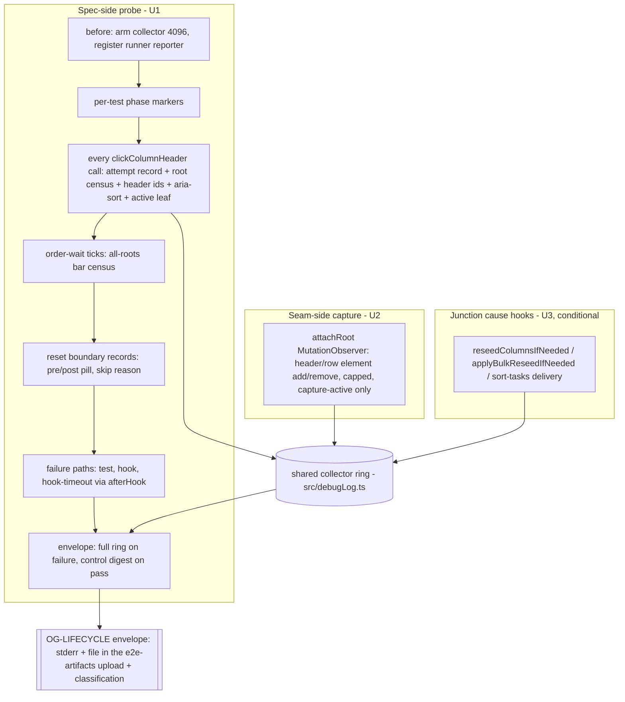
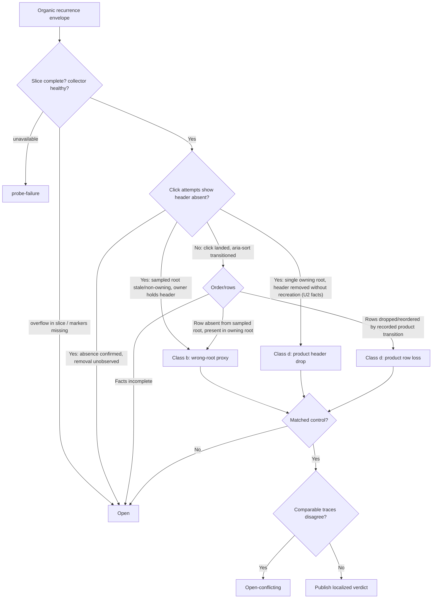

# Gantt Column Sort Nondeterminism Diagnosis - Plan

## Goal Capsule

Diagnose the `gantt-column-sort.e2e.ts` flake — rank 3 of the ranked defect list in `docs/reports/2026-08-19-001-reliability-rediagnosis.md` — without changing the behavior under observation. The record now holds eight instances across three symptom shapes in two tests: `Column header "note.due" did not become clickable` (runs 31909561031, 32000640719, 32204158681 attempt 1, baseline leg 6, 32795673512 attempt 1, and legend-window run 32483108735 dispatch 2 leg 1 — a 1/48 window rate per `docs/reports/2026-08-22-001-reliability-legend-diagnosis.md`), `Expected B before A on due-desc; saw A@0 B@-1` (run 32113805668 attempt 1), and `Did not reach the descending sorted state before reopen` (run 32797728173 attempt 1). The clickability and sort-order shapes both live in the first-mount sort test; the reopen shape lives in the session-only test — a first-mount concentration the trace must preserve. No historical instance carries a lifecycle trace.

This plan builds the bounded diagnostic capability that makes the next organic recurrence classifiable: class (b) weak harness gate/proxy (including wrong-root sampling and the unhealed leaf-steal window), class (d) product re-render nondeterminism (column reseed, bulk reseed, remount), or an explicit `open`/`open-conflicting` result. No fix ships from this plan; a fix requires a separate evidence-backed plan after a boundary settles (governing report, rank-3 entry: "Diagnose header/row lifecycle before writing any fix").

Success means:

- every historical instance's evidence stays byte-for-byte untouched; verification runs never enter a historical denominator;
- an organic recurrence of any of the three symptoms in ordinary CI produces a `[OG-LIFECYCLE]` envelope whose facts satisfy exactly one row of the pre-registered classification table, or an honest `open`;
- no wait, timeout, retry, assertion, readiness contract, workflow masking, or product behavior changes;
- each implementation unit lands as its own 2–4 hour PR; four hours is the re-slice trigger;
- no GitHub issue is created; this plan is the local work-management source.

Stop conditions: at four elapsed hours on any unit, stop at the nearest green checkpoint and re-slice. A session ends at its first merged PR. If evidence invalidates a Key Technical Decision, stop and record the contradiction rather than improvising a new design mid-unit.

---

## Product Contract

### Evidence authority

`docs/reports/2026-08-19-001-reliability-rediagnosis.md` is the governing record: the rank-3 entry, the four-way cause classification (KTD7 taxonomy), and the method requirements (R6: no entry closed "environmental" from an inert diff or passing rerun; harness-vs-src attribution stays open until distinguishing evidence lands). The incident-record entry in `docs/backlogs/backlog.md` ("Reliability incident record — windows since the 2026-08-19 fold") holds the 2026-08-25 instances with their window denominator; it is folded per ruling R3 at plan close and is not edited by this plan except as that fold discipline directs.

The prior diagnosis `docs/solutions/developer-experience/column-sort-e2e-first-mount-header-race.md` (resolved 2026-06-29) is a standing mitigation, not a settled cause: its specific-header readiness gate is still in the spec, and the 2026-08-17 recurrence invalidates the resolution's finality. Its deferred post-click hardening is not the fix — the recorded symptom is that no click lands after a passed gate. U4's report updates that entry's standing.

Durable learnings that bind this plan as constraints, not cause claims:

- `docs/solutions/developer-experience/failure-safe-wdio-lifecycle-diagnostics.md` — the envelope contract: default-off collector, two-outcome envelope, original error always primary, bounded after-failure CDP retrieval.
- `docs/solutions/developer-experience/no-heavy-diagnostics-on-hot-paths.md` — records are cheap scalars; never wrap hot third-party methods.
- `docs/solutions/design-patterns/readiness-signal-keys-on-data-its-consumer-reads.md` and `docs/solutions/developer-experience/gate-e2e-on-cold-index-before-measuring-render.md` — the gate-design rules the classification rows encode.
- `docs/solutions/integration-issues/starter-note-steals-active-leaf-e2e-flake.md` — the unhealed leaf-steal window inside `sortByColumn`'s click loop is a named class-(b) candidate; this plan observes it and must not heal it.
- `docs/solutions/test-failures/wdio-config-reimport-wipes-cross-session-state.md` — cross-session state lives in wdio lifecycle hooks, never module scope; mutation-check the instrument.
- `docs/solutions/conventions/window-cutoff-pattern-self-referential-measurement-reports.md` — cutoffs by run id and attempt count; no top-ups.

### Key Decisions

- KD1. **Rank 3 is the reliability campaign's first unit.** (session-settled: user-approved — chosen over rank 2 `gantt-calendar-items-sources`: rank 2 sits at a bounded stop with its probe already armed, while rank 3 recurred twice on 2026-08-25 and carries the ranked list's open diagnose-first mandate.) Governs R1, R2.
- KD2. **Per-unit landing; the incident-record backlog entry lands on U1's branch.** (session-settled: user-approved — chosen over batching the campaign work: the charter's per-unit cadence is the default and the incident evidence should merge with the first campaign PR.) Governs R11.

### Requirements

Evidence integrity:

- R1. Preserve every historical instance, its run ids, denominators, and symptom text. No report or incident-window entry is edited, rerun, replaced, or topped up.
- R2. Diagnose all three recorded symptom shapes. Classification follows the pre-registered rules in the Planning Contract; harness-vs-src attribution stays open absent distinguishing evidence.
- R3. A class-(b) or class-(d) verdict requires a complete same-mount slice trace and a matched passing control. Timing movement, event absence, or a later pass is insufficient. Incomplete evidence classifies as `open`; complete comparable traces supporting different classes classify as `open-conflicting`.

Probe integrity:

- R4. Production-side diagnostics reuse the existing lifecycle collector in `src/debugLog.ts`. Test code arms, reads, and classifies; new capture logic lives only in the seam module `src/bases/ganttLifecycleDiagnostics.ts`. No second product-side sink.
- R5. The primary WDIO error is always preserved. Diagnostic failure may make evidence incomplete but never replaces, downgrades, or masks the original result, and never turns a passing suite red.
- R6. Do not change waits, retries, timeouts, assertion cadence, action order, readiness behavior, product behavior, or CI/workflow masking. Specifically: do not add the `activateBaseLeaf` heal to `sortByColumn`'s click loop — record its absence as evidence. Bounded observation overhead — recording calls that change no wait, action, order, or readiness decision — is sanctioned and is measured and reported with the baseline (KTD6); it is distinct from the prohibited changes above.
- R7. Every recorded fact is a bounded scalar. List-shaped facts (header ids, bar orders, root censuses) serialize to bounded strings. No U1/U2 record may set `collectorFailure`.

Measurement posture:

- R8. Commission no measurement window, repeat-run dispatch, or top-up beyond two pre-registered exceptions: KTD1's single contingency window, and the single control rerun defined under Matched control (control supply, never a denominator entry). The probe arms in ordinary CI executions of the spec; organic recurrences supply the traces. Verification executions never enter any historical denominator; the instrumented spec is the new comparison baseline, and a matched control must come from an instrumented execution.
- R9. Land no fix, speculative or otherwise. Any fix requires a separate evidence-backed plan.

Repository contract:

- R10. Ranked-defect rules apply (see the review contract in the Planning Contract). U3's candidate files include ranked-defect files; the plan cites their ranking entries, and no ranked-file metric may regress without a stated, trend-report-backed reason.
- R11. Each unit lands as its own squash-merged PR behind the full gate (CI, both local receipts, zero unresolved final-gate threads), 2–4 hours each, four-hour re-slice.

### Acceptance examples

- AE1. **Covers R2, R3.** Given an organic `did not become clickable` failure, when the per-attempt census shows the sampled root is stale or non-owning while a live owning root holds the `note.due` header, then the verdict is class (b) wrong-root proxy. Without the simultaneous owning-root observation, `open`.
- AE2. **Covers R2, R3.** Given the same failure, when the census shows one connected owning root whose header set lacks `note.due` for the full window, and U2's DOM lifecycle records show the header element removed without recreation after the readiness gate passed, then the verdict localizes to a product header drop — class (d) — provided a matched control shows the header surviving the same journey. With removal unobserved (U2 not landed or slice incomplete), `open`.
- AE3. **Covers R2, R3.** Given a `B@-1` or `descending state` failure, when per-tick censuses show the click never landed on any root (attempt recorded, no matching header at click time) while sort state stayed ascending, then the failure is a missed-click consequence — classified by where the header went (AE1/AE2 rules), not as a sort defect.
- AE4. **Covers R2, R3.** Given the same failure, when the click landed (attempt recorded with header present, `aria-sort` transitioned) and the bar order still never reached the expected order while rows were dropped or reordered by a recorded reseed, then class (d), localized to the recorded product transition, with a matched control required.
- AE5. **Covers R3, R5.** Given a recurrence whose envelope reports `diagnosticOutcome: unavailable` or an overflowed failing-test slice, the result is `probe-failure` or `open` respectively — recorded, never guessed, and the original test failure stands unmodified.
- AE6. **Covers R3.** Given two complete comparable recurrences whose first contradictions fall in different classes, the published result is `open-conflicting`; no single-cause fix is commissioned.

### Scope Boundaries

- No product, harness-wait, selector, or readiness change of any kind (R6, R9).
- No measurement window or rerun beyond R8's two pre-registered exceptions (KTD1's contingency window, the Matched-control rerun), and no scheduled cadence; the mechanical-gate nomination from the governing report stays a separate campaign unit.
- No rank-4 (`gantt-default-field-mappings`) dedicated unit: its 2026-08-25 recurrence graduates it to incident-tracked; its click-never-landed shape means this diagnosis's findings likely transfer, which the U4 report must note.
- No GitHub issue; the plan is the work-management source.

#### Deferred to Follow-Up Work

- The eventual fix unit (shape depends on the verdict; the leaf-steal heal inside `sortByColumn`'s loop is the named candidate if class (b) wrong-leaf evidence lands).
- Generalizing the per-attempt click-census helper into shared e2e harness utils if another ranked spec needs it (existing backlog entry under "P8 — e2e / CI infra").
- Renaming the shared runner-reporter global `__tnGanttLegendRunnerFailureReporter` to a spec-neutral name (touches conf + legend + calendar specs; cosmetic).

---

## Planning Contract

### Observation pipeline

The collector ring is the single sink (R4). Arming it also activates every existing product hook site (mount events in `src/bases/register.ts`, `active-leaf-classified`, `svar-ready` with its `apiRebound` fact, viewport settlement) — those records are part of the trace for free.

### Diagnostic contract

The spec arms the default-off collector from its own `describe` for every ordinary execution; no WDIO setting, product config, or workflow enables it. Pre-registered probe design, each item binding the implementation:

- **Capacity and lifetime:** one suite-long ring at capacity 4096 (the collector maximum). Readiness-poll evidence stays Node-side (the calendar-sources `record:false` pattern) so six 90-second gates do not flood the ring. Suite-long lifetime preserves the inter-test windows where a reseed cause for the next test's failure lives. U1 carries a worst-case record budget — waits × tick counts × census records, click-attempt records, hook-site records, and U2's caps, across the full five-test journey including failure paths — asserted against 4096 with margin by a unit test, and names which inter-test boundaries survive worst-case eviction.
- **Phase vocabulary (pre-registered):** `suite-before`, `before-each:<n>:<title>`, `test:<title>`, `readiness-passed:<n>`, `reopen-detach-start`, `reopen-detached`, `terminal-failure`, `teardown`. The reopen markers bracket the deliberate AE3 remount so any mount sequence outside them is product-initiated. The `readiness-passed` marker is recorded into the ring the moment each gate satisfies (raw polls stay Node-side), so post-gate removal is decidable from the slice alone.
- **Per-attempt click facts (every `clickColumnHeader` call site, not only `sortByColumn`'s loop):** attempt ordinal; a census of every `.og-bases-gantt` root — mount token, connected, visible, owns-Base, and whether that root's header set holds `note.due` — with the sampled root identified; the sampled root's `data-header-id` values as one bounded string; whether the click landed; `aria-sort` before and after; active-leaf view type; and whether a markdown (starter) leaf exists. One `browser.execute` per attempt returns click result plus facts. The all-roots header fact is what makes AE1's wrong-root verdict provable rather than inferable.
- **Order-wait censuses:** every 15-second order/state wait in the spec — the `waitUntilOrExplain` sites and the plain `browser.waitUntil` descending-state waits (including the one that throws the recorded reopen symptom) — additionally records an all-roots bar census per tick inside its condition, with no timeout, interval, or throw-behavior change. For `waitUntilOrExplain`, recording happens in the condition; `explain()` stays browser-call-free per that helper's contract.
- **Reset boundaries:** the `beforeEach` records per-root `resetPill` and `aria-sort` before and after `resetSortIfActive`, plus an explicit reset-skipped fact naming the reason, so leaked sort state from a wrong-root skip cannot masquerade as next-test nondeterminism.
- **Failure retrieval:** `after-failure-only` — on a primary failure go directly to the bounded CDP path (`captureLifecycleEnvelope`, 7.5-second deadline); never re-enter the possibly-wedged WebDriver channel first. Envelope cap 3, keyed by error identity; classification tolerates duplicate-origin envelopes for one failure. Hook failures are covered by registering the existing shared runner reporter global (`__tnGanttLegendRunnerFailureReporter` — reuse the exact name the conf calls) and by new `afterHook` wiring in `test/wdio/wdio.conf.mts` mirroring `afterTest`. Pre-registered fact: the `before` hook's worst-case internal budgets (60s TaskNotes API + 60s subtask relationships + 90s readiness, before reload time) already exceed the 180-second mocha hook timeout, so a hook timeout is an expected organic failure shape — the `afterHook` envelope path exists to capture it. Do not change the budgets.
- **Pass-path emission:** a green suite emits a compact control digest — per-test click-landed stats, root censuses, checkpoint booleans, a bounded DOM-lifecycle summary once U2 lands, overflow/collector flags, and the control-identity stamp defined under Matched control — exactly the fields the classification rows and control matching consume, not the full ring. Deviation from the calendar-sources full-envelope precedent, argued: this ring is 16× larger and matched controls need only the digest fields.
- **Collector-absent policy:** if `__tnGanttLifecycle` is missing after reload, degrade — run the suite unarmed and emit the loud retrieval-failure line. Classification counts `diagnosticOutcome: unavailable` as `probe-failure`, a distinct trended bucket, never `open` (AE5).
- **Slice-scoped completeness:** a verdict consumes the failing test's slice between its own phase markers. Required: that slice's boundary markers present, no overflow observed within the slice, no `collectorFailure`. Overflow that evicted earlier slices is reported as a fact, not a disqualifier.
- **Matched control:** same full build SHA, fixture and plugin versions, Base path, ordered suite journey, instrumented spec version, trace schema, runtime fingerprint (runner image, Node, Obsidian/Electron/ChromeDriver, TaskNotes version — read from the job log as the legend report did), and boundary under comparison; reaches the same phase with terminal prerequisites; complete single-mount slice. The instrumented spec is the new baseline (R8); pre-instrumentation executions are never controls. **Control supply is pre-registered, not improvised:** on an organic failure, rerun the failing run once at the same commit (`gh run rerun --failed`); verify the rerun checked out the identical merge SHA (if the base moved and the SHA differs, the rerun does not qualify); harvest its control digest as the matched control. That rerun is control supply — never a denominator entry, never a historical-evidence edit. Every digest carries a control-identity stamp (the fields above, as scalars) so matching is mechanical, and U4 cites the matched control beside any verdict.

### Classification algorithm

The first contradictory boundary owns the localization. Later missing states are consequences. Click-attempt aggregation is pre-registered: the earliest attempt whose facts contradict passed readiness owns the classification; a trace mixing absent-header and later landed attempts classifies by that earliest causal attempt, with the recovery recorded as a fact, never re-litigated by later attempts. The leaf-steal window (markdown leaf present, active leaf not the Base, no heal inside the click loop) is positive class-(b) evidence only when the owning root is simultaneously observed correct.

### Key Technical Decisions

- KTD1. **Armed probe in ordinary CI first; one pre-registered contingency window.** The legend diagnosis's 48-leg window caught zero legend recurrences but did catch one column-sort instance (1/48) plus 47 same-SHA green legs — evidence that a window can supply both recurrences and matched controls for this spec, at billed cost. Ordinary CI is still the primary supply (2/7 executions failed on 2026-08-25; zero marginal cost), so no window is commissioned up front. Contingency, pre-registered now rather than decided after an outcome: if no complete organic trace lands within 40 instrumented ordinary-CI executions or six weeks of U2's merge, whichever comes first, a single `e2e-repeat.yml` dispatch (`executions=24`) at a pinned instrumented SHA is authorized under the window-cutoff convention. Covers R8.
- KTD2. **One probe covers the whole spec journey.** The three symptoms live in two tests sharing the same root/header/sort-state observation surface, with two shapes concentrated in the first-mount test; per-symptom probes would triple the machinery and miss cross-test causes (leaked sort state, inter-test reseeds). Covers R2.
- KTD3. **U2 (seam-internal DOM lifecycle observation) is authorized up-front, sequenced second; U3 (junction cause hooks) stays evidence-activated.** Spec-side polling proves absence but cannot observe the removal moment; without it, every genuine-absence recurrence dead-ends at `open` (AE2), wasting recurrences. U2 confines itself to the seam's existing `attachRoot` — a capped, capture-active-gated childList MutationObserver recording only `[data-header-id]` and `.wx-bar[data-id]` adds/removes as scalar facts — adding zero junction hook sites, zero new seam public exports, and leaving the pinned budgets in `test/unit/ganttLifecycleSeam.test.ts` unchanged. U3's junction growth is deferred until a traced recurrence shows a genuine drop whose product cause the existing `svar-ready`/mount records cannot attribute.
- KTD4. **Reuse the existing envelope machinery.** `test/specs/helpers/lifecycleTrace.ts` (bounded CDP retrieval, two-outcome envelope, `[OG-LIFECYCLE]` emission) and the collector in `src/debugLog.ts` are the mechanisms; the sort spec consumes them. Copying calendar-sources machinery the sort spec does not need (config-action history matching) is forbidden — dead completeness criteria would spuriously mark traces incomplete. Covers R4.
- KTD5. **Every click call site is instrumented.** The spec's second and third `clickColumnHeader` calls are fire-and-forget today; a vanished header silently no-ops them, and an ascending no-op is order-indistinguishable from Base order — the likeliest mechanism behind the `B@-1` and `descending state` symptoms. Recording only `sortByColumn`'s loop would structurally force those symptoms to `open`. Covers R2, AE3/AE4.
- KTD6. **Probe-effect baseline and suppression check.** Per-attempt executes add measurable per-tick latency; the instrumented spec is declared the new baseline, controls come only from instrumented runs, and U4 records the instrumented spec's first green executions — with the measured observation overhead — as that baseline. Suppression is checked, not assumed away: the instrumented spec's per-execution failure frequency is compared against the historical 2–7% band, and a sustained zero across 40 instrumented executions publishes as "no recurrence — probe suppression not excluded", never as plain improvement. Covers R6, R8.

### Review contract (ranked-defect files)

U3's candidate files include one ranked-defect file: `src/bases/GanttContainer.svelte` (rank 1) per `docs/reports/2026-08-15-001-maintainability-rediagnosis.md` and `maintainability-registry.json`; its other product candidate, `src/bases/svarInterceptors.ts`, is not ranked. `src/bases/register.ts` (rank 2) is not a U3 candidate — its existing mount hooks already capture the register-side lifecycle. The repository invariant and placement rule apply in full: no diagnostics or instrumentation concern moves into a ranked-defect file except through the seam module; junction files keep only call hooks; the lifecycle-capture names of the debug-log module are imported only by the seam. If U3 activates, its PR states the growth reason against the trend measurement's output, updates the pinned hook-site budget constants in `test/unit/ganttLifecycleSeam.test.ts` deliberately, adds any new seam public export to `seamPublicNames` in `maintainability-registry.json`, and its Definition of Done requires no ranked-file metric regression — or names the regression with its dated-trend-report-backed reason. U1 touches no ranked file; U2 touches only the seam module, which is not ranked.

### Landing strategy

One PR per unit, squash-merged on green (CI + both local receipts at the pushed tip + zero unresolved hosted final-gate threads). U1's branch also carries this plan document and the incident-record backlog entry already in the working tree (KD2). U4 may cluster with U2 only under the calendar-sources precedent: if U2's verification produces no organic recurrence, U4 immediately closes the diagnosis as `open — no traced recurrence` and splitting would strand the capability without its dated outcome — the cohesion reason required by charter E2/E3. U3 is not pre-authorized work; it activates only on the evidence named in KTD3.

---

## Implementation Units

### U1. Test-owned click and journey probe (first PR, 2–4 hours)

- **Goal:** every execution of the sort spec produces the per-attempt, per-tick, and boundary facts the classification rows consume, and every failure path — test body, hook, hook timeout — yields an envelope with the original error primary.
- **Requirements:** R2, R4–R8 (KD2; KTD2, KTD4, KTD5).
- **Dependencies:** none.
- **Files:** `test/specs/gantt-column-sort.e2e.ts`, `test/specs/helpers/columnSortDiagnosis.ts` (new), `test/specs/helpers/lifecycleTrace.ts` (consume; extend only if the control-digest emission needs a shared entry point), `test/wdio/wdio.conf.mts` (`afterHook` wiring mirroring `afterTest`), `test/unit/columnSortDiagnosis.test.ts` (new).
- **Approach:**
  1. Arm the collector (capacity 4096) and register the shared runner reporter global in `before`; set the pre-registered phase markers; deregister and stop in `after`.
  2. Wrap every `clickColumnHeader` call site with the recording wrapper (one `browser.execute` returning click result plus the per-attempt fact set from the Diagnostic contract). Original click mechanism, order, and timing unchanged.
  3. Extend every 15-second order/state wait with the all-roots bar census — the `waitUntilOrExplain` sites and the plain `browser.waitUntil` descending-state waits — recording in each condition; keep `explain()` browser-call-free.
  4. Record reset-boundary facts and the `readiness-passed` marker in `beforeEach`; keep readiness-poll evidence Node-side.
  5. Add the pure classification helper implementing the algorithm, aggregation rule, and completeness rules; emission per the failure/pass split, and persist every envelope and control digest as a file inside the `.wdio-results` tree so the existing e2e-artifacts upload carries it beyond log expiry.
  6. Add `afterHook` wiring in the conf; the worst-case `before` budgets exceed the 180-second hook timeout (pre-registered fact in the Diagnostic contract), so rehearse that a hook-level failure still yields the envelope; do not change the budgets.
- **Execution note:** verify the failure path first — inject a synthetic hook failure locally and prove the envelope arrives with the original error primary before polishing checkpoint breadth.
- **Patterns to follow:** `test/specs/helpers/calendarItemsSourcesLifecycle.ts` (arming, Node-side poll evidence), `test/specs/helpers/lifecycleTrace.ts` (envelope, CDP fallback), `test/specs/gantt-legend.e2e.ts` (runner-reporter registration).
- **Test scenarios:**
  - Covers AE1. A census fixture with a stale sampled root and a live owning root holding the header classifies class (b) wrong-root; the same fixture without the owning-root observation stays `open`.
  - Covers AE3. A fixture where a non-loop click attempt records header-absent and sort state stays ascending routes to the header-absence rules, not a sort verdict.
  - Covers AE5. `diagnosticOutcome: unavailable` classifies as `probe-failure`, never `open`; an overflowed failing slice classifies `open` with overflow named.
  - A slice missing its boundary phase markers refuses every verdict.
  - Overflow recorded outside the failing slice does not disqualify the slice.
  - No record produced by the probe sets `collectorFailure` (drive the recording paths against `createGanttLifecycleCollector` with list-shaped inputs; assert bounded-string serialization).
  - Envelope dedup: two envelopes keyed to one error identity classify once.
  - A synthetic primary hook failure with failed ordinary retrieval exercises the bounded CDP fallback and preserves the original error as primary.
  - The worst-case record budget (all sources, five tests, failure paths) fits capacity 4096 with margin; the named inter-test boundaries survive worst-case eviction.
  - Mixed click attempts (absent-header then landed) classify by the earliest causal attempt, with the recovery recorded as a fact.
- **Verification:** full bare `npx jest` green; focused `e2e:local` run of the sort spec green with the control digest visible in stderr; the injected-failure rehearsal shows the envelope; no wait/assertion diffs in the spec beyond recording.

### U2. Seam-internal header/row DOM lifecycle observation (second PR, 2–4 hours)

- **Goal:** the removal and recreation moments of the `note.due` header and task bars are observable facts, so genuine-absence recurrences can reach a class-(d) verdict instead of dead-ending at `open`.
- **Requirements:** R4, R6, R7, R10 (KTD3).
- **Dependencies:** U1 (the census facts its records join against).
- **Files:** `src/bases/ganttLifecycleDiagnostics.ts`, `test/unit/ganttLifecycleDiagnostics.test.ts`.
- **Approach:** extend `attachRoot` with a childList-only MutationObserver filtered to `[data-header-id]` and `.wx-bar[data-id]` additions/removals. Records carry element kind, stripped id, add/remove, and sequence — scalars only. Gate on `isGanttLifecycleCaptureActive` so the observer does no work unarmed; cap records per mount; disconnect in the existing disposer path. No new junction hook sites, no new seam public exports, pinned budgets untouched.
- **Test scenarios:**
  - Covers AE2. Header element removed and not re-added yields removal-without-recreation facts joinable to U1's census by mount token and sequence.
  - Adds/removes of non-matching elements record nothing.
  - Unarmed, the observer performs no recording work.
  - The record cap holds under churn and caps as a recorded fact, not silent loss.
  - The disposer disconnects the observer; no records after dispose.
- **Verification:** full bare `npx jest` green including the seam structural test with unchanged budget constants; focused `e2e:local` sort-spec run shows DOM lifecycle records in the digest; boundary lint gate green.

### U3. Junction cause hooks (conditional; activates on evidence)

- **Activation:** a traced organic recurrence classified as a genuine header/row drop whose product cause the existing `svar-ready`, mount, and U2 DOM records cannot attribute.
- **Requirements:** R4, R10 (KTD3; review contract).
- **Candidate files, narrowed at activation:** `src/bases/GanttContainer.svelte` (`reseedColumnsIfNeeded`, `applyBulkReseedIfNeeded` call hooks), `src/bases/svarInterceptors.ts` (sort-tasks delivery), `src/bases/ganttLifecycleDiagnostics.ts`, `test/unit/ganttLifecycleSeam.test.ts` (deliberate budget update), `maintainability-registry.json` (if a new seam export lands).
- **Approach:** call hooks only in junction files; capture logic in the seam. The activating PR carries the full ranked-defect argument per the review contract.
- **Test expectation:** defined at activation with the evidence in hand.

### U4. Publish the bounded diagnosis (final documentation PR)

- **Goal:** a dated report that makes the capability, rules, and outcome auditable after CI logs expire.
- **Requirements:** R1–R3, R8 (KTD6).
- **Dependencies:** U1, U2.
- **Files:** `docs/reports/2026-MM-DD-00N-reliability-column-sort-diagnosis.md` (new), `docs/solutions/developer-experience/column-sort-e2e-first-mount-header-race.md` (annotate the resolution as a standing mitigation superseded-in-finality by the recurrence, pointing at the new report), `docs/backlogs/backlog.md` (the standing on-recurrence procedure entry, plus whatever the R3 fold discipline directs).
- **Approach:** mirror the legend/calendar-sources trace-ledger shape: the eight historical instances by run id incorporated by reference; the pre-registered classification table, aggregation rule, and phase vocabulary copied as the binding rules; the instrumented-baseline declaration (first green instrumented executions with measured observation overhead, KTD6); the window cutoff by run id and attempt count; the outcome — a localized verdict only when an organic CI recurrence supplied a complete qualifying trace (verification executions validate capture and never ground a verdict), otherwise `open — no traced recurrence` with the probe armed. That open outcome is non-terminal: the rank-3 entry stays open, and the report pre-registers the on-recurrence procedure — on any red sort-spec CI run, download the envelope from the e2e-artifacts, trigger the single control rerun per Matched control, classify per the table, and fold the verdict — recorded as a standing backlog entry so the path is mechanism, not memory. Report a sustained-zero frequency against the historical band per KTD6's suppression rule. Note the rank-4 transfer observation from Scope Boundaries.
- **Test expectation:** none — documentation unit; its content is verified against the classification helper's actual output shapes.
- **Verification:** report facts recompute from the sources of record; no historical denominator edited.

---

## Verification Contract

| Gate | Command / check | Applies to |
|---|---|---|
| Unit suite | full bare `npx jest` (never piped) | U1–U3 |
| Focused e2e | `npm run e2e:local` with only the sort spec active; move `test/specs/_local-*.e2e.ts` aside first, restore after | U1–U3 |
| Failure-path rehearsal | injected hook failure produces the envelope with the original error primary | U1 |
| Seam boundary | structural seam test and boundary lint gate green; budget constants unchanged (U1/U2) or deliberately updated with stated reason (U3) | U2, U3 |
| Ranked-file metrics | per-PR trend measurement output read against the review contract; no unexplained ranked-file growth | U3 |
| Review gates | ce-code-review receipt + cross-model peer receipt at the exact pushed tip; zero unresolved hosted final-gate threads | all PRs |

Baseline caution: `e2e:local` rebuilds from the working tree — take any on-main comparison traces before editing source, and make no source edits while a baseline run executes.

## Definition of Done

- U1 and U2 merged; every failure path of the sort spec yields an envelope; a green run yields the control digest; no wait, assertion, or behavior change anywhere in the diff (R6).
- The classification helper refuses every verdict its completeness rules disallow, proven by unit tests.
- U4's dated report published with the pre-registered rules, the instrumented baseline, the window cutoff, and the honest outcome; the on-recurrence procedure recorded as a standing backlog entry; an `open — no traced recurrence` outcome leaves the rank-3 entry open with the probe armed; the prior solutions entry annotated.
- No ranked-file metric regresses; U1/U2 leave the seam budgets and registry untouched; any U3 change carries its deliberate update and argument (R10).
- No fix landed (R9); no historical evidence edited (R1); abandoned experimental code removed from every diff.
- Each unit landed as its own PR on green with both receipts and zero unresolved final-gate threads (R11).
