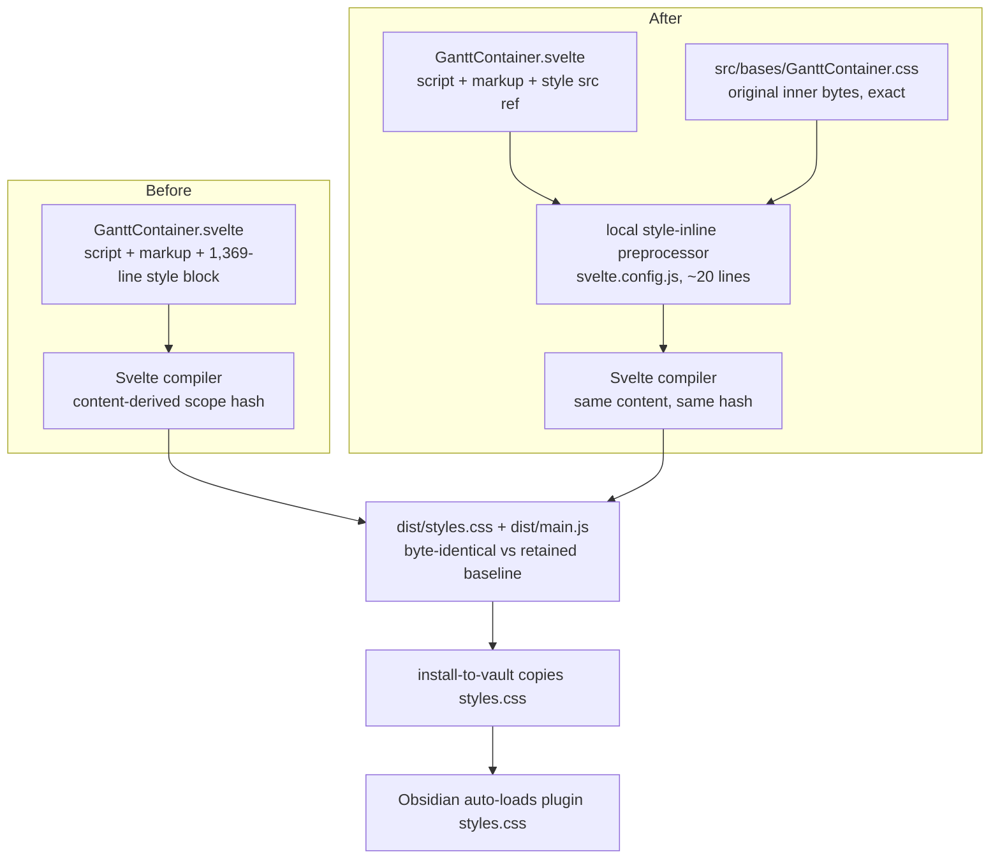

# GanttContainer Style-Block Extraction - Plan

## Goal Capsule

- **Objective:** Move the entire ``) and no inline CSS rules. That style-node replacement is the only sanctioned edit to the component.
- R2. The extraction is behavior-preserving with a mechanical proof: `dist/styles.css` and `dist/main.js` (sourcemap content excluded) are byte-identical to a named baseline receipt captured from the pre-change tree and retained for both units' comparisons.
- R3. Zero CSS rule edits, and exact-bytes relocation: `GanttContainer.css` holds the original inner bytes of the style block exactly — splice whitespace included, no added header comment — because the Svelte scope-hash class derives from the style content, so any added byte re-rolls every compiled selector. Pre-existing style defects discovered during the move (e.g., the duplicated touch-rule group at ~2784–2797 / ~2960–2969) are recorded in `docs/backlogs/backlog.md`, never silently repaired.
- R4. A mechanical guard prevents regression of the extraction's shape: style re-accretion into the component AND removal of the preprocessor wiring both fail a structural unit test (same pattern as the lifecycle-seam test).
- R5. The PR body leads with the reading-cost and churn-ownership argument; ranked-file metric deltas are reported against the trend measurement output as bookkeeping, not as the improvement claim (see Review contract).

### Scope Boundaries

- Out: any script change, and any markup change other than the single style-node replacement R1 sanctions — the seam test pins exact `$effect` shapes and 17 diagnostic call sites; the PR diff must confine component changes to the style node.
- Out: the runtime-injected per-view stylesheets (`style[data-og-treatment]`, `style[data-og-calendar]`, lines ~666–719) and the `--og-context-opacity` effect — a separate dynamic subsystem with an open CSP issue (#183).
- Out: the SVAR theming mechanism (`Willow`/`WillowDark` remount) — standing rule: never deviate from SVAR's documented API without sign-off.
- Out: style blocks of the other 13 `.svelte` components — no precedent-setting sweep; this slice is rank-1 only.

#### Deferred to Follow-Up Work

- Deduplicate the repeated touch-rule group once the extraction has landed (record in backlog during U2).
- Diff-sync coordination extraction — the report's next sequenced rank-1 slice, its own plan.

---

## Planning Contract

### Key Technical Decisions

- KTD1. **Compile-time inlining via a build-local style-inline preprocessor** (session-settled: user-directed — chosen over adding `svelte-preprocess` as a devDependency: its default TypeScript transformer engages on every component's `<script lang="ts">`, v6 requires `verbatimModuleSyntax` which no tsconfig in this repo sets, and the sole feature this plan needs is ~20 config-local lines). A markup preprocessor defined in `svelte.config.js` matches the exact `` tag in `GanttContainer.svelte`, replaces it with a style tag holding the file's exact bytes, and returns the CSS file in `dependencies` so watch builds rebuild on CSS edits. Content, scope-hash class, specificity, and rule order are unchanged, so compiled output stays byte-identical. Second rejected alternative: plain CSS import (the `src/release/release-notes.css` pattern) — it drops the scope hash from every compiled selector, costing one specificity class on all ~115 rules, unscoping ~30 plain selectors (`.zoom-btn`, `.gtcell`, …) into app-wide globals, and re-rolling the cascade against SVAR's own Svelte-hashed styles (the block's comments at ~2819 and ~3382 document that this arithmetic is deliberately tuned).
- KTD2. **Fallback mechanism and failure triage:** a byte-diff confined to the scope-hash class string indicates content or splice drift in the CSS file — correct the bytes in place; it is not a mechanism failure. A broader unexplained diff is a mechanism failure: fall back to `svelte-preprocess` configured `{ typescript: false }` (verify at that point that style-`src` inlining stays active under that config), same receipts. Narrowing to the certified pair is not a fallback — no mechanism-independent reason for it survived research.
- KTD3. **Guard shape:** a structural Jest test asserting (a) the component's single ``.
  3. Build and byte-compare `dist/styles.css` and sourcemap-stripped `dist/main.js` against the U1 baseline receipts. Triage any difference per KTD2 (hash-only drift → fix bytes in place; broader diff → fallback).
  4. Add the structural guard test (KTD3, all three assertions).
  5. Record in the backlog: the duplicated touch-rule group (and any other defect noticed in passing — change nothing, R3), plus two campaign-method adjustments from the 2026-08-27 Modern Software Engineering alignment audit, for the maintainer's next re-measure ruling: (a) add a testability-pressure input to the ranking (count behaviors per ranked file provable only at the e2e tier — principle 5's proxy; this correctly scores relocation slices as zero-design-gain and weld extractions like `initGantt`/diff-sync as the high-value ones), and (b) tie at least one success claim in each future trend report to an outcome class (incident cost, flake instances, false-greens surfaced) rather than structural deltas alone.
- **Execution note:** fastest evidence first — build + byte-compare before any test suite; then the computed-style e2e quartet; full suites last.
- **Patterns to follow:** `test/unit/ganttLifecycleSeam.test.ts` for source-structural assertions.
- **Test scenarios:**
  - Guard: `GanttContainer.svelte` contains exactly one `<style>` tag, it carries `src="./GanttContainer.css"`, and its inner content is empty (assert the expected values, not merely absence of a pattern).
  - Guard: `src/bases/GanttContainer.css` exists and contains sentinel selectors from both certified concerns (`.og-bases-gantt`, a `.wxi-` mask rule, a zigzag custom-property definition) — the file being present-but-empty must fail.
  - Guard: `svelte.config.js` source contains the style-inline preprocessor wiring (assert the expected marker/value).
  - Regression: full bare `npx jest` — the seam test's 17-call-site and `$effect`-shape pins must pass untouched.
- **Verification:** byte-identical artifacts per R2; the component's PR diff confined to the style-node replacement; the four computed-style e2e specs green locally (`gantt-calendar-items-recurring`, `gantt-legend`, `gantt-collapse-chevron-contrast`, `gantt-resizer-arrow-contrast`); light/dark after-captures matching U1's baseline state, attached to the PR as before/after pairs; watch-mode rebuild triggers on a CSS-file edit (convenience check, non-gating); full jest green.

---

## Verification Contract

| Gate | Command / evidence | Applies to |
|---|---|---|
| Baseline receipts | pre-change `npm run build`; retained copies + SHA-256 of `dist/styles.css` and sourcemap-stripped `dist/main.js`; baseline light/dark screenshots with fixed state | U1 step 1–2 |
| Build + byte-compare | `npm run build`, then byte-compare both artifacts against the retained baseline receipts | U1, U2 |
| Diff confinement | the PR diff for `GanttContainer.svelte` touches only the style-node replacement | U2, PR |
| Type check | `npm run typecheck` | U1, U2 |
| Unit tests (full, bare, never piped) | `npx jest` | U1, U2 |
| Computed-style e2e quartet | `npm run e2e:local` scoped to `gantt-calendar-items-recurring`, `gantt-legend`, `gantt-collapse-chevron-contrast`, `gantt-resizer-arrow-contrast` (confirm the spec-scoping flag syntax at run time) | U2 |
| Visual proof | before/after light + dark screenshot pairs from the same vault fixture, viewport, and theme state (`obsidian plugin:reload` from PowerShell only) | U2 |
| Trend measurement | `node scripts/maintainability-trend.mjs` output staged/pasted into the PR body | PR |
| Local review receipts | `node scripts/check-review-receipts.mjs record ce-code-review`; cross-model peer review with `--record` | PR |
| Hosted final gate | `@codex review` comment; read thread content via GraphQL; zero unresolved threads | PR |

---

## Review contract (ranked-defect file obligations)

- **Ranking citation:** `GanttContainer.svelte` is entry 1 of the ranked defect list in `docs/reports/2026-08-15-001-maintainability-rediagnosis.md` (18.7% churn × 30 concerns; 1,369 style lines; the report's own sequencing names the style block as this slice).
- **Argued touch (stated accurately):** the move extracts the two enumerated zero-coupling style concerns (~1,000 lines: zigzag/occupancy visual system, SVAR icon-font replacement) plus ~370 lines of container/maximize/zoom/marker CSS whose script halves remain in the component — future edits to those features span both files, accepted under KD1's one-PR economy. Both ranked metrics improve (line count and enumerated concern count); the concern delta is a **source-level relocation, not a seam extraction** — runtime structure and cascade behavior are unchanged by design — and the trend entry should carry that annotation. No growth occurs, so no exception record is required.
- **Improvement claim:** reading cost and churn ownership — script readers stop paying 1,369 style lines, and future style churn lands in `src/bases/GanttContainer.css` instead of the rank-1 file. The line delta is trend bookkeeping, not the argument.
- **Invariant (carried):** no PR moves a diagnostics or instrumentation concern into a ranked-defect file except through its seam module; a PR that grows a ranked-defect file's line count or concern count states the reason in its description, read against the trend measurement's output. This PR grows nothing; the trend output lands in the PR body regardless.
- **Placement rule (carried):** instrumentation and diagnostics live in their own module behind the seam; views and junction files keep only call hooks; the debug-log module's lifecycle-capture names are imported only by the seam. The extracted CSS is not a diagnostics concern and imports nothing, so the rule is carried, not implicated.

---

## Risks & Dependencies

- **Local preprocessor defect** — detected mechanically at U1 step 4 (wiring no-op) and U2 step 3 (inline correctness); triage and fallback per KTD2.
- **Editor tooling** — `svelte-check` and the language server load `svelte.config.js`, so the preprocessor applies there too; the gate is `npm run typecheck` staying green. Degraded editor hover on styles is acceptable.
- **Nondeterministic build output** — the U1 no-op compare doubles as the determinism check: a false failure there means the build is nondeterministic, to be distinguished from a mechanism failure before invoking KTD2.
- **Armed-spec flake during e2e runs** — a red armed-spec run triggers the Goal Capsule stop condition, not a local rerun.

---

## Definition of Done

- R1–R5 hold; both units merged as one squash-merged PR on green (CI + both local receipts + zero unresolved hosted-gate threads).
- PR body leads with the reading-cost/churn-ownership argument; byte-identical receipts (both artifacts vs the retained baseline, hashes quoted), before/after screenshot pairs, and the trend measurement output are attached; the metric deltas (≈ −1,367 lines, −2 concerns, annotated as source-level relocation) are reported as bookkeeping; no ranked-file metric regresses.
- Guard test green (all three assertions); seam test untouched and green; full bare `npx jest` green; component PR diff confined to the style-node replacement.
- Backlog entry exists for the duplicated touch-rule group (and any other parked defect).
- No leftover experimental or dead-end code in the diff.

---

## Sources & Research

- `docs/reports/2026-08-15-001-maintainability-rediagnosis.md` — rank-1 entry, Measurement 2 concern inventory (including which style lines belong to script concerns), trend baseline semantics.
- `docs/solutions/integration-issues/svar-gantt-injected-css-scoped-specificity.md` — the specificity arithmetic KTD1 protects; CSP issue #183 against runtime injection.
- `docs/solutions/integration-issues/svar-shared-classname-selector-leak.md` — why unscoping shared `.wx-*`/`.wxi-*` names is dangerous (KTD1's second rejected alternative).
- `docs/solutions/integration-issues/svar-gantt-datauri-currentcolor-glyph-invisible.md` — the icon-font mask rules are load-bearing functionality; the contrast e2e pair guards them.
- `docs/solutions/workflow-issues/run-behavior-neutral-refactoring-as-releasable-reviewed-slices.md` — the no-opportunistic-fixes rule (R3) and fastest-evidence-first ordering (U2 execution note).
- `src/release/release-notes.css` + `src/release/ReleaseNotesView.ts:22` — the repo's only plain-CSS-import precedent, and why it is insufficient here (unscoped delivery).
- svelte-preprocess README and v6 migration guide — documents `<style src>` external-file support; evaluated 2026-08-27 and rejected as primary (KTD1: default TypeScript transformer hazard, `verbatimModuleSyntax` requirement); retained as KTD2's configured fallback.
- Svelte compiler docs (`cssHash`) — the scoped-class name derives from the style content/filename, the basis of R3's exact-bytes rule.
