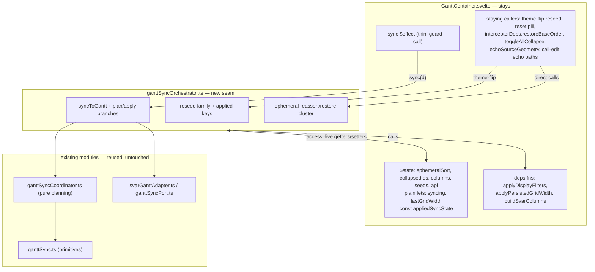
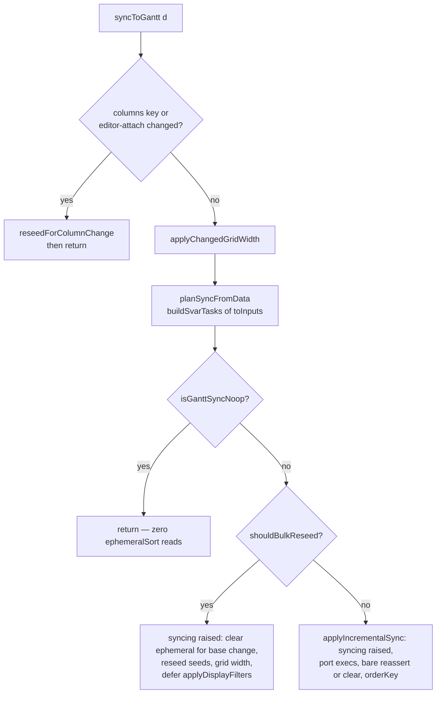

# GanttContainer Diff-Sync Coordination Extraction - Plan

## Goal Capsule

- **Objective:** extract the diff-sync coordination concern from `src/bases/GanttContainer.svelte` into an owned, unit-testable seam module — a behavior-preserving refactor that cuts the concern's coupling to the component and gives it the unit coverage it has never had. This is the last sequenced rank-1 slice of the maintainability campaign.
- **Authority hierarchy:** AGENTS.md and the engineering charter bind; this plan operationalizes them for this slice. Where this plan and current code disagree on an anchor, re-derive from code — baseline line anchors in cited reports are stale by design.
- **Execution profile:** one PR per unit (U1 → U2 → U3, dependency-ordered), squash-merged on green; a session ends at its first merged PR. Test-first: each unit's module tests are written to pin current behavior before the move — red/green brackets each deletion of a component-side original.
- **Stop conditions:** a red armed-spec CI run (`gantt-column-sort`, `gantt-calendar-items-sources`, `gantt-legend`) outranks this work — download the `og-lifecycle` envelope from the run's `e2e-artifacts` before any rerun, then follow `docs/reports/2026-08-26-001-reliability-column-sort-diagnosis.md`. A unit exceeding ~4 hours to shippable triggers re-slicing. Abort to the nearest green checkpoint on context compaction or state-class errors.

---

## Product Contract

### Summary

Move the diff-sync coordination logic — sync orchestration, reseed family, and ephemeral-sort reassert/restore — out of `src/bases/GanttContainer.svelte` into a sibling seam module beside `src/bases/ganttSyncCoordinator.ts`, wired through a live accessor bridge. Component state, effects, and thin hooks stay; the coordination logic becomes provable at the unit tier for the first time.

### Problem Frame

`src/bases/GanttContainer.svelte` is the maintainability campaign's rank-1 ranked-defect file (`docs/reports/2026-08-15-001-maintainability-rediagnosis.md`, ranked list entry 1: 18.7% churn × 30 concerns × 4 pressure-band functions × the `initGantt` weld). The report sequences its slices: interceptors (done, PR #453), style block (done, PR #459), then diff-sync coordination — this plan. The 2026-08-27 Farley alignment audit (`docs/reports/2026-08-27-001-farley-alignment-audit.md`) scores this slice, with the `initGantt` weld, as where the campaign's genuine design-level gains live: unlike the style relocation (reading-cost economics), the diff-sync logic is coupled to component state through mutable flags and closures, and none of its orchestration — branch ordering, the `syncing` echo bracket, three timer deferrals — has unit coverage. "If our tests are difficult to write, it means that our design is poor" is the audit's testability instrument; this concern is the file's clearest instance.

### Requirements

**Extraction**

- R1. The diff-sync coordination logic — `syncToGantt` orchestration with its plan/apply helpers, the bulk-reseed and incremental branches, the reseed family, the ephemeral-sort reassert/restore cluster, and the coordination surface of echo suppression and lifecycle/generation tracking (the `syncing` bracket semantics and generation-aware timer behavior crossing the bridge) — lives in an owned seam module; the component keeps its `$state`, its `$effect`s, the `syncing` flag, and thin call hooks.
- R2. Behavior is preserved exactly: branch orderings, both `syncing` call conventions, the three `setTimeout(0)` deferrals with their fire-time guards and no added cancellation, echo tagging, bulk-reseed threshold semantics, and object/Map identity across the seam (see KTD3–KTD5).

**Testability**

- R3. The extracted logic is provable at the unit tier without mounting any component: module unit suites cover every branch and both timer conventions, and the sync effect's reactive dependency contract is pinned by the read census plus source-shape assertions over the effect and the access literal, with one e2e assertion for the composed behavior (KTD6).

**Reuse and guards**

- R4. Existing machinery is reused, never duplicated: `src/bases/ganttSync.ts` (untouched — stopping-rule endpoint), `src/bases/ganttSyncCoordinator.ts`, `src/bases/ganttSyncPort.ts`, `src/bases/svarGanttAdapter.ts`.
- R5. Guard tests hold: `test/unit/ganttLifecycleSeam.test.ts` passes unchanged (all 17 pinned `lifecycleDiagnostics.*` sites stay in the component; the view's debugLog import allowlist stays exactly `['dlog']`); `test/unit/ganttContainerStyleExtraction.test.ts` is untouched; `test/unit/svarInterceptors.test.ts` is updated assertion-preserving only where a pinned binding shape genuinely changes.
- R6. The ranked-defect contract is satisfied: no ranked-file metric regresses, and each PR body states its improvement claim in coupling/testability terms with metric deltas as bookkeeping (Planning Contract § Ranked-defect review contract).

### Key decisions

- **Scope: all four baseline concerns in scope; `initGantt` weld excluded.** (session-settled: user-directed — chosen over narrowing to sync + echo suppression only, and over pulling the `initGantt` weld in: the weld is its own future slice.) Governs R1, R2. Research refined the shape: echo suppression and lifecycle/generation tracking contribute their *coordination surface* (the `syncing` bracket semantics, generation-aware timer behavior) — their state stays in the component and crosses the bridge, because their remaining extractable mass lives inside the deferred `initGantt` weld.

### Scope Boundaries

- **Deferred to follow-up work:** the `initGantt` weld extraction (the audit's other named gain site); a solutions doc capturing the live-accessor-bridge extraction recipe (via ce-compound after this work lands — flagged as a gap by learnings research); the `GanttContainer.css` dedupe slice (parked in the backlog).
- **Stays in the component (crossed as deps, not moved):** `applyDisplayFilters` (row-visibility concern), `applyPersistedGridWidth` (dual-homed: also called by `initGantt` and the host callback), `buildSvarColumns` (reads editor wiring), `toggleAllCollapse` / `focusOnInstance` / `echoSourceGeometry` / cell-edit echo paths (view behaviors that use the echo guard), `interceptorAccess` / `interceptorDeps` wiring.
- **Outside this slice's identity:** decomposing `src/bases/ganttSync.ts` (principle 7 stopping rule — "Not debt" endpoint); any change to SVAR API usage; any behavior change.

---

## Planning Contract

Design decisions below cite the instrument they serve from the Farley audit and `docs/architecture/principles.md`; the plan was built against the repo's Modern Software Engineering grounding (cohesion = cost of change; the "and" test; testability as the design signal; never optimize line count).

### Key Technical Decisions

- KTD1. **Sibling seam module, not a coordinator extension.** The moved logic lands in a new `src/bases/ganttSyncOrchestrator.ts` (name directional) beside `ganttSyncCoordinator.ts`. The coordinator stays the pure, dependency-free planning core — its own doc comment (lines 206–211) sanctions exactly this division: "what belongs here is the comparison"; the orchestration carries timers, api access, and Svelte-state reads that would end the coordinator's pure unit-testability. Serves cohesion (one concern per module) and reuses the established seam pattern (principle 4 — no second mechanism).
- KTD2. **Live accessor bridge for component state** (CONCEPTS.md § Extraction seams; exemplar `src/bases/svarInterceptors.ts`). The component hands the module an access object of getter/setter properties closed over component scope — `syncing`, `ephemeralSort`, `api`, `collapsedIds`, seed setters — plus a deps object of stable functions. Getters and setters are bare reads/assignments: no cloning, no caching, no eager dereference. Two contracts ride on this: **(a) synchronous-read contract** — every dependency-establishing reactive read on the synchronous sync path executes within the sync entry point's call frame, because the sync `$effect`'s dependency on `collapsedIds` exists only through `toInputs`' synchronous read inside that frame. The KTD5 timer callbacks are the deliberate carve-out: their lazy fire-time reads are `ephemeralSort` and the api — non-tracking, never captured at schedule time. The grid-width value is the counter-case: it is deliberately resolved at schedule time inside the component-owned `applyPersistedGridWidth` and the callback closes over it, per U2's scenario; **(b) branch-scoped reads** — the module performs no accessor dereference outside the branch that needs it (today the NOOP branch never reads `ephemeralSort`; widening the read set changes when the effect re-runs and can replay a reorder after `restoreBaseOrder`'s catch path).
- KTD3. **`syncing` stays a component plain `let`; both call conventions are preserved verbatim.** The incremental path calls the ephemeral reassert *bare* inside its already-raised `syncing` window; the post-reseed timer wraps its reassert in its *own* raise/`finally`. `syncing` is a boolean, not a counter — a DRY "guarded reassert" helper would drop the flag mid-`applyIncrementalGanttSync` and let SVAR-internal echoes persist to notes as user edits. The flag is never copied across the seam (`docs/solutions/integration-issues/svar-gantt-diff-sync-interactions.md`).
- KTD4. **State ownership split.** The module owns the applied-key plain lets (`appliedColumnsKey`, `appliedEditorAttachKey`, `appliedGridWidth`) as private state, initialized from an immutable initialization argument the component passes to the factory carrying the mount-time values (columns key, editor-attach key, grid width) — never by reading live getters at construction, which the eager-dereference ban in KTD2 forbids. The component keeps `lastGridWidth` (written by staying persistence wiring) and constructs `appliedSyncState`, passing the reference once in deps — its object and inner Map identities must survive every reseed, because staying-side `applyEchoToBaseline` and `interceptorDeps.lookupAppliedLink` alias them. Seed setters are bare assignments; one `createGanttSeedSnapshot` result flows to both the `$state` seeds and `replaceAppliedGanttData`.
- KTD5. **Timers stay with their owners, unchanged.** The post-bulk display-filter and post-reseed reassert deferrals move into the module with the functions that own them; the grid-width deferral stays inside the component-owned `applyPersistedGridWidth` and crosses the seam only as a dependency call. All three keep raw scheduling: no handles, no cancellation, no `destroyed` gates. Fire-time guards and try/catch are the staleness mechanism — the post-reseed reassert deliberately fires into the *re-bound* api after a theme-flip remount. Sync-path functions stay synchronous (no `async`/`await`/microtask hops): the `syncing` window and the no-reentrancy property depend on it.
- KTD6. **Test strategy: owned measurement points, no bespoke component rig.** (session-settled: user-directed — chosen over a scoped-jest mounted-harness rig: it would re-test framework behavior and add a second component-testing mechanism, against Modern Software Engineering's isolate-third-party guidance and principle 4.) Module suites use a spy access object (counting getters, recording setters), a recording fake api/port, and jest fake timers (`doNotFake: ['performance']`). The reactive dependency contract is proven at seams we own, in three parts: **(1)** the spy-accessor read census — the bridge is the measurement point (dependency injection as calipers, Modern Software Engineering Ch 9) — proves the module's reads are synchronous and branch-scoped; **(2)** a mechanical source-shape pin, in the same structural style as `test/unit/ganttLifecycleSeam.test.ts`, of two component surfaces — the sync `$effect` (guard plus single call, direct reads of the data store, switcher revision, and api present) and the orchestrator access-object literal (each property a bare `get`/`set` over the closed-over component state: no value capture, no caching, no `$state.snapshot`) — so component-side drift in either fails red; **(3)** one e2e assertion that collapse state toggled through the UI survives a reseed — a change crossing the bulk threshold, or the theme-flip reseed, the path where seeds recompute `open` from `collapsedIds` through the bridge (confirm existing coverage first; the collapse-owning spec is `test/specs/gantt-expansion-sorting.e2e.ts`, which has no such assertion today). Svelte's tracking of synchronous transitive reads is framework behavior the repo already rests on everywhere — it is not re-tested with a bespoke unit-tier component rig, which would add a second component-testing mechanism against the repo's "components are e2e-tested" posture (principle 4; Farley: isolate third-party code, don't re-test it). E2e otherwise stays the regression check, not the proof tier (principle 5).

### High-Level Technical Design

Target topology — what moves, what stays, and the two bridge surfaces:

`syncToGantt` branch flow (orderings are behavior — preserve verbatim):

### Ranked-defect review contract

`src/bases/GanttContainer.svelte` holds ranked-defect entry 1 (`docs/reports/2026-08-15-001-maintainability-rediagnosis.md` § The ranked defect list; concern anchors in § Measurement 2, baseline-relative — re-derive spans from current code). This plan's touch **is** that entry's sequenced fix: the report names diff-sync coordination as the slice following interceptors and the style block.

- **Invariant:** no diagnostics or instrumentation concern moves into a ranked-defect file except through its seam module; a PR that grows a ranked file's line or concern count states the reason in its description, read against the trend measurement's output; a shrink states its improvement claim — metric deltas are bookkeeping, never the claim itself, and a source-level relocation is not a seam extraction (2026-08-27 Farley alignment audit).
- **Placement rule:** instrumentation and diagnostics live behind the seam (`src/bases/ganttLifecycleDiagnostics.ts`); views and junction files keep only call hooks; the lifecycle-capture names of the debug-log module are imported only by the seam. The new module falls under the source-tree boundary closure automatically: it may import only `dlog`/`isGanttDebugEnabled` from `src/debugLog.ts` and only seam public names from the diagnostics seam. The five `dlog` call sites moving with the code are call hooks, not lifecycle-capture imports — the seam test's 17 pinned sites are all outside the moving code and stay in the component.
- **Improvement claim (the genuine seam-extraction argument):** the moved logic's coupling to component state — today implicit closure capture over mutable flags and `$state` — becomes an explicit, named, structurally-testable bridge surface; and orchestration behavior that today only e2e can observe (branch ordering, the `syncing` bracket, timer conventions, identity preservation) gains direct unit coverage. That is the coupling cut and the testability gain; line/concern deltas are bookkeeping. Any part of the move that is mere relocation (e.g., the `dlog` lines) is annotated as such, not claimed as extraction.
- **Definition of Done carries:** no ranked-file metric regresses (see Definition of Done).

---

## Implementation Units

### U1. Create the seam module with the ephemeral-sort coordination cluster

- **Goal:** `src/bases/ganttSyncOrchestrator.ts` exists with the live-accessor bridge shape, owning `reassertEphemeralSort`, `clearSvarSortArrow`, `restoreBaseOrder`, `clearEphemeralSort`, and `clearEphemeralSortForBaseChange`; the component's staying callers (reset pill, `interceptorDeps.restoreBaseOrder`) call the module.
- **Requirements:** R1, R2, R3, R5 (per KTD1–KTD3).
- **Dependencies:** none.
- **Files:** `src/bases/ganttSyncOrchestrator.ts` (new), `src/bases/GanttContainer.svelte`, `test/unit/ganttSyncOrchestrator.test.ts` (new), `test/unit/svarInterceptors.test.ts` (only if a pinned binding shape changes — aim for none).
- **Approach:**
  1. Define the module factory taking an access object (`syncing` get/set, `ephemeralSort` get/set, `api` get) and a deps object; `restoreBaseOrder` needs a current-tasks supplier (component-provided closure over `toInputs` until U3 moves it in) and the `appliedSyncState` reference.
  2. Move the five functions with bodies as close to verbatim as the bridge allows; `clearSvarSortArrow`'s `api.getStores().data.setState({ _sort: null })` is a signed SVAR-internal deviation — preserve it exactly.
  3. Construct the module instance at component setup, before the `interceptorDeps` const, so `restoreBaseOrder` stays a stable direct reference.
- **Execution note:** write the module tests against current behavior first, then move; reword any volatile-ref comment fragments during the move (the pre-commit guard greps added lines).
- **Test scenarios:**
  - `restoreBaseOrder`: `_sort` cleared first, `move-task` replay echo-tagged, `orderKey` advanced; `syncing` true throughout and false after.
  - `move-task` throws mid-replay: `orderKey` not updated, `syncing` still released; a later sync over unchanged data replays the full reorder (the catch-path recovery contract).
  - `clearEphemeralSort` (pill path): `ephemeralSort` nulled through the setter before the restore runs.
  - `clearEphemeralSortForBaseChange` and clear-path: `ephemeralSort` set null via setter and `_sort` cleared verbatim.
  - Accessor liveness: swapping the access object's `api` between calls lands execs on the new api (no wiring-time capture).
- **Verification:** full `npx jest` green; `npm run e2e:local -- --spec test/specs/gantt-column-sort.e2e.ts` green locally; seam test and style guard pass unchanged.

### U2. Move the reseed family and applied-key state into the module

- **Goal:** `reseedColumnsIfNeeded`, `applyChangedGridWidth`, `reseedForColumnChange`, `reseedSeedsFromData` (including its timer-wrapped reassert) live in the module, with `appliedColumnsKey` / `appliedEditorAttachKey` / `appliedGridWidth` as module-private state.
- **Requirements:** R1, R2, R3 (per KTD4, KTD5).
- **Dependencies:** U1.
- **Files:** `src/bases/ganttSyncOrchestrator.ts`, `src/bases/GanttContainer.svelte`, `test/unit/ganttSyncOrchestrator.test.ts`.
- **Approach:**
  1. Private applied keys initialize from the factory's immutable initialization argument (mount-time columns key, editor-attach key, grid width), constructed before the first effect run; runtime access stays through live getters only.
  2. Deps grow: `buildSvarColumns`, the `columns` setter, seed setters (bare assignments), `applyPersistedGridWidth` (stays in component — dual-homed), `cellEditColumnIds` getter, `config.getSort` supplier.
  3. The staying `maybeReseedForThemeFlip` calls the module's reseed synchronously before flipping mode — that ordering contract is preserved by keeping the call shape identical.
  4. Ordering micro-contracts preserved verbatim: `appliedGridWidth` set before `reseedForColumnChange`; ephemeral clear before seed reseed in callers.
- **Execution note:** fake timers with `doNotFake: ['performance']`; one seed snapshot flows to both the `$state` seeds and `replaceAppliedGanttData`. Write the reseed-family tests against current behavior before deleting the component-side originals.
- **Test scenarios:**
  - Columns-key change → column-reseed early return: no diff execs, `columns` setter receives fresh objects, all three applied keys updated, `applyPersistedGridWidth` dep invoked; a width-only change re-asserts width without reseeding.
  - Editor-attach-only change (columns key unchanged) → the same column-reseed early return: no diff execs, fresh columns, applied keys updated, `applyPersistedGridWidth` dep invoked.
  - Post-reseed reassert timer: scheduled during reseed; on fire, reassert exec wrapped in its own `syncing` raise (true during, false after).
  - Timer scheduled, `ephemeralSort` cleared before fire → no exec (fire-time guard).
  - Timer scheduled, access `api` swapped (re-bind) before fire → exec lands on the new api (no cancellation added).
  - Timer fires and exec throws → swallowed; `syncing` false after.
  - Grid-width apply: the deferred resize carries the schedule-time width (resolved when `applyPersistedGridWidth` is called) against the fire-time api — observable at the module tier only as the `applyPersistedGridWidth` dep being invoked at the pinned points; the timer's internals stay component-owned.
  - Identity: after a reseed, `appliedSyncState` object and its `links` Map instance are unchanged, and `appliedSyncState.tasks.get(id)` is the same object as the seed's task (no-clone bridge).
  - Destroy: pending timers fire without throwing when `destroyed` is set and `api` still assigned (no destroy gate added).
- **Verification:** full `npx jest` green; column-sort spec green locally.

### U3. Move the sync orchestration and reduce the effect to a thin hook

- **Goal:** `syncToGantt`, `planSyncFromData`, `applyBulkReseedIfNeeded`, `applyIncrementalSync`, and `toInputs` live in the module; the sync `$effect` body is a guard plus one call; the U1 current-tasks dep is dropped.
- **Requirements:** R1, R2, R3, R4, R6 (per KTD2, KTD3, KTD5, KTD6).
- **Dependencies:** U1, U2.
- **Files:** `src/bases/ganttSyncOrchestrator.ts`, `src/bases/GanttContainer.svelte`, `test/unit/ganttSyncOrchestrator.test.ts`, sync-effect + access-literal source-shape test (new, name directional: `test/unit/ganttSyncEffectShape.test.ts`), `test/specs/gantt-expansion-sorting.e2e.ts` (collapse-survives-reseed assertion).
- **Approach:**
  1. The `$effect` keeps its own reads and guard (`$data`, `switcherRevision`, `if (!api) return`) — the api read stays an effect dependency so the first sync fires on bind.
  2. `toInputs` moves in; its `collapsedIds` and `hiddenSources()` reads stay synchronous within the sync call frame (KTD2a).
  3. The SVAR adapter is constructed per sync run against the current api inside the module (module imports `createSvarGanttAdapter`; `echoSource` arrives via deps).
  4. `applyDisplayFilters` crosses as a dep; its post-bulk deferral stays module-owned.
  5. Both `syncing` conventions final-check: incremental path's reassert stays bare (KTD3).
  6. Reactive-contract proof per KTD6: write the source-shape pins (sync effect and access literal) in the seam-test structural style; add the collapse-survives-reseed assertion to `test/specs/gantt-expansion-sorting.e2e.ts`. No jest changes: the repo's unit tier keeps its Svelte mocks ("components are e2e-tested").
- **Execution note:** write the source-shape pin and the read-census assertions before deleting the component-side originals, so red/green brackets the move.
- **Test scenarios:**
  - Identical data twice → NOOP: zero port execs, zero `syncing` toggles, zero `ephemeralSort` accessor reads (counting-getter spy).
  - One changed task → incremental: echo-tagged update exec; `syncing` true inside the port callback, false after; `appliedSyncState` advanced.
  - Structural ops over threshold → bulk: seeds written through bare setters; `replaceAppliedGanttData` on the same state object; `baseSortKey` rebaselined; `applyDisplayFilters` called exactly once after timer flush, never synchronously.
  - Sort active + data change, base sort unchanged → `sort-tasks` reassert exec, zero reorder moves, `syncing` still true immediately after the reassert returns (bare convention pin).
  - Sort active + base sort changed → clear path: `ephemeralSort` nulled, `_sort` cleared, reorder replayed, keys advanced.
  - Echo applied between two syncs (`applyEchoToBaseline` on the shared reference): next sync with matching data is NOOP; with pre-echo data it re-issues.
  - Switcher: `hiddenSources()` value change between calls is seen by the second sync (live read); a revision bump with unchanged content is a NOOP.
  - Post-reseed cell-edit agreement: an in-place `custom.properties` advance makes the next sync NOOP (fingerprint agreement across the seam).
  - Timer schedule ordering: post-reseed reassert timer fires before the post-bulk display-filter timer.
  - Source-shape pin, effect: the component's sync `$effect` body is guard plus a single orchestrator call, with direct reads of the data store, the switcher revision, and the api guard present (structural assertion over the component source, seam-test style, comment-tolerant per-read assertions).
  - Source-shape pin, access literal: every property of the orchestrator access object is a bare `get`/`set` over the closed-over component binding — no value capture, no caching, no snapshot.
  - Read census, tracking half: within one `sync(d)` invocation, `collapsedIds` is read synchronously in the call frame (counting-getter spy) — the fact that makes collapse changes re-trigger the effect.
  - E2e: collapse state toggled through the UI survives a reseed (bulk-threshold change or theme flip) in real Obsidian — added to `test/specs/gantt-expansion-sorting.e2e.ts`, the collapse-owning spec, which has no such assertion today.
- **Verification:** full `npx jest` green; column-sort spec green locally; trend output shows the rank-1 shrink with the improvement claim stated in the PR body.

---

## Verification Contract

| Gate | Command / check | Applies |
|---|---|---|
| Lint (boundary closure + complexity ≤15 incl. `.svelte` and the new module) | `npm run lint` | every unit |
| Typecheck | `npm run typecheck` | every unit |
| Full unit suite, bare (never piped) | `npx jest` | every unit, before every push |
| Behavior-observing e2e | `npm run e2e:local -- --spec test/specs/gantt-column-sort.e2e.ts` (park any `_local-*.e2e.ts` probes first) | every unit |
| Guard tests | `test/unit/ganttLifecycleSeam.test.ts` unchanged at 17 sites; `test/unit/ganttContainerStyleExtraction.test.ts` untouched; `test/unit/svarInterceptors.test.ts` assertion-preserving | every unit |
| Reactive-contract proof (U3): source-shape pins (effect + access literal) and read census in the unit suite; collapse-survives-reseed asserted in `test/specs/gantt-expansion-sorting.e2e.ts`; no jest posture change | `npx jest` + `npm run e2e:local -- --spec test/specs/gantt-expansion-sorting.e2e.ts` | U3 |
| Review receipts | `check-review-receipts.mjs record ce-code-review`, then `cross-model-peer-review.sh main <out> --record` with `PATH="/c/ProgramData/PowerShell7:$PATH"` | every push |
| Trend measurement | read `maintainability-trend.mjs` per-PR output; PR body answers its ranked-file prompt | every PR |
| Hosted gate | `@codex review`; read inline threads AND issue comments; zero unresolved threads | every PR |

A red `gantt-column-sort` run in CI is ambiguous by default (open diagnosis stands): download the `og-lifecycle` envelope before any rerun; never attribute to this refactor, or dismiss as flake, without the trace. No screenshot gate applies — the slice has no visual change; any unexpected visual difference is a behavior-preservation failure, not a screenshot task.

---

## Definition of Done

- U1–U3 merged via per-unit PRs, each on green gates (CI + both local receipts + zero unresolved hosted-review threads).
- `src/bases/GanttContainer.svelte` no longer defines the diff-sync coordination functions; it keeps `$state`, `$effect`s, `syncing`, `appliedSyncState` construction, and thin hooks.
- **No ranked-file metric regresses:** GanttContainer's line and concern counts shrink (diff-sync coordination and the ephemeral reassert/restore interplay relocate behind the seam); every function in the new module is at or under cognitive complexity 15; `src/bases/register.ts` and other ranked files untouched.
- Each PR body states the improvement claim per the drift-guard — coupling cut into a named bridge surface plus unit coverage where none existed — with metric deltas as bookkeeping and any pure relocation annotated as such.
- The new module's unit suites pass with the behavior pins listed per unit; the reactive dependency contract is pinned by the read census and the sync-effect source-shape assertion, with the composed behavior asserted once at the e2e tier; mutation-check applied to at least the three critical pins (synchronous-read, branch-scoped reads, bare-vs-wrapped `syncing` conventions): break the guarded behavior on purpose and observe red before trusting the test.
- No abandoned experimental code in any diff; volatile-ref comment fragments reworded, not carried.

---

## Appendix — Sources & Research

- `docs/reports/2026-08-15-001-maintainability-rediagnosis.md` — rank-1 entry (§ The ranked defect list), concern inventory with baseline anchors (§ Measurement 2), `ganttSync.ts` stopping rule (§ Not debt).
- `docs/reports/2026-08-27-001-farley-alignment-audit.md` — the instruments this plan designs against; the relocation-vs-seam-extraction drift-guard.
- `docs/solutions/integration-issues/svar-gantt-diff-sync-interactions.md` — the behavioral contract of the moving code (echo semantics, bulk-reseed branch, reassert loop guard).
- `docs/solutions/workflow-issues/run-behavior-neutral-refactoring-as-releasable-reviewed-slices.md` — the campaign playbook; prior sync extractions #365–#368; note its #374 closing verdict predates the concern-count measurement that now ranks this file.
- `docs/solutions/workflow-issues/plan-is-the-single-point-of-failure-for-plan-reviewing-gates.md` — why this plan carries the ranked-defect contract in full.
- CONCEPTS.md § Extraction seams (live accessor bridge), § Drag commit (echo), § Pillar measurement (ranked-defect file, placement boundary).
- `src/bases/svarInterceptors.ts` (PR #453) — access/deps bridge exemplar; `src/bases/ganttSyncCoordinator.ts` doc comment lines 206–211 — the sanctioned division of labor.
- Current-code anchors verified at HEAD `ca040cb` (component at 2,705 lines); all baseline spans in cited reports are stale relative to it.
