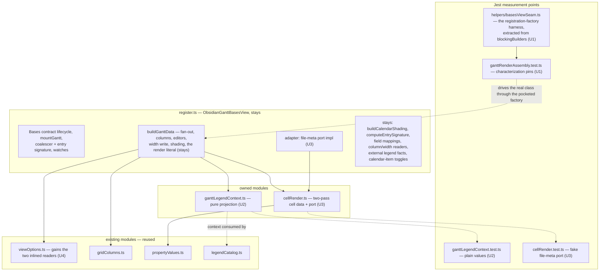
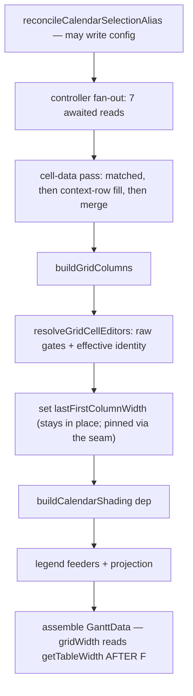

# register.ts Render-Data Assembly Extraction - Plan

## Goal Capsule

- **Objective:** a maintainer can change how the Gantt's render data is projected (a legend fact, a cell-data field, a view option) with a Jest test telling them within seconds whether the assembly still honours its contracts — today that answer exists only in a WDIO run against real Obsidian. Means: characterize `buildGanttData` through the seam the repository already owns, then move its two separable concerns (the legend projection and the two-pass cell data) into owned, unit-tested modules with the vault and metadata-cache reads cut into one port, behavior preserved exactly. This opens the campaign's rank-2 file, which no campaign slice has touched; both of its named welds remain after this plan (§ Ranked-defect review contract).
- **Authority hierarchy:** AGENTS.md and the engineering charter bind; this plan operationalizes them for this slice. Where this plan and current code disagree on an anchor, re-derive from code — baseline anchors in cited reports are stale by design, and § Measurement below records what was re-derived at HEAD `90b2470`.
- **Execution profile:** one PR per unit (U1 → U2 → U3 → U4, dependency-ordered: characterization first, then the leaves, then the readers and the closing report), squash-merged on green; a session ends at its first merged PR. Test-first: the assembly is characterized before anything moves, and each unit's module tests are written against current behavior before the register-side original is deleted — red/green brackets each move.
- **Revision 2026-09-03 (binding, second pass):** re-audited against the decomposition-balance rules the maintainer set on 2026-09-03 from the *Modern Software Engineering* book notes (§ Decomposition balance below), then reviewed by the spec-time layer, whose findings this pass applies. The render-data assembly does **not** move behind a view-options port and a live-accessor bridge (the first pass); the assembly is **characterized first** through the seam the repository already owns, extracted into a shared test helper (this pass), and only then are its two separable concerns moved. The perf harness's second producer is no longer a unit: the measured cost of driving the production assembly inside that harness exceeds the cost of the duplication, and the trade is recorded (§ Scope Boundaries). The original U3/U4 texts are superseded, not executed; the measured reasons are in § Measurement (re-audit).
- **Stop conditions:** a red armed-spec CI run (`gantt-column-sort`, `gantt-calendar-items-sources`, `gantt-legend`) outranks this work — download the `og-lifecycle` envelope from the run's `e2e-artifacts` before any rerun, then follow `docs/reports/2026-08-26-001-reliability-column-sort-diagnosis.md`. A unit exceeding ~4 hours to shippable triggers re-slicing. Abort to the nearest green checkpoint on context compaction or state-class errors.

---

## Measurement

Re-derived at HEAD `90b2470` on 2026-08-29, before choosing the target. The campaign's rule is that cited baselines are stale by design; these numbers supersede the expectations carried into this session.

**Instrument output** (`node scripts/maintainability-trend.mjs --at-ceiling`, window `7949fd113..90b2470b2`, 40 commits):

| Ranked file | Lines | Window touches | Complexity band 11–15 |
|---|---|---|---|
| `src/bases/GanttContainer.svelte` (rank 1) | 2,492 | 9 (22.5%) | **2** (was 4) — `resolveRowEditor` 11, `focusOnInstance` 15 |
| `src/bases/register.ts` (rank 2) | 1,931 | 3 (7.5%) | **0** |
| `src/controller/GanttController.ts` (rank 4) | 2,430 | 1 (2.5%) | 4 (12/14/13/13) |

At-ceiling count: **16**, unchanged from the 2026-08-25 report. Pressure band total: 79.

**Finding 1 — the churn instrument is currently saturated and cannot rank these targets.** Every window touch on all three ranked files is a campaign commit (#427, #430, #446, #450, #453, #459, #461, #462, #463). Zero feature or bug-fix commits touched any ranked file in the window. This is the distortion the baseline report predicted ("an extraction commit *touches* the file it shrinks, so the share ticks up on every slice"). Ranking therefore falls back to the full-history baseline (GanttContainer 18.7%, register.ts 14.9%, GanttController 7.3%), concern cohesion, and testability.

**Finding 2 — the `initGantt` weld has dissolved; it is no longer a slice.** The 2026-08-15 report characterizes it as 327 lines / 9 intercept sites / 14 action registrations over 9+ outer mutable bindings. Re-derived, it is **57 lines** (`src/bases/GanttContainer.svelte` `function initGantt`): an api-rebind guard, three `wire*` calls, `applyPersistedGridWidth`, a `dlog` counter, `wireSvarInterceptors`, and one best-effort scroll-reset `setTimeout`. PRs **#427 and #430** dissolved the weld (327 → 166 → 49 lines); **#446** then added 9 lines of diagnostics call hooks and **#453** moved those onto the seam without changing its size. What remains is wiring — the legitimate content of a composition root. Extracting it would be a source-level relocation, which the 2026-08-27 Farley alignment audit's drift-guard rules out as an improvement claim.

**Finding 3 — the report's option-reader candidate is unchanged, not stale, and it is still the weaker slice.** *(Corrected 2026-08-29 after independent re-derivation — see `docs/reports/2026-08-29-001-testing-first-principles-audit.md`.)* `src/bases/viewOptions.ts` (801 lines, 16 exported readers) and `test/unit/viewOptions.test.ts` (842 lines) are **byte-identical between the baseline commit `7949fd113` and HEAD**, and `register.ts` holds the same accessor methods at both commits — so the 2026-08-15 report measured exactly the state measured here, and its entry refers to the ~20 register-side accessor methods, not to unextracted reader implementations. Most of those accessors are 1–3 line adapters over `viewOptions.ts`, so extracting them would be relocation. **Two are not:** `getShowDateIndicators` (`:981`) and `getArrowMode` (`:830`) have no `read*` counterpart — they hardcode their Bases key and inline their default semantics (`!== false`; `=== 'all' ? 'all' : 'primary'`) inside the ranked file, asserted nowhere at the Jest tier, and both are read by `buildGanttData`. Giving them readers is a genuine extraction and rides U4. The two welds the report names — `mountGantt` (**388 lines**, 1092–1479) and `buildGanttData` (**193 lines**, 1482–1674) — are live and confirmed.

**Finding 4 — the decisive signal is testability, and it points at the render-data assembly.** *(Corrected 2026-08-29 — the original claim that no test reached the class was empirically false; see `docs/reports/2026-08-29-001-testing-first-principles-audit.md`.)* `ObsidianGanttBasesView` is a **1,547-line class** (296–1842). It is **not** uncovered: `test/unit/blockingBuilders.test.ts` constructs a real instance under Jest — handing the real `registerBasesGantt` a fake plugin that pockets the view factory, then calling that factory with a fake `App`/`config`/`data` — and drives five private methods (`buildFieldMappings`, `getEffectiveMappings`, `buildDatePolicyConfig`, `buildEstimateMeaningForTask`, `collectMarkedCalendarNotes`) through an `as unknown as ViewInternals` cast. Measured: 9 of 59 class-scope functions execute, and three separate one-line mutations to class-body methods turn 8, 14 and 14 of its 19 tests red. That is behavioural coverage.

The correct, narrower statement — which still selects this slice: **the class body's only unit coverage is the field-mapping / date-policy / marked-calendar-notes cluster reached through the registration-factory seam; the render-data assembly (`buildGanttData`, 1482–1674) and `mountGantt` have none.** `grep -rn "legendContext" test/` returns **no match** — `legendCatalog.test.ts` and `test/probe/legend-swatch.probe.ts` both hand-build a context and test the *consumer*, so the projection that produces it is verified only through `test/specs/gantt-legend.e2e.ts`. Farley's instrument is "if our tests are **difficult to write**, our design is poor" (Ch. 9) — difficult, not absent; the difficulty here is that the only Jest-tier path casts past `private`, which pins the internals this campaign exists to free.

**Reproducing this section.** `node scripts/maintainability-trend.mjs --at-ceiling --base 7949fd1135ed32017cb72aafdb92c4f09caf8267 --head HEAD` (the explicit base triggers the sweep, which reads the working tree, not the range — note that `--base` also overrides the merge-base, so this invocation prints 0 window touches for every ranked file and does **not** reproduce the table's Window-touches column); `git log --no-renames --format="%h %s" 7949fd113..90b2470 -- <ranked path>` for Finding 1 and for that column; `npx eslint <the three ranked files> --rule '{"sonarjs/cognitive-complexity": ["warn", 10]}'` for the band counts; `grep -rn "from '.*bases/register'" test/` and `grep -rn "legendContext" test/` for Finding 4. Dispute any number by re-running its command.

**Finding 5 — register.ts's defect is breadth, not depth.** It carries zero functions in the 11–15 complexity band; `buildGanttData` is 193 lines at cognitive complexity ≤ 5 (a threshold-5 sweep does not report it). This slice therefore claims **no complexity relief**, and any PR body claiming one would be inventing a reality to suit the argument (Ch. 7). The claim is cohesion and testability.

**Conclusion.** Rank 1 is at a defensible stopping point: its named slices are done, its remaining pressure is one at-ceiling function, and its concerns have a jest-tier measurement point. The campaign moves to **rank 2**, and testability picks the slice: the render-data assembly, leaves first.

**Recorded observation, parked (not fixed here):** `buildCalendarShading` (1686–1770) is named as a builder but performs three registration side effects — `calendarWatch.syncKnownPaths`, `calendarWatch.syncAssociations`, and the `lastAssociationTaskPaths` write. That is a separation-of-concerns finding for a later slice; this plan crosses the function as a dependency and changes nothing inside it. Entered in `docs/backlogs/backlog.md` at U2.

---

**Re-audit 2026-09-03 (decomposition balance).** `src/bases/register.ts` is byte-identical to the plan's HEAD (no commits touched it since), so every anchor above still holds. `buildGanttData` is 193 lines at cognitive complexity ≤ 5. Its body divides as: the seven-read fan-out (13 lines), the two-pass cell data (20 lines, where the vault and metadata-cache reads live), grid columns and editors (30 lines, calls into pure modules that already have their own tests), the legend feeders (25 lines, pure), and a return literal of roughly 80 lines that reads about thirty-five option and config values and places them on the render contract. The literal is wiring, not logic: it makes five decisions of its own (the alias reconcile first, one `Promise.all`, the width write before the width read, the raw-versus-effective mapping pairing, and the drag-mode supplier crossing as a function). Measured against the balance rules (numbers re-derived on 2026-09-03 after the spec-time review corrected an asserted count): a new view option touches **six** places today — the option definition and its reader in `src/bases/viewOptions.ts`, the reader's test, the adapter method in `register.ts`, the render literal, and the `GanttData` field — and would have touched **nine** under the original extraction (a port member, a spy-fixture line, and a field-set pin entry on top). The legend projection and the cell-data pass each create one measurement point whose fakes are smaller than the logic they observe (plain values; one fake port). The original assembly module would have needed a nineteen-getter port, a ten-member dependency object, a two-member bridge and three spy fixtures to observe five decisions; the seam the plan now uses instead is the existing registration-factory harness (about 106 lines in `test/unit/blockingBuilders.test.ts`, shared across every unit once extracted) driving the real class and the real controller with targeted spies. That ratio — roughly 106 shared fixture lines against 193 lines of assembly, counted once — is what the wiring-to-behavior guardrail below measures, and it is why the assembly is characterized in place rather than moved: the module would have cost a 1.5× wider change surface for every option and a fixture set larger than the logic, to observe the same five decisions.

## Product Contract

### Summary

Characterize `buildGanttData` through the registration-factory seam the repository already owns, then move its two separable concerns out of the Bases view host into owned modules: the legend-context projection (pure) and the grid cell-data pass (behind a file-meta port), leaving the assembly itself in place with its two inlined option coercions lifted to the readers module (revised 2026-09-03 — see § Decomposition balance). The view host keeps its Bases-contract lifecycle, its config and app access, the assembly literal, and one thin adapter. Derivations that only a real-Obsidian e2e run can observe today become provable in Jest.

### Problem Frame

`src/bases/register.ts` is the maintainability campaign's rank-2 ranked-defect file (`docs/reports/2026-08-15-001-maintainability-rediagnosis.md`, ranked list entry 2: 14.9% churn × 14 concerns in 1,872 lines — "the junction box every view-level feature passes through"). It has never been touched by a campaign slice, and `jest.config.mjs` (lines 54–59) carries a standing commitment about it in the coverage-exclusion comment: "Logic-dense files (register.ts, views) are NOT excluded — their logic is being extracted into tested modules (plan U2/U5), not hidden." For `register.ts` that extraction has not happened.

`buildGanttData` is Farley's `add_to_cart1` (Ch. 10, Listing 10.5): essential complexity — projecting the `GanttData` render contract from derived instances, colors, and view options — fused with accidental complexity: `this.app.vault.getAbstractFileByPath`, `instanceof TFile`, `this.app.metadataCache.getFileCache`, `this.config.get`, and `this.data?.data`. Those are the "alien interloper" lines Ch. 11 names, sitting inside the logic that matters, at a different level of abstraction from everything around them. The consequence is measured in Finding 4: the assembly has no Jest-tier measurement point of its own, and the **legend projection specifically** has exactly one measurement point anywhere — a >5-minute WDIO loop whose owning spec is the reliability campaign's rank-1 flaky spec. Other outputs of the assembly do have e2e owners (U3's verification names `test/specs/gantt-markdown-cells.e2e.ts`); the claim is scoped to the projection, not to the whole render contract.

### Requirements

**Extraction**

- R1. The legend-context projection — the fact-gathering feeders and the `legendContext` literal — lives in an owned module as a pure function; `register.ts` keeps the call.
- R2. The grid cell-data pass — the matched pass, the context-row fill, and their merge — lives beside its existing builders, with the Obsidian file-meta read crossing as an injected port; `register.ts` keeps the adapter that implements the port.
- R3. The render-data assembly's behavioral contracts — the five decisions § Measurement names — are pinned at the Jest tier through the registration-factory seam **before** any concern moves, so every later unit refactors against a characterization; the two option coercions inlined in the assembly move to the readers module beside their siblings. The assembly body itself stays in `register.ts`; extracting it needs a present reason (a second consumer, or a change that touches more than the six places a view option touches today), and the deferred `mountGantt` slice is where that question is next asked.

**Behavior preservation**

- R4. Behavior is preserved exactly. The ordering contracts named in KTD3 hold verbatim, `reconcileCalendarSelectionAlias` keeps its position and its config write, the raw-vs-effective mapping split keeps its two distinct call sites, and no read moves across an `await`.

**Testability**

- R5. Each extracted unit is provable at the Jest tier with no Obsidian host and no mounted component: the legend projection by direct call, the cell-data pass through a fake file-meta port, and the assembly's contracts through the registration-factory seam with a fake plugin and config.

**Reuse and guards**

- R5a. **Every unit that leaves a host-side adapter outside its extracted module owes one characterization through the registration-factory seam** (the mechanism `test/unit/blockingBuilders.test.ts` already uses, extracted in U1 into a shared helper that file then imports — its assertions stay unchanged and green), asserting a **distinguishing value for every field the adapter supplies, enumerated from the adapter's own output type**, never a hand-picked subset. Module tests use fakes and spy ports by design, so none of them can see a same-typed miswire in the host literal. Naming members instead of the rule is the failure this plan has already paid for three times: state the rule, derive the list.
- R5b. **The scenario lists in this plan are illustrative; the characterization step produces the binding list.** Each listed pin states the contract it proves and the mutation it must turn red; the spy or fixture mechanism named beside it is the plan's best current reading and may be replaced by a stronger one during characterization without a plan change, provided the mutation still goes red. Each unit writes tests against current behavior *before* its original is deleted, and that step must enumerate **every observable decision of the code being moved** — selection and ordering semantics (`.find` is first-match, not any-match), fallback precedence, guard conditions, and the position of side effects. A scenario list maintained by hand in this document cannot be complete, and treating it as complete is the same hand-maintained-list defect R5a and R6a remove, committed one level up. Scenarios named here are the ones easiest to get wrong, never the whole set; a reviewer who finds an unnamed observable decision has found a characterization gap, not a missing bullet. **The same binding covers code that stays.** Where this plan states a requirement about host-side code it does *not* move — a call that must keep its position, a side effect that must still happen, an ordering the assembly depends on — that requirement owes a guard through R5a's registration-factory seam, derived from this plan's own requirement list rather than named ad hoc. A requirement with no test that can fail is a comment. Today's instance: `reconcileCalendarSelectionAlias()` must run **before** the extracted assembler and may write config that `buildCalendarShading` then reads (KTD3.2) — store a `tngantt_displayCalendars.defaultRow` that disagrees with `tngantt_highlightWeekends`, and fail if reconciliation is omitted or moved after assembly.
- R6. Existing machinery is reused, never duplicated: `src/bases/viewOptions.ts`, `src/bases/cellRender.ts`, `src/bases/propertyValues.ts`, `src/bases/gridColumns.ts`, `src/bases/legendCatalog.ts`, `src/bases/barTreatment.ts` (`isSafeColor`), `src/bases/visualSemantics.ts`, `src/controller/InstanceExpansion.ts`. No second mechanism is introduced for a job one of these already does.
- R6a. **Every extracted entry point takes a single typed input object, not a positional list.** AGENTS.md caps parameters at 3–4, and each unit here crosses that on its own: the legend projection carries five facts, the cell-data pass five inputs. The object is also what makes the complete-field-set pins expressible — a named input set can be asserted whole, a positional list cannot.
- R7. The ranked-defect contract is satisfied: no ranked-file metric regresses, and each PR body states its improvement claim in cohesion/testability terms with metric deltas as bookkeeping (§ Ranked-defect review contract).

### Key decisions

- **Target is rank 2, not rank 1.** Governs the whole plan; argued from § Measurement Findings 1–5. Rank 1's three sequenced slices (interceptors #427/#430, style block #459, diff-sync #461–#463) are merged and its named `initGantt` weld has dissolved into wiring; rank 2 has never been sliced, and among the ranked files it holds the largest mass reachable only through the slowest tier. The recommendation is therefore explicit: **rank 1 is at a defensible stopping point and the campaign moves down the list**, which is a change of target from what the cited reports and session memory carried in.
- **Slice picked by testability: characterize first, then the leaves.** *(Amended 2026-09-03.)* A method with no test is legacy code in Feathers's sense, and the units that follow change its body; so the first unit pins its contracts through the existing seam, and only then do the leaves move (the sequencing `docs/solutions/architecture-patterns/live-accessor-bridge-extraction-recipe.md` § 4 proved four times). The orchestrator itself is not moved by this plan.
- **No new e2e.** Principle 5: the composed behavior is already covered by the existing specs that render the legend, the grid cells, and the chart. The derivations move to the fastest tier; adding an e2e for them would be the "new e2e for behavior already provable at a faster tier" the principle's test names.

### Scope Boundaries

- **Deferred to follow-up work:** `mountGantt` (388 lines — the other named weld, its own plan); the `buildCalendarShading` separation-of-concerns finding recorded in § Measurement; `GanttController.ts`'s `selectSource` mapping block (rank 4's named first slice).
- **Accepted duplication, recorded (revised 2026-09-03):** `test/perf/generator/buildGanttData.ts` exports `assembleGanttData`, a second producer of the render contract that populates only the perf-load-bearing fields. The first pass of this plan required retiring it; the spec-time review measured what driving the production assembly inside that harness costs, and it exceeds the duplication: the harness runs under vitest browser mode with an `obsidian` shim that has no `BasesView` (the view class cannot even be imported there), the assembly is a private method reachable only by constructing the view with its lifetime, watches and DOM stand-ins, the locale is resolved from a debug global rather than config, and keeping columns and cells out of the timed path would mean measuring a configuration production never runs. Ch. 13's rule decides it — the cost of one canonical representation can exceed the cost of duplication — and principle 4's "one mechanism" binds production producers; the harness is a measurement instrument whose partial object is a fixture. The trade is stated here, restated in the closing report, and parked in `docs/backlogs/backlog.md` at plan close with the field-level gap to re-measure when the harness next changes.
- **Stays in `register.ts` (crossed as deps or adapters, not moved):** `buildCalendarShading` and its cache, `computeEntrySignature`, the option-reader adapters over `viewOptions.ts`, `buildFieldMappings` / `getEffectiveMappings`, `getVisiblePropertyIds` / `getDisplayName` / `getColumnSize` / `getTableWidth`, `readExternalCalendarLegendFacts`, `getCalendarItemToggles`, the picker and switcher openers, every watch and lifecycle hook.
- **Outside this slice's identity:** any behavior change; any reliability-campaign work (see below); decomposing `src/bases/ganttSync.ts` (principle 7 "Not debt" endpoint); any feature work (frozen until the quality campaigns end).
- **Reliability-campaign boundary, stated explicitly.** `gantt-legend` is the reliability campaign's rank-1 defect, at a deliberate bounded stop whose stopping rule forbids new windows and speculative fixes. This plan opens no window, adds no probe, changes no behavior the legend spec observes, and does not edit `test/specs/gantt-legend.e2e.ts`. That U2 incidentally gives the legend's *inputs* deterministic Jest coverage is a maintainability consequence, not a reliability fix; no PR in this plan may be described as addressing the legend defect.

---

## Planning Contract

Each decision below cites the instrument it serves — a governing principle, a charter item, or a named *Modern Software Engineering* chapter, consulted via the maintainer’s book notes.

### Decomposition balance (binding, 2026-09-03)

The maintainer's rule for this campaign, drawn from the *Modern Software Engineering* book notes (Ch. 9 designing for testability; Ch. 10 § How to Achieve Cohesive Software and § Costs of Poor Cohesion; Ch. 11 essential versus accidental complexity; Ch. 12 § Fear of Over-Engineering, § Picking Appropriate Abstractions, § Always Prefer to Hide Information; Ch. 13 § Decoupling May Mean More Code and § DRY Is too Simplistic; Ch. 14 § Measurement Points): decomposition has a failure mode on both sides, and the plan must respect it or be replanned.

1. **Cohesion is measured by the cost of change**, never by module count. The naive monolith and the over-dispersed design are the same class of defect (`add_to_cart1` and `add_to_cart3`).
2. **Cut essential from accidental complexity first**; inside the essential side, cut only where "one function, one thing" is actually violated.
3. **A new module or seam needs a present reason** — a second consumer, a distinct rate of change, or a measurement point a test needs now. "We may need it later" is future-proofing (YAGNI).
4. **Testability sets the sweet spot.** A seam earns its place when it is a measurement point that makes a test possible or deterministic. If a test is hard because concerns are conflated, split; if a test is hard because several fakes must be wired to observe one behavior, the split went too far.
5. **Decoupling may cost more code**, judged against the cost of change and one consistent level of abstraction — never against line totals.
6. **DRY within a boundary, not across boundaries** that change for different reasons.
7. **Prefer the more general representation at a boundary, within sensible bounds**; typed option objects over positional lists.

Two guardrails bind every unit's PR, and are review criteria for every gate that reads this plan:

- **Wiring-to-behavior ratio (measured, not felt).** Count the fixture lines a unit adds to exercise the code it moves or pins — adapters, ports, bridges, fakes and spies — against the lines of logic under test; a shared harness counts once, in the unit that extracts it. The bound is 1.0: a unit whose unshared fixture exceeds its logic is ceremony and re-slices or stops. Every PR body reports the two numbers. The extraction recipe's own boundary rule is the same instinct: a bridge wrapped around pure logic is ceremony.
- **Cost-of-change probe (measured against a census, not asserted).** The PR body names one typical change in the moved concern — a new legend fact for U2, a new file-meta field for U3, a new view option for U4 (six places today, by census: option definition, reader, reader test, adapter method, literal, `GanttData` field) — and counts the places it touches before and after by grepping a real member, not by recall. Because feature work is frozen, the body also runs the probe on the change the campaign will actually make next (the deferred `mountGantt` extraction): a design that is cheaper for a new option but dearer for the next extraction has to say so. A count that rises fails the unit — with one stated exception: a rise of exactly one place that is the Jest test the moved concern never had is the measurement point this plan exists to create, and the PR body names it as such; a rise for any other reason, or by more than that one place, fails regardless of line or concern deltas.

Each PR body also answers, in one sentence each: which concern moves and why it is one thing; the present reason for any new module or seam; the measurement point the seam creates.

### Key Technical Decisions

- KTD1. **The legend projection is a pure module, not a bridge.** `src/bases/ganttLegendContext.ts` (name directional) exports a pure function from facts to `GanttLegendContext`. The extraction recipe's own boundary rule governs: "Do not use [the live accessor bridge] for pure logic… A bridge wrapped around pure logic is ceremony." The projection takes **one typed input object** carrying instances, colors, shading facts, source channels and toggles, and returns a value — no `this`, no Obsidian, no live state (R6a; five positional parameters would breach AGENTS.md's cap). Serves principle 5 (fastest reliable level) and Ch. 11 (separating essential from accidental complexity). It lands as a new module rather than inside `legendCatalog.ts` (734 lines) because the producer changes when the legend's *facts* change and the catalog changes when its *rows* change — two reasons to change, so the "and" test separates them (Ch. 10).
- KTD2. **The cell-data pass lands in `src/bases/cellRender.ts` beside its existing builders, not in a new module.** `buildCellData` and `buildFetchedCellData` already live there and already change with the fill strategy; the two-pass orchestration changes for the same reason, so Ch. 10's rule — "putting related concepts, concepts that change together, together" — puts it there. `cellRender.ts` is 160 lines, so this creates no second weld, and a new module with one consumer would be an abstraction without a present need (Ch. 12, YAGNI). The Obsidian read crosses as an injected **port** (Ch. 11, Ports & Adapters): the module states what it needs (`(path) => { basename, extension, frontmatter } | null`), and `register.ts` keeps the `TFile`/vault/metadataCache adapter that satisfies it.
- KTD3. **Three ordering contracts are behavior and are pinned, not tidied.** These are the reason a "read all the options once at the top" refactor would be a silent behavior change, and each becomes an assertable pin for the first time:
  1. **`lastFirstColumnWidth` is written mid-pass and read later in the same pass.** `this.lastFirstColumnWidth = firstColumnWidth(gridColumns)` (1568) precedes `gridWidth: this.getTableWidth()` (1635), and `getTableWidth()` reads that field as its fallback. Both the write and the read stay in `register.ts`; the ordering is pinned through the registration-factory seam, which observes the real field on the real class (KTD5).
  2. **`reconcileCalendarSelectionAlias()` runs first and may write config.** Its own comment records that the refresh a write triggers converges on the next pass. It keeps its position at the head of the assembly and stays in `register.ts`.
  3. **The raw-vs-effective mapping split is deliberate and stays split.** `buildFieldMappings()` (raw view config) gates progress/estimate writability; `getEffectiveMappings()` (resolved) supplies editor identity. The comment at 1548–1562 argues why. These are two distinct conventions, and the recipe's hard-won rule applies: pin them, never DRY-unify them.
- KTD4. **No view-options port and no assembly module.** *(Replanned 2026-09-03; supersedes the port-plus-adapter design.)* The assembly reads about thirty-five option and config values and makes five decisions of its own. A typed port of getters would give the module one frame of reference, as Ch. 11's example does, but here the port's member count exceeds the module's decision count by an order of magnitude, the adapter literal would be as long as the code it feeds, and a new view option would touch nine places instead of the six it touches today (§ Measurement, re-audit). That fails the wiring-to-behavior ratio and the cost-of-change probe. The assembly literal stays in `register.ts`; what moves is only the two option coercions still inlined there (`showDateIndicators` and the `arrowMode` coercion), which join their sixteen siblings in `src/bases/viewOptions.ts` because they change with them (Ch. 10, concepts that change together) and gain the direct reader tests the siblings already have.
- KTD5. **No live-accessor bridge.** *(Replanned 2026-09-03.)* The two mutable fields the original bridge existed to carry — the loading flag read after the awaits and the width written mid-pass — stay where they are because the code that reads and writes them stays. Their contracts are pinned instead (KTD3.1 and the post-await read of the loading flag) through the registration-factory seam, which observes the real fields on the real class.
- KTD8. **Contracts stated as rules with mechanical censuses, scoped to what actually moves.** *(Amended 2026-09-03.)* The complete-field-set pin (b) stands: at U2's projection seam for its input and output, and at U1's assembly characterization for the full `GanttData` key set — written as a `Record<keyof GanttData, …>` fixture (the compile-time shape the repository settled for derived member lists), never a hand-typed name array, so a field added to the interface fails typecheck until the pin covers it — with a distinguishing non-default value per optional field, so a dropped field fails rather than passes. The post-await read census (a) is kept as **one mechanical pin plus three targeted ones**, never a hand list. The mechanical pin derives its member set at the **choke points** every read passes through, not at the methods that wrap them: every Bases option value reaches the pass through the fake config's `get` — the view's own getters and the imported readers alike take `(key) => this.config.get(key)` — and every host fact reaches it through the fake app's members, so the fake config and the fake app record each read against the moment the controller promises resolve, and the pin asserts that every key and host member read by the pass was read **after** resolution — the sole pre-await read being the arrow-mode key, which is named as the exception because the links read consumes it. A read moved ahead of the await by any later unit (R4: "no read moves across an await") fails this pin whether it was a getter, an imported reader, or a direct config read, without anyone editing a list. The three targeted pins then prove liveness where the backing is a live host fact rather than a config key — the loading flag, the TaskNotes-present check, and the user-field types — by changing the backing while a controller promise is held pending and asserting the completed result carries the new value. The single-snapshot rule (c) keeps its two named instances (`userFieldTypes` serving both cell rendering and editor resolution; `arrowMode` read once and handed to the links read), and the fifth decision — the drag-mode supplier crossing the render contract as a function, never resolved during assembly — gets its own pin.
- KTD6. **Test strategy: the existing seam, extracted and shared; owned measurement points for the two moved concerns.** *(Amended 2026-09-03, second pass.)* The registration-factory harness that `test/unit/blockingBuilders.test.ts` keeps file-local (`makeFakeApp`, `makeHarness`: a fake plugin that pockets `registerBasesView`, a fake app, the plugin lifetime, the factory invocation, a real `GanttController` over a stub source) is extracted in U1 into `test/unit/helpers/basesViewSeam.ts`; `blockingBuilders.test.ts` imports it and its assertions do not change. Every characterization in this plan drives the **real** view and the **real** controller through that helper: the controller's seven async reads are `jest.spyOn`-ed to test-owned deferred promises so its synchronous members answer correctly on their own; the fake config carries `get` and a recording `set` (the alias reconcile writes); the fake app carries the vault and metadata-cache members the pass reads plus a swappable `plugins.getPlugin` handle — TaskNotes presence and the user-field types are both read from that one handle (`api` present, and `api.model.config().userFields`), so the two liveness pins share the backing and vary it differently — and a swappable `getOrder` on the config (or `properties` on the data) so the characterization can select property columns; `metadataTypeManager.properties` feeds only the per-column Obsidian-widget fallback and is not a post-await snapshot. The first pass declined this seam because it casts past `private`; the plan accepts exactly that trade for exactly this reason: the seam already exists (principle 4, no second mechanism), the alternative was a seam surface larger than the logic it would observe, and R5a already required this seam for adapter characterization. The pins assert observable contracts — a write ordered against a read, the concurrency of a fan-out, which mapping set gates which editor — not private structure, and the one private field a pin must set (the view's controller, for the mapping-split pin) is named as such in U1. U2's projection is tested with plain values; U3's pass with one fake file-meta port carrying a call log.
- KTD7. **Source-shape pin scope, settled in advance.** If an extracted adapter literal (U3's file-meta port adapter, for instance) warrants a source-shape pin, it is a tripwire for accidental drift, sharing its guarding with the compiler's excess-property check over the typed literal — never a parser hardened against crafted evasion. Six escalating hardening rounds on such a pin were deliberately eliminated from history on maintainer direction grounded in Modern Software Engineering's fear-of-over-engineering argument (Ch. 12). Pin-fortification is out of scope **as a design proposal** and is not re-proposed here. That settles the remedy's shape, never a reviewer's duty: a **demonstrated** false pass — a specific miswire the pin and the compiler both accept — is a correctness finding, reported at full severity like any other. What is closed is “harden the pin further” as a standing suggestion, not the reporting of a defect someone can exhibit.

- KTD9. **Characterize before moving.** *(Added 2026-09-03.)* `buildGanttData` has no test; in Feathers's definition that makes it legacy code, and U2–U4 all edit its body. The present reason rule 3 demands is therefore concrete and immediate: the pins are the regression net the very next unit refactors against, not insurance for a future extraction. They are written first, against current behavior, and every later unit's green run is measured against them. If the deferred `mountGantt` slice later moves the assembly, the pins move with it as the same tests against the same contracts.

### High-Level Technical Design

Target topology — what moves and what stays *(revised 2026-09-03; no assembly module, no bridge)*:

Assembly ordering (behavior — preserve verbatim; KTD3):

### Ranked-defect review contract

`src/bases/register.ts` holds ranked-defect entry 2 (`docs/reports/2026-08-15-001-maintainability-rediagnosis.md` § The ranked defect list: 14.9% churn × 14 concerns in 1,872 lines; concern anchors in § Measurement 2, baseline-relative — re-derive from current code). This plan **opens** that entry rather than closing it: the report names `buildGanttData` and `mountGantt` as the file's two welds; this plan characterizes the first and moves two of its sub-concerns out, leaves both welds in place, and defers `mountGantt` to its own plan. § Measurement above retires the report's other named candidate (the option readers, already extracted) as stale.

- **Invariant:** no diagnostics or instrumentation concern moves into a ranked-defect file except through its seam module; a PR that grows a ranked file's line or concern count states the reason in its description, read against the trend measurement's output; a shrink states its improvement claim — metric deltas are bookkeeping, never the claim itself, and a source-level relocation is not a seam extraction (2026-08-27 Farley alignment audit).
- **Placement rule:** instrumentation and diagnostics live behind the seam (`src/bases/ganttLifecycleDiagnostics.ts`); views and junction files keep only call hooks; the lifecycle-capture names of the debug-log module are imported only by the seam. `register.ts` keeps its existing `createMountLifecycleCapture` seam usage untouched — no unit in this plan adds, removes, or relocates a diagnostics call site, and no new module in this plan imports a lifecycle-capture name. The new modules fall under the source-tree boundary closure automatically.
- **Improvement claim (the genuine seam-extraction argument, revised 2026-09-03):** the cell-data pass's coupling to the Obsidian host — today direct vault and metadata-cache reads interleaved with the assembly — becomes one explicit, named, injectable file-meta port; the legend projection, whose only measurement point today is a WDIO run against real Obsidian (its sole owner a spec at a bounded reliability stop), gains direct unit coverage as a pure function; and the assembly's five behavioral decisions gain Jest pins through the existing seam before anything moves. The assembly literal itself is not relocated, by design: moving it would have created a seam surface larger than the logic it observes and a wider change surface for every option (§ Measurement, re-audit). **The expected concern count after this plan is 14, unchanged** — the legend projection and the cell-data pass are sub-concerns of the render-data weld in the report's enumeration, not concerns of their own — and the closing report says so rather than claiming a shrink the enumeration does not support; the line delta (about 75 lines out, a port adapter in) is bookkeeping. That is the cohesion cut and the testability gain. **This slice claims no complexity relief** — `register.ts` carries zero functions in the 11–15 band (§ Measurement Finding 5). Line and concern deltas are bookkeeping; any part of a move that is mere relocation is annotated as such.
- **Definition of Done carries:** no ranked-file metric regresses (see Definition of Done), and the plan closes with a dated trend report re-enumerating the entry's metrics.

---

## Implementation Units

### U1. Extract the seam harness and characterize the assembly in place

*(Added 2026-09-03, second pass; the first pass's "pin through the seam" step, moved to the front and given the harness it needs.)*

- **Goal:** `buildGanttData`'s five behavioral decisions and its post-await read contract (R4) have Jest pins a later refactor cannot silently break, written against current behavior before any concern moves; the registration-factory harness becomes a shared helper every later characterization reuses. No production code changes.
- **Requirements:** R3, R4, R5, R5a, R5b, R6 (per KTD3, KTD5, KTD6, KTD8, KTD9).
- **Dependencies:** none.
- **Present reason (rule 3):** U2–U4 each edit this method's body; a method without a test is the legacy-code condition, and the pins are the net the next unit refactors against (KTD9).
- **Files:** `test/unit/helpers/basesViewSeam.ts` (new — `makeFakeApp` and `makeHarness` lifted from `test/unit/blockingBuilders.test.ts`, with the additions below), `test/unit/blockingBuilders.test.ts` (imports the helper; its 19 assertions unchanged and green), `test/unit/ganttRenderAssembly.test.ts` (new).
- **Approach:**
  1. Extract the harness: the fake app (vault `getMarkdownFiles`/`getAbstractFileByPath`, metadata cache `getFileCache`/`getFirstLinkpathDest`, plus a swappable `plugins.getPlugin` handle whose `api.model.config().userFields` backs the user-field types), the fake config (`get`, a recording `set`, and a swappable `getOrder` so property columns can be selected — without one, `visiblePropIds` is empty and the editor, cell-fill and column-order pins have nothing to observe), the fake plugin that pockets the view factory, the plugin lifetime, and the real `GanttController` over the stub source exactly as `makeHarness` builds it today, parameterized for notes, config and data rather than copied. `blockingBuilders.test.ts` switches to the import; a green run with no assertion change is the proof the extraction is behavior-preserving.
  2. Characterize: build the view through the pocketed factory; assign the harness's controller to the view's private `ganttController` field through the same cast `blockingBuilders` uses **and** pass that same instance as the assembly's argument (the effective-mappings read goes through the field, the reads through the argument); `jest.spyOn` the six async read methods to deferred promises the test resolves (`getChoiceOptions` is spied once with a role-keyed implementation and called twice, so the fan-out counts seven calls); call the assembly through the seam. The plan's private writes are two and named: `ganttController` here, and `externalEventsLoading` in the loading-flag pin (only the mount's observer sets it in production).
  3. Write the pins below against current behavior. If characterization surfaces a contract this list omits, add its pin (R5b); if it surfaces a defect, park it in the backlog (§ Definition of Done) — do not fix it here.
- **Test scenarios (all through the seam):**
  - Ordering pin (KTD3.1), value-based, on the **first assembly of a freshly built view**: with the name column's configured width (keyed on the resolved name property, `file.name` when no text property is set) set to a value other than the fallback and the table-width option unset, the assembled `gridWidth` equals that width only if the width write precedes the width read; reversing them on purpose turns it red (on a second assembly the reversal would return the previous pass's width, so the fixture is a fresh view or a changed width).
  - Mapping-split pin (KTD3.3), both halves observable: select an **ungated** date column (the start date — its editor has no write gate, so identity alone decides) **and** the progress and estimate columns through `getOrder`; spy the controller's effective mappings to name a start property the raw view config leaves unset, and choose raw and effective progress/estimate mappings whose writability outcomes are opposite. Assert that the date column receives the date editor only under the effective set, and that the progress and estimate editors are present or absent exactly as the **raw** set dictates. A status column cannot serve as the identity probe here: its editor is additionally gated by the controller's status-writable flag, which is false on the un-initialized controller the harness builds, so both a correct and a wrong identity source would yield no editor and the pin would stay green.
  - Alias-first pin (KTD3.2): with the display-calendars option stored as an object carrying an explicit `default: true` and the weekend-highlight option set to `false` (an unset legacy key, or an object without a boolean `default`, never writes), the recorded `set` of the display-calendars key precedes the first spied controller call; with a fake config nothing refreshes, so expect one write per assembly rather than convergence.
  - Fan-out pin: all seven controller reads are invoked before any of their promises resolves, and the assembly stays pending while one remains outstanding.
  - Post-await census pin (KTD8a, mechanical, at the choke points): with the six controller reads held pending, the fake config's `get` and the fake app's members record every read against the resolution moment; resolve, and assert that every config key and host member the pass read was read after resolution — the recorded set is the test list, the arrow-mode key the one named pre-await exception. Mutation checks: hoist the date-indicators getter above the `Promise.all`, then hoist the imported row-visibility reader (a direct `config.get` path, not a view getter) above it — observe red both times, revert.
  - Post-await liveness, three targeted pins (KTD8a): change the loading flag, the TaskNotes-present backing (swap the plugin handle's `api` away), and the user-field types (swap the handle's `api.model.config().userFields`, keeping `api` present) while a controller promise is held pending; the completed result carries the new values. The TaskNotes flip also changes companion availability inside the field mappings and empties the user-field types, so the expected editor gates and write flags account for both side effects rather than failing for the wrong reason.
  - Single-snapshot pins (KTD8c): `arrowMode` is read once per pass and the links read receives that same value; `userFieldTypes` serves both cell rendering and editor resolution from one snapshot.
  - Drag-mode supplier pin: the render contract's drag-mode member is the supplier itself — assemble, mutate the backing option, call the same result's supplier without reassembling, assert the new value.
  - Complete-field-set pin (KTD8b): a `Record<keyof GanttData, …>` fixture with a distinguishing non-default value per optional data field; the assembled result's key set and values match it, so a dropped or added field fails. **Function-valued members are pinned by calling them through the result, never by type**: the refresh-generation member must return the controller's next generation when invoked as a detached function (a bare method reference would lose its receiver and answer undefined — the settled-drag overlay retires on that counter), the two derive closures must answer what the controller answers for a fixture task, and the drag-mode supplier is covered by its own pin below.
  - Derived-field consistency: `gridColumnsKey` equals the key derived from the result's own columns across two assemblies whose column order differs (varied through `getOrder`).
  - Mutation checks: reverse the width write and read, make the seven reads sequential, and inline the drag-mode supplier's value on purpose — observe red each time, revert, and print the applied change as the evidence.
- **Cost-of-change probe (guardrail):** no production code changes, so the probe reports the baseline: a new view option touches six places today (census in § Decomposition balance); the next extraction (`mountGantt`) touches this test only where a contract it pins moves. Wiring ratio: the shared harness (about 106 lines, counted once here) plus per-test spies against 193 lines of assembly — under 1.0.
- **Verification:** `npm run lint`, `npm run typecheck`, full `npx jest` bare (the boundary and receipt guards unchanged). No e2e run: nothing observable changes.

---

### U2. Extract the legend-context projection as a pure module

- **Goal:** `src/bases/ganttLegendContext.ts` exports a pure function producing `GanttLegendContext` from its facts; `buildGanttData` calls it. The feeders at 1579–1594 and the literal at 1646–1666 leave `register.ts`.
- **Requirements:** R1, R4, R5, R5a, R6, R6a (per KTD1, KTD6).
- **Dependencies:** U1 — the assembly characterization is the regression net this unit refactors against.
- **Files:** `src/bases/ganttLegendContext.ts` (new), `src/bases/register.ts`, `test/unit/ganttLegendContext.test.ts` (new), `docs/backlogs/backlog.md` (park the `buildCalendarShading` finding).
- **Approach:**
  1. Define the input type from the facts the literal actually consumes; keep `readExternalCalendarLegendFacts` in `register.ts` and pass its result in (it reads the TaskNotes plugin handle and view config — accidental complexity that stays host-side).
  2. Move `hasRecordedRecurringOccurrences`, `hasNonAuthoredEdgeInstance`, and the two `isSafeColor` colour scans into the function, importing them from their existing homes (R6 — no re-implementation).
  3. Preserve both fallback chains verbatim, including which scan is filtered to the `external-event` family.
  4. Write the module tests first, against current behavior, then delete the register-side original.
- **Execution note:** reword any volatile-ref comment fragments while moving — the pre-commit guard greps added lines.
- **Test scenarios:**
  - Event colour falls back to the external representative colour when no visible instance carries a safe one; uses the instance colour when one does.
  - External-occurrence colour is drawn only from instances whose `calendarItem.family` is `external-event`; a safe colour on a non-external instance does not supply it.
  - An unsafe colour value is skipped by both scans, and the fallback applies (assert the resulting colour value, not the absence of the rejected one).
  - Empty instance list yields both colours from the external facts, with the recurring and non-authored-edge flags false.
  - A recorded recurring occurrence with **no** torn edge sets `hasRecordedRecurringOccurrences` and leaves `hasNonAuthoredEdges` false; a torn edge with no recorded occurrence does the inverse. The asymmetry is the point: facts that carry both flags at once cannot tell the two apart.
  - `externalCalendarsEnabled` and `calendarItems.showRecurring` carry through from their inputs unchanged.
  - **Complete-field-set pin (KTD8b at this seam):** one call with every input field carrying a distinguishing value, asserting the returned context's full key set and each value. It guards the module's routing of the fields it merely passes through — `barFillSource`/`barStripSource`/`barIconSource`, `statusColors`/`priorityColors`, `taskNotesPresent`/`showDateIndicators` — where a swap is type-correct and otherwise invisible. State its limit with it: the pin does **not** reach the host-side call that names those values into the module's argument object. The next scenario closes that.
  - **Adapter characterization through the registration-factory seam.** The host-side literal puts `taskNotesPresent` and `showDateIndicators` one line apart as two booleans, and neither the pin nor the legend e2e can tell them apart — the fixture sets both true. Drive the assembly through the seam `test/unit/blockingBuilders.test.ts` already uses (hand the real `registerBasesGantt` a fake plugin, take the pocketed view factory), with those two set to **different** values, and assert the resulting `legendContext` carries each on its own field. Its user-visible failure is concrete: TaskNotes loaded with date indicators disabled would hide TaskNotes rows and show disabled date-status rows. KTD6 declines this seam for the assembly, and two of its three reasons still bite here — the cast pins internals, and constructing the view runs its whole constructor. Accept both for this one scenario: only KTD6's second reason is specific to the ordering pin, and the ports cannot answer “did the adapter name the fields correctly” by construction, so the alternative is leaving a user-visible defect path with no gate at all. **R5a carries this obligation for U2 and U3 too**, so it is a rule rather than a promise made here on their behalf.
  - Ordered multi-match, both scans: with two visible instances carrying safe colours the selection is the **first** (`register.ts:1584-1592` uses `.find`), and an unsafe colour ahead of a safe one is skipped rather than ending the scan. An extraction taking the *last* safe colour passes every other scenario here and silently repaints the legend from the second bar.
  - Mutation check: invert one fallback chain on purpose, observe red, revert.
- **Cost-of-change probe (guardrail):** a new legend fact touches the input type, the projection, and its test — three places; today it touches the feeder block and the literal in `register.ts` — two places whose only test is a WDIO spec. The one extra place is the Jest test the projection never had — the stated exception in § Decomposition balance — and the PR body names it as such. Wiring ratio: plain-value fixtures, well under 1.0.
- **Verification:** `npm run lint`, `npm run typecheck`, full `npx jest` bare; `npm run e2e:local -- --spec test/specs/gantt-legend.e2e.ts`, run unchanged as a **composition check, not a field-level gate**. It answers whether the legend still renders from the extracted projection. It cannot discriminate a swap of two same-typed fields: its fixture carries a recorded occurrence and a torn edge at the same time, and `legendCatalog` ORs virtual recurring into the same entry. The discriminating gate is the complete-field-set pin above, at the Jest tier. Approach step 2 moves both flags and both colour scans *inside* the module, so those four are covered by the module's own tests; the pin covers the module's routing of the fields it passes through. A red legend run is triaged under the reliability campaign's existing procedure, never "fixed" here.

### U3. Move the two-pass cell-data assembly behind a file-meta port

- **Goal:** the matched pass, the context-row fill, and their merge (1497–1534) live in `src/bases/cellRender.ts`; the vault/`TFile`/metadata-cache read becomes a port implemented by an adapter in `register.ts`.
- **Requirements:** R2, R4, R5, R5a, R6, R6a (per KTD2, KTD6).
- **Dependencies:** U1 (the characterization) and U2 (sequencing — keeps each PR's diff to one concern).
- **Files:** `src/bases/cellRender.ts`, `src/bases/register.ts`, `test/unit/cellRender.test.ts`.
- **Approach:**
  1. Add the pass function beside `buildCellData` / `buildFetchedCellData`, taking **a single typed options object** with the entries, visible property ids, cell-data context, instances and file-meta port (R6a — five positional parameters would breach AGENTS.md's cap and make the pass costly to evolve).
  2. `resolveUserFieldTypes` and `getObsidianPropertyWidget` read the Obsidian app; keep them host-side and pass the composed `ResolveRenderType` in, so the module stays free of Obsidian imports.
  3. Keep the single `resolveDateLocale()` snapshot shared by both passes — the comment at 1507–1508 states why it is taken once per pass.
  4. Preserve the `visiblePropIds.length > 0` guard and the `seen` set verbatim.
  5. Write the tests against current behavior first, then delete the register-side original.
- **Test scenarios:**
  - A matched row's record is not overwritten by a fetched record for the same path (assert the surviving record's value).
  - A context row absent from the Bases result is filled from the port, for both `cellRenders` and `propertyValues`.
  - Empty visible property ids: the port is never called (call-log census) and both maps come back as the matched pass left them.
  - A path the port answers with null is skipped, and the remaining paths still fill.
  - Both passes format through the same locale value (assert the formatted output agrees across a matched and a fetched row).
  - Liveness: change the port's backing metadata between two calls and assert the second call's records carry the new values.
  - **Every adapter output exercised through a real context row (R5a)**, not only through the fake port: a Show-all row resolved via the real `TFile`/metadata adapter carries a distinguishing value for **every field the port's output type declares** — `basename`, `extension` and `frontmatter` at today's shape, and whatever the type gains later. `frontmatter` is load-bearing and was missing from an earlier draft of this list: `buildFetchedCellData` builds each synthetic entry's frontmatter from the port (`src/bases/cellRender.ts:150`), so an adapter returning it empty leaves `note.*` cells blank on fetched rows while every other gate in this unit passes. The fake-port tests cannot catch swapped adapter fields, and the selected e2e covers matched rows that bypass the adapter entirely.
  - Mutation check: remove the "matched wins" ordering on purpose, observe red, revert.
- **Cost-of-change probe (guardrail):** a new file-meta field touches the port type, the adapter, and the pass's test — three places; today it touches the inline adapter and the pass in `register.ts` — two places with no unit test. The one extra place is the Jest test the pass never had — the stated exception in § Decomposition balance — and the PR body names it as such. Wiring ratio: one fake port with a call log against the pass, well under 1.0.
- **Verification:** `npm run lint`, `npm run typecheck`, full `npx jest` bare; `npm run e2e:local -- --spec test/specs/gantt-markdown-cells.e2e.ts` green locally — the cell-rendering-owning spec, run unchanged as a regression check.

### U4. Lift the two inlined readers, and close the plan

*(Replanned 2026-09-03; supersedes both "Move the remaining assembly behind the view-options port and the bridge" and "Retire the second render-contract producer".)*

- **Goal:** the two option coercions still inlined in `buildGanttData` (`showDateIndicators` and the `arrowMode` coercion) move to `src/bases/viewOptions.ts` beside their sixteen siblings and gain the direct reader tests the siblings have; the closing trend report lands; the accepted duplication and the deferred `mountGantt` slice are parked.
- **Requirements:** R3, R4, R6, R7.
- **Dependencies:** U1 (the pins stay green through the change), U2, U3 (so the closing report measures the finished shape).
- **Present reason (rule 3):** the readers module already owns every other option coercion (Ch. 10, concepts that change together); the two inlined ones are the Measurement Finding 3 gap.
- **Files:** `src/bases/viewOptions.ts` and `test/unit/viewOptions.test.ts` (`readShowDateIndicators`, `readArrowMode`), `src/bases/register.ts` (the two call sites; nothing else), `docs/reports/<date>-register-render-data-closing-trend-report.md` (new; the charter's dated-report obligation), `docs/backlogs/backlog.md` (park the perf-harness duplication with its measured reason, and the `mountGantt` slice).
- **Approach:**
  1. Add the two readers with the exact coercions the assembly inlines today and test them against the real config adapter; switch the two call sites. `readArrowMode` returns the controller's link-rewrite mode type, a type-only import the readers module already has precedent for; name it in the PR body.
  2. Run the trend measurement at the finished shape and write the closing report: line delta as bookkeeping, concern count re-enumerated (expected 14), the measurement points gained, the two guardrails' numbers per unit, the accepted duplication and its reason.
- **Test scenarios:**
  - `readShowDateIndicators` defaults to true and is false only on an explicit `false`; `readArrowMode` returns `all` only for `'all'` and `primary` for every other value, invalid ones included — tested directly, not through a spy (a widened coercion would otherwise pass every other gate).
  - U1's characterization suite stays green unchanged.
  - Mutation check: widen the arrow coercion on purpose, observe red, revert.
- **Cost-of-change probe (guardrail):** a new view option touches the same six places before and after; the two lifted coercions now touch the reader and its test where they touched the literal — no rise. Wiring ratio: none added.
- **Verification:** `npm run lint`, `npm run typecheck`, full `npx jest` bare; `npm run e2e:local -- --spec test/specs/gantt-legend.e2e.ts` run locally as an unchanged regression check (`showDateIndicators` feeds the legend; a red run is triaged under the reliability campaign's existing procedure, never "fixed" here); trend output attached to the PR body and the closing report.

## Verification Contract

| Gate | Command / check | Applies |
|---|---|---|
| Lint (boundary closure + complexity ≤ 15, new modules included) | `npm run lint` | every unit |
| Typecheck | `npm run typecheck` | every unit |
| Full unit suite, bare (never piped — a pipeline exits with the last command's status) | `npx jest` | every unit, before every push |
| Behavior-observing e2e (regression check, not the proof tier) | `npm run e2e:local -- --spec <the unit's owning spec>` (park any `_local-*.e2e.ts` probes first) — U2 `gantt-legend`, U3 `gantt-markdown-cells`, U4 `gantt-legend`; U1 changes nothing observable and runs none | U2, U3, U4 |
| Guard tests | `test/unit/ganttLifecycleSeam.test.ts`, `test/unit/maintainabilityBoundaryConfig.test.ts`, and the boundary mutation harness pass unchanged | every unit |
| Review receipts | `check-review-receipts.mjs record ce-code-review`, then `cross-model-peer-review.sh main <out> --record` with `PATH="/c/ProgramData/PowerShell7:$PATH"` | every push |
| Trend measurement | read `maintainability-trend.mjs` per-PR output; PR body answers its ranked-file prompt and cites rank 2 | every PR |
| Hosted gate | `@codex review`; read inline threads **and** issue comments; zero unresolved threads before merge | every PR |

No new e2e spec or assertion is added by this plan (§ Key decisions). No screenshot gate applies — the slice has no visual change; an unexpected visual difference is a behavior-preservation failure, not a screenshot task. A red armed-spec CI run is ambiguous by default: download the `og-lifecycle` envelope before any rerun, and never attribute it to this refactor, or dismiss it as flake, without the trace.

---

## Definition of Done

*(Amended 2026-09-03, second pass.)*

- U1–U4 merged via per-unit PRs, each on green gates (CI + both local receipts + zero unresolved hosted-review threads).
- `src/bases/register.ts` no longer holds the legend-context projection or the two-pass cell-data assembly; `buildGanttData` stays as the assembly with its two inlined coercions replaced by readers; the class keeps its Bases-contract lifecycle, `mountGantt`, the watches, the calendar-shading builder, and the file-meta port adapter. `test/unit/blockingBuilders.test.ts` imports the shared harness with its assertions unchanged.
- **No ranked-file metric regresses, and the concern count is stated honestly:** `register.ts`'s line count does not grow (about 75 lines leave, a port adapter enters); the concern count is **expected to remain 14** — the moved sub-concerns belong to the render-data weld in the report's enumeration — and the closing report re-enumerates it and says so; both welds remain, with `mountGantt` deferred to its own plan. Every function in every new or edited module is at or under cognitive complexity 15. The other ranked files are untouched.
- Each PR body states the improvement claim per the drift-guard — the measurement points gained and the host coupling cut into a named port — with metric deltas as bookkeeping, any pure relocation annotated as such, **no complexity-relief claim** (§ Measurement Finding 5), and the two decomposition-balance guardrails answered with their measured numbers (§ Decomposition balance).
- U1's characterization suite exists before any concern moves and stays green through U2–U4; the new and edited unit suites carry the behavior pins listed per unit; the liveness pins mutate their backing state between calls; the complete-field-set pin is a `Record<keyof GanttData, …>` fixture; the mutation checks named per unit have been run — break the guarded behavior on purpose, observe red, revert, and print the applied change as the evidence.
- Any pre-existing defect surfaced during characterization is recorded in `docs/backlogs/backlog.md` and parked, not silently fixed. The `buildCalendarShading` separation-of-concerns finding is parked at U2.
- **The render contract's second producer is a recorded, reasoned trade**, not an open violation: the perf harness keeps its partial object, § Scope Boundaries states the measured reason, and U4 parks it with the field-level gap to re-measure when the harness next changes.
- The dated closing trend report lands under `docs/reports/` in U4's PR, re-enumerating rank 2's metrics (charter dated-report obligation).
- No abandoned experimental code in any diff; volatile-ref comment fragments reworded, not carried.

---

## Appendix — Sources & Research

- `docs/reports/2026-08-15-001-maintainability-rediagnosis.md` — rank-2 entry (§ The ranked defect list), the measurement method this plan's § Measurement reproduces, and the concern inventory whose option-reader candidate Finding 3 retires.
- `docs/reports/2026-08-27-001-farley-alignment-audit.md` — the relocation-vs-seam-extraction drift-guard binding the improvement claim.
- `docs/solutions/architecture-patterns/live-accessor-bridge-extraction-recipe.md` — the four-times-proven bridge mechanics, the pure-logic boundary (KTD1), the sequencing rule, and the liveness and characterization pitfalls this plan inherits.
- `docs/solutions/workflow-issues/run-behavior-neutral-refactoring-as-releasable-reviewed-slices.md` — the campaign playbook (slicing, landing cadence, characterization-first).
- `docs/solutions/workflow-issues/plan-is-the-single-point-of-failure-for-plan-reviewing-gates.md` — why this plan carries the ranked-defect contract in full.
- `docs/architecture/principles.md` — principle 4 (reuse the owner's mechanism), principle 5 (fastest reliable level; testability is design feedback), principle 7 (semantic cohesion, falsifiable).
- `docs/engineering/practices.md` — E1/E11 campaign rule and plan contract, E4/E5 (a test's name is a claim), E8/E2 (complexity ceiling), session cadence.
- CONCEPTS.md § Extraction seams (live accessor bridge, read census, liveness pin, source-shape pin), § Pillar measurement (ranked-defect file, placement boundary).
- Dave Farley, *Modern Software Engineering: Doing What Works to Build Better Software Faster* (Addison-Wesley, 2021), consulted for this plan via the maintainer’s book notes: Ch. 7 (Inventing a Reality to Suit Our Argument — Finding 5's honesty constraint), Ch. 8 (Scope of an Experiment — the predict-the-failure discipline behind the mutation checks), Ch. 9 (The Importance of Testability; Designing for Testability Improves Modularity — measurement points and the calipers), Ch. 10 (How to Achieve Cohesive Software; Costs of Poor Cohesion — cohesion as cost of change, and Listing 10.5's `add_to_cart1`), Ch. 11 (Separating Essential and Accidental Complexity; Ports & Adapters — the alien-interloper line and the port), Ch. 12 (Fear of Over-Engineering; Picking Appropriate Abstractions; Always Prefer to Hide Information — YAGNI and KTD7), Ch. 13 (Decoupling May Mean More Code; DRY Is too Simplistic — KTD4's accepted cost and KTD3.3's preserved split), Ch. 14 (Measurement Points; How to Improve Testability).
- Current-code anchors verified at HEAD `90b2470`, span ends corrected 2026-08-29 by independent re-derivation: `register.ts` 1,931 lines; `ObsidianGanttBasesView` **296–1842** (1,547 lines; 1844–1849 is the JSDoc of the free function `isTaskNotesPresent`); `mountGantt` **1092–1479** (388 lines); `buildGanttData` **1482–1674** (193 lines; 1676 is the next member's JSDoc); cell-data pass 1497–1534; `lastFirstColumnWidth` write 1568; legend feeders 1579–1594; `gridWidth` read 1635; `legendContext` literal **1646–1666**; `buildCalendarShading` 1686–1770. Start anchors were all exact; six span *ends* were over-stated by 1–7 lines in the first draft. All baseline spans in cited reports are stale relative to these.
- `docs/reports/2026-08-29-001-testing-first-principles-audit.md` — the audit that corrected Findings 2/3/4 and the anchors above, established the factory-seam comparison in KTD6, and recorded the perf-harness rival producer.
