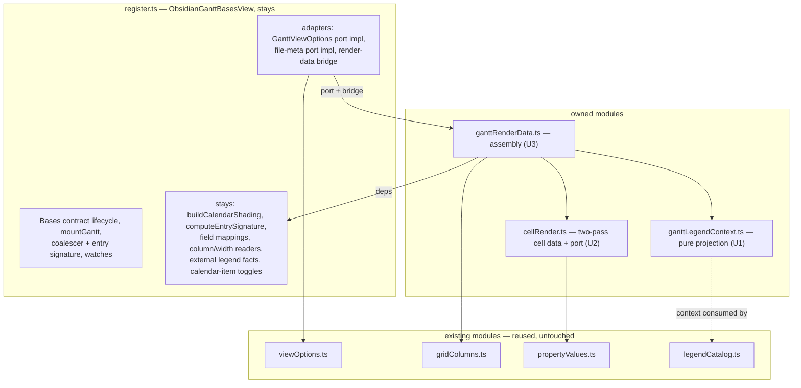
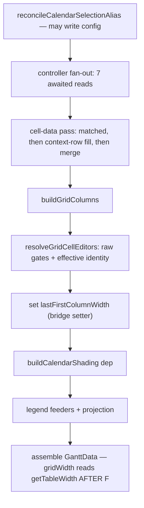

# register.ts Render-Data Assembly Extraction - Plan

## Goal Capsule

- **Objective:** extract the render-data assembly concern (`buildGanttData`) out of `src/bases/register.ts` into owned, unit-testable modules — a behavior-preserving refactor that separates the essential complexity (projecting the render contract) from the accidental complexity (Obsidian vault/metadata reads, Bases config reads) and gives the projection the unit coverage it has never had. This opens the campaign's rank-2 file, which no campaign slice has touched.
- **Authority hierarchy:** AGENTS.md and the engineering charter bind; this plan operationalizes them for this slice. Where this plan and current code disagree on an anchor, re-derive from code — baseline anchors in cited reports are stale by design, and § Measurement below records what was re-derived at HEAD `90b2470`.
- **Execution profile:** one PR per unit (U1 → U2 → U3, dependency-ordered, leaves first), squash-merged on green; a session ends at its first merged PR. Test-first: each unit's module tests are written against current behavior before the register-side original is deleted — red/green brackets each move.
- **Stop conditions:** a red armed-spec CI run (`gantt-column-sort`, `gantt-calendar-items-sources`, `gantt-legend`) outranks this work — download the `og-lifecycle` envelope from the run's `e2e-artifacts` before any rerun, then follow `docs/reports/2026-08-26-001-reliability-column-sort-diagnosis.md`. A unit exceeding ~4 hours to shippable triggers re-slicing. Abort to the nearest green checkpoint on context compaction or state-class errors.

---

## Measurement

Re-derived at HEAD `90b2470` on 2026-08-29, before choosing the target. The campaign's rule is that cited baselines are stale by design; these numbers supersede the expectations carried into this session.

**Instrument output** (`node scripts/maintainability-trend.mjs --at-ceiling`, window `7949fd113..90b2470b2`, 40 commits):

| Ranked file | Lines | Window touches | Complexity band 11–15 |
|---|---|---|---|
| `src/bases/GanttContainer.svelte` (rank 1) | 2,492 | 9 (22.5%) | **2** (was 4) — `resolveRowEditor` 11, `focusOnInstance` 15 |
| `src/bases/register.ts` (rank 2) | 1,931 | 3 (7.5%) | **0** |
| `src/controller/GanttController.ts` (rank 4) | 2,430 | 1 (2.5%) | 4 (12/14/13/13) |

At-ceiling count: **16**, unchanged from the 2026-08-25 report. Pressure band total: 79.

**Finding 1 — the churn instrument is currently saturated and cannot rank these targets.** Every window touch on all three ranked files is a campaign commit (#427, #430, #446, #450, #453, #459, #461, #462, #463). Zero feature or bug-fix commits touched any ranked file in the window. This is the distortion the baseline report predicted ("an extraction commit *touches* the file it shrinks, so the share ticks up on every slice"). Ranking therefore falls back to the full-history baseline (GanttContainer 18.7%, register.ts 14.9%, GanttController 7.3%), concern cohesion, and testability.

**Finding 2 — the `initGantt` weld has dissolved; it is no longer a slice.** The 2026-08-15 report characterizes it as 327 lines / 9 intercept sites / 14 action registrations over 9+ outer mutable bindings. Re-derived, it is **57 lines** (`src/bases/GanttContainer.svelte` `function initGantt`): an api-rebind guard, three `wire*` calls, `applyPersistedGridWidth`, a `dlog` counter, `wireSvarInterceptors`, and one best-effort scroll-reset `setTimeout`. PRs **#427 and #430** dissolved the weld (327 → 166 → 49 lines); **#446** then added 9 lines of diagnostics call hooks and **#453** moved those onto the seam without changing its size. What remains is wiring — the legitimate content of a composition root. Extracting it would be a source-level relocation, which the 2026-08-27 Farley alignment audit's drift-guard rules out as an improvement claim.

**Finding 3 — the report's option-reader candidate is unchanged, not stale, and it is still the weaker slice.** *(Corrected 2026-08-29 after independent re-derivation — see `docs/reports/2026-08-29-001-testing-first-principles-audit.md`.)* `src/bases/viewOptions.ts` (801 lines, 16 exported readers) and `test/unit/viewOptions.test.ts` (842 lines) are **byte-identical between the baseline commit `7949fd113` and HEAD**, and `register.ts` holds the same accessor methods at both commits — so the 2026-08-15 report measured exactly the state measured here, and its entry refers to the ~20 register-side accessor methods, not to unextracted reader implementations. Most of those accessors are 1–3 line adapters over `viewOptions.ts`, so extracting them would be relocation. **Two are not:** `getShowDateIndicators` (`:981`) and `getArrowMode` (`:830`) have no `read*` counterpart — they hardcode their Bases key and inline their default semantics (`!== false`; `=== 'all' ? 'all' : 'primary'`) inside the ranked file, asserted nowhere at the Jest tier, and both are read by `buildGanttData`. Giving them readers is a genuine extraction and rides U3. The two welds the report names — `mountGantt` (**388 lines**, 1092–1479) and `buildGanttData` (**193 lines**, 1482–1674) — are live and confirmed.

**Finding 4 — the decisive signal is testability, and it points at the render-data assembly.** *(Corrected 2026-08-29 — the original claim that no test reached the class was empirically false; see `docs/reports/2026-08-29-001-testing-first-principles-audit.md`.)* `ObsidianGanttBasesView` is a **1,547-line class** (296–1842). It is **not** uncovered: `test/unit/blockingBuilders.test.ts` constructs a real instance under Jest — handing the real `registerBasesGantt` a fake plugin that pockets the view factory, then calling that factory with a fake `App`/`config`/`data` — and drives five private methods (`buildFieldMappings`, `getEffectiveMappings`, `buildDatePolicyConfig`, `buildEstimateMeaningForTask`, `collectMarkedCalendarNotes`) through an `as unknown as ViewInternals` cast. Measured: 9 of 59 class-scope functions execute, and three separate one-line mutations to class-body methods turn 8, 14 and 14 of its 19 tests red. That is behavioural coverage.

The correct, narrower statement — which still selects this slice: **the class body's only unit coverage is the field-mapping / date-policy / marked-calendar-notes cluster reached through the registration-factory seam; the render-data assembly (`buildGanttData`, 1482–1674) and `mountGantt` have none.** `grep -rn "legendContext" test/` returns **no match** — `legendCatalog.test.ts` and `test/probe/legend-swatch.probe.ts` both hand-build a context and test the *consumer*, so the projection that produces it is verified only through `test/specs/gantt-legend.e2e.ts`. Farley's instrument is "if our tests are **difficult to write**, our design is poor" (Ch. 9) — difficult, not absent; the difficulty here is that the only Jest-tier path casts past `private`, which pins the internals this campaign exists to free.

**Reproducing this section.** `node scripts/maintainability-trend.mjs --at-ceiling --base 7949fd1135ed32017cb72aafdb92c4f09caf8267 --head HEAD` (the explicit base triggers the sweep, which reads the working tree, not the range — note that `--base` also overrides the merge-base, so this invocation prints 0 window touches for every ranked file and does **not** reproduce the table's Window-touches column); `git log --no-renames --format="%h %s" 7949fd113..90b2470 -- <ranked path>` for Finding 1 and for that column; `npx eslint <the three ranked files> --rule '{"sonarjs/cognitive-complexity": ["warn", 10]}'` for the band counts; `grep -rn "from '.*bases/register'" test/` and `grep -rn "legendContext" test/` for Finding 4. Dispute any number by re-running its command.

**Finding 5 — register.ts's defect is breadth, not depth.** It carries zero functions in the 11–15 complexity band; `buildGanttData` is 193 lines at cognitive complexity ≤ 5 (a threshold-5 sweep does not report it). This slice therefore claims **no complexity relief**, and any PR body claiming one would be inventing a reality to suit the argument (Ch. 7). The claim is cohesion and testability.

**Conclusion.** Rank 1 is at a defensible stopping point: its named slices are done, its remaining pressure is one at-ceiling function, and its concerns have a jest-tier measurement point. The campaign moves to **rank 2**, and testability picks the slice: the render-data assembly, leaves first.

**Recorded observation, parked (not fixed here):** `buildCalendarShading` (1686–1770) is named as a builder but performs three registration side effects — `calendarWatch.syncKnownPaths`, `calendarWatch.syncAssociations`, and the `lastAssociationTaskPaths` write. That is a separation-of-concerns finding for a later slice; this plan crosses the function as a dependency and changes nothing inside it. Entered in `docs/backlogs/backlog.md` at U1.

---

## Product Contract

### Summary

Move the render-data assembly out of the Bases view host into owned modules: the legend-context projection (pure), the grid cell-data pass (behind a file-meta port), and then `buildGanttData` itself (behind a view-options port plus a small live-accessor bridge). The view host keeps its Bases-contract lifecycle, its config and app access, and thin adapters. Derivations that only a real-Obsidian e2e run can observe today become provable in Jest.

### Problem Frame

`src/bases/register.ts` is the maintainability campaign's rank-2 ranked-defect file (`docs/reports/2026-08-15-001-maintainability-rediagnosis.md`, ranked list entry 2: 14.9% churn × 14 concerns in 1,872 lines — "the junction box every view-level feature passes through"). It has never been touched by a campaign slice, and `jest.config.mjs` (lines 54–59) carries a standing commitment about it in the coverage-exclusion comment: "Logic-dense files (register.ts, views) are NOT excluded — their logic is being extracted into tested modules (plan U2/U5), not hidden." For `register.ts` that extraction has not happened.

`buildGanttData` is Farley's `add_to_cart1` (Ch. 10, Listing 10.5): essential complexity — projecting the `GanttData` render contract from derived instances, colors, and view options — fused with accidental complexity: `this.app.vault.getAbstractFileByPath`, `instanceof TFile`, `this.app.metadataCache.getFileCache`, `this.config.get`, and `this.data?.data`. Those are the "alien interloper" lines Ch. 11 names, sitting inside the logic that matters, at a different level of abstraction from everything around them. The consequence is measured in Finding 4: the assembly has no Jest-tier measurement point of its own, and the **legend projection specifically** has exactly one measurement point anywhere — a >5-minute WDIO loop whose owning spec is the reliability campaign's rank-1 flaky spec. Other outputs of the assembly do have e2e owners (U2's verification names `test/specs/gantt-markdown-cells.e2e.ts`); the claim is scoped to the projection, not to the whole render contract.

### Requirements

**Extraction**

- R1. The legend-context projection — the fact-gathering feeders and the `legendContext` literal — lives in an owned module as a pure function; `register.ts` keeps the call.
- R2. The grid cell-data pass — matched assembly, the context-row fill, and their merge — lives beside its existing builders, with the Obsidian file-meta read crossing as an injected port; `register.ts` keeps the adapter that implements the port.
- R3. The remaining `buildGanttData` assembly lives in an owned module reached through a typed view-options port and a live-accessor bridge for the view's two mutable fields; `register.ts` keeps the port adapter and the call.

**Behavior preservation**

- R4. Behavior is preserved exactly. The ordering contracts named in KTD3 hold verbatim, `reconcileCalendarSelectionAlias` keeps its position and its config write, the raw-vs-effective mapping split keeps its two distinct call sites, and no read moves across an `await`.

**Testability**

- R5. Each extracted unit is provable at the Jest tier with no Obsidian host and no mounted component: the legend projection by direct call, the cell-data pass through a fake file-meta port, and the assembly through a spy port and bridge whose getters count and whose setters record.

**Reuse and guards**

- R5a. **Every unit that leaves a host-side adapter outside its extracted module owes one characterization through the registration-factory seam** (the mechanism `test/unit/blockingBuilders.test.ts` already uses — a new test of its own; that file stays green and unchanged), asserting a **distinguishing value for every field the adapter supplies, enumerated from the adapter's own output type**, never a hand-picked subset. Module tests use fakes and spy ports by design, so none of them can see a same-typed miswire in the host literal. Naming members instead of the rule is the failure this plan has already paid for three times: state the rule, derive the list.
- R6. Existing machinery is reused, never duplicated: `src/bases/viewOptions.ts`, `src/bases/cellRender.ts`, `src/bases/propertyValues.ts`, `src/bases/gridColumns.ts`, `src/bases/legendCatalog.ts`, `src/bases/barTreatment.ts` (`isSafeColor`), `src/bases/visualSemantics.ts`, `src/controller/InstanceExpansion.ts`. No second mechanism is introduced for a job one of these already does.
- R6a. **Every extracted entry point takes a single typed input object, not a positional list.** AGENTS.md caps parameters at 3–4, and each unit here crosses that on its own: the legend projection carries five facts, the cell-data pass five inputs. The object is also what makes the complete-field-set pins expressible — a named input set can be asserted whole, a positional list cannot.
- R7. The ranked-defect contract is satisfied: no ranked-file metric regresses, and each PR body states its improvement claim in cohesion/testability terms with metric deltas as bookkeeping (§ Ranked-defect review contract).

### Key decisions

- **Target is rank 2, not rank 1.** Governs the whole plan; argued from § Measurement Findings 1–5. Rank 1's three sequenced slices (interceptors #427/#430, style block #459, diff-sync #461–#463) are merged and its named `initGantt` weld has dissolved into wiring; rank 2 has never been sliced, and among the ranked files it holds the largest mass reachable only through the slowest tier. The recommendation is therefore explicit: **rank 1 is at a defensible stopping point and the campaign moves down the list**, which is a change of target from what the cited reports and session memory carried in.
- **Slice picked by testability, leaves first.** The unit order mirrors the four-times-proven sequencing in `docs/solutions/architecture-patterns/live-accessor-bridge-extraction-recipe.md` § 4 (PRs #461 → #462 → #463): move the leaves that need the least bridging first, the orchestrator last.
- **No new e2e.** Principle 5: the composed behavior is already covered by the existing specs that render the legend, the grid cells, and the chart. The derivations move to the fastest tier; adding an e2e for them would be the "new e2e for behavior already provable at a faster tier" the principle's test names.

### Scope Boundaries

- **Deferred to follow-up work:** `mountGantt` (388 lines — the other named weld, its own plan); the `buildCalendarShading` separation-of-concerns finding recorded in § Measurement; `GanttController.ts`'s `selectSource` mapping block (rank 4's named first slice).
- **Recommended follow-up unit, not promoted here (maintainer's call):** `test/perf/generator/buildGanttData.ts` exports `assembleGanttData` — a **second producer of the render contract**, i.e. a second mechanism for the job U3's module will own (principle 4). Its docstring records why it exists: the in-memory harness lacks the `app.vault` / `app.metadataCache` / `config.get` surface `buildGanttData` reaches for, so it populates only perf-load-bearing fields. U3 removes that reason — the harness can then supply in-memory adapters for the two ports and call the real assembler, taking producers from 2 to 1. Recorded by the 2026-08-29 audit's sequencer; its field-level counts are not re-derived here, so re-measure on promotion.
- **Stays in `register.ts` (crossed as deps or adapters, not moved):** `buildCalendarShading` and its cache, `computeEntrySignature`, the option-reader adapters over `viewOptions.ts`, `buildFieldMappings` / `getEffectiveMappings`, `getVisiblePropertyIds` / `getDisplayName` / `getColumnSize` / `getTableWidth`, `readExternalCalendarLegendFacts`, `getCalendarItemToggles`, the picker and switcher openers, every watch and lifecycle hook.
- **Outside this slice's identity:** any behavior change; any reliability-campaign work (see below); decomposing `src/bases/ganttSync.ts` (principle 7 "Not debt" endpoint); any feature work (frozen until the quality campaigns end).
- **Reliability-campaign boundary, stated explicitly.** `gantt-legend` is the reliability campaign's rank-1 defect, at a deliberate bounded stop whose stopping rule forbids new windows and speculative fixes. This plan opens no window, adds no probe, changes no behavior the legend spec observes, and does not edit `test/specs/gantt-legend.e2e.ts`. That U1 incidentally gives the legend's *inputs* deterministic Jest coverage is a maintainability consequence, not a reliability fix; no PR in this plan may be described as addressing the legend defect.

---

## Planning Contract

Each decision below cites the instrument it serves — a governing principle, a charter item, or a named *Modern Software Engineering* chapter, consulted via the maintainer’s book notes.

### Key Technical Decisions

- KTD1. **The legend projection is a pure module, not a bridge.** `src/bases/ganttLegendContext.ts` (name directional) exports a pure function from facts to `GanttLegendContext`. The extraction recipe's own boundary rule governs: "Do not use [the live accessor bridge] for pure logic… A bridge wrapped around pure logic is ceremony." The projection takes **one typed input object** carrying instances, colors, shading facts, source channels and toggles, and returns a value — no `this`, no Obsidian, no live state (R6a; five positional parameters would breach AGENTS.md's cap). Serves principle 5 (fastest reliable level) and Ch. 11 (separating essential from accidental complexity). It lands as a new module rather than inside `legendCatalog.ts` (734 lines) because the producer changes when the legend's *facts* change and the catalog changes when its *rows* change — two reasons to change, so the "and" test separates them (Ch. 10).
- KTD2. **The cell-data pass lands in `src/bases/cellRender.ts` beside its existing builders, not in a new module.** `buildCellData` and `buildFetchedCellData` already live there and already change with the fill strategy; the two-pass orchestration changes for the same reason, so Ch. 10's rule — "putting related concepts, concepts that change together, together" — puts it there. `cellRender.ts` is 160 lines, so this creates no second weld, and a new module with one consumer would be an abstraction without a present need (Ch. 12, YAGNI). The Obsidian read crosses as an injected **port** (Ch. 11, Ports & Adapters): the module states what it needs (`(path) => { basename, extension, frontmatter } | null`), and `register.ts` keeps the `TFile`/vault/metadataCache adapter that satisfies it.
- KTD3. **Three ordering contracts are behavior and are pinned, not tidied.** These are the reason a "read all the options once at the top" refactor would be a silent behavior change, and each becomes an assertable pin for the first time:
  1. **`lastFirstColumnWidth` is written mid-pass and read later in the same pass.** `this.lastFirstColumnWidth = firstColumnWidth(gridColumns)` (1568) precedes `gridWidth: this.getTableWidth()` (1635), and `getTableWidth()` reads that field as its fallback. The write crosses as a bridge setter and the read as a dep call, in that order.
  2. **`reconcileCalendarSelectionAlias()` runs first and may write config.** Its own comment records that the refresh a write triggers converges on the next pass. It keeps its position at the head of the assembly and stays in `register.ts`.
  3. **The raw-vs-effective mapping split is deliberate and stays split.** `buildFieldMappings()` (raw view config) gates progress/estimate writability; `getEffectiveMappings()` (resolved) supplies editor identity. The comment at 1548–1562 argues why. These are two distinct conventions, and the recipe's hard-won rule applies: pin them, never DRY-unify them.
- KTD4. **A view-options port, not twenty deps.** The assembly module reads option values through one typed `GanttViewOptions` port of getters; `register.ts` implements it as an adapter over the existing `viewOptions.ts` readers. This is Ch. 11's `s3client` → `store` improvement: the module is written from one consistent frame of reference and never learns that Bases config exists. It costs an adapter literal — Ch. 13's "decoupling may mean more code" is the accepted trade — and buys a named contract that a spy can implement. The port's getters are read at the points the current code reads them, so KTD3's ordering holds.
- KTD5. **A live accessor bridge for exactly two members** (CONCEPTS.md § Extraction seams; exemplars `src/bases/svarInterceptors.ts`, `src/bases/ganttSyncOrchestrator.ts`). The view's two mutable fields cross live: `externalEventsLoading` as a getter-only member (the external-batch wire mutates it between passes, so a captured value would go stale) and `lastFirstColumnWidth` as a setter (KTD3.1). Everything else crosses as deps or through the port. Getters and setters are bare reads and assignments; the module dereferences no accessor and calls no dep at construction, so a factory that eagerly read and cached cannot satisfy the census. Unlike the diff-sync seam, the caller here is a plain async method and not a Svelte `$effect`, so the synchronous-read and branch-scoped-read contracts do not apply — this bridge's whole obligation is liveness, and the tests say only that.
- KTD8. **Two contracts stated as rules with mechanical censuses, not as per-member scenario lists.** Three peer-review rounds enumerated members crossing the same two boundaries one at a time (`externalEventsLoading`, then `getInferredDragMode` and `ResolveRenderType`, then `isTaskNotesPresent`, `arrowMode` and `dateMappingNotice`). A hand-maintained list of members is incomplete by construction; the classes are what must be pinned.
  - **(a) The post-await read census.** U3's characterization step produces the *complete* enumeration of values `buildGanttData` reads **after** its `Promise.all` — today at least `isTaskNotesPresent`, `getShowDateIndicators`, `getHighlightWeekends`, the bar-source readers, `getCalendarItemToggles`, `readEstimateMeaning`, `readNonWorkingRendering`, `readExternalCalendarLegendFacts`, `resolveUserFieldTypes`, and the option reads inside the returned literal. Every member of that census owes a mid-await liveness pin: hold a controller promise pending, change its backing, resolve, assert the completed result carries the new value. The census is committed with the unit so a later reader can check it against the code rather than trust the list. Members read **before** the await are pinned the other way — see (c).
  - **(b) The complete-field-set pin.** `GanttData` has optional fields, so an extraction can silently drop one and keep typecheck, Jest and every behavioural e2e green — `dateMappingNotice` is the instance the peer found, but the exposure is every optional field. The suite asserts the assembled result's **full key set** against `GanttData`, with a distinguishing non-default value per optional field, so an omission fails rather than passes.
  - **(c) Pre-await snapshots are pinned as snapshots.** `arrowMode` is read **once** before `Promise.all` and must reach both `controller.getLinks(arrowMode)` and the returned `arrowMode` field — the same value, not two reads. Pin one getter read for the pass and assert the exact argument `getLinks` received equals the reported field; two reads would let a mid-pass mode change generate `primary` links while the result claims `all`, dropping secondary-instance edges.
- KTD6. **Test strategy: owned measurement points; no Obsidian host, no mounted component.** The bridge and the ports are the calipers (Ch. 9: "dependencies are the calipers"; Ch. 14 § Measurement Points: dependency injection is how fine-grained measurement points are made). Three fixtures: a plain-value fixture for the pure legend projection; a fake file-meta port with a call log for the cell-data pass; a spy port whose getters count and a spy bridge whose setters record, for the assembly. Liveness pins follow the recipe's call–mutate–call rhythm: mutate the backing field **between** two calls and assert the second call observed the new value, with the log zeroed after construction so construction-time reads cannot pay for a per-call assertion. No jest posture change: the unit tier keeps its Svelte and Obsidian mocks.

  **Weighed against the existing registration-factory seam** (principle 4 — no second mechanism for a job one already does). `test/unit/blockingBuilders.test.ts` already reaches this class under Jest: it hands the real `registerBasesGantt` a fake plugin that pockets the view factory, calls the factory with fakes, and casts to `ViewInternals`. That seam is right for what it does — supplying realistic view-side wiring to a *controller* characterization test — and it is not adopted here for three reasons. (1) It works by casting past `private`, so every test written that way pins the internals; adding more of them raises the cost of the refactor this campaign exists to make cheap (Ch. 12: tests written as tests rather than as specifications couple to implementation). (2) It cannot express this slice's sharpest assertion: the KTD3.1 ordering pin needs an ordered event log across the `lastFirstColumnWidth` write and the `getTableWidth` read, where a real view yields only the final object — a broken ordering still produces a plausible result, so the test would pass while the guard it names is broken (E4/E5). (3) Constructing the class to exercise one method also runs its constructor and field initializers (`super(controller)`, `createDiv`, `installBasesConfigRefreshHook`, the data adapter, the mount-token lifecycle, the shading cache) — none of it the assembly's business (Ch. 9, scope of measurement). The ports are therefore an additional measurement point for a different subject, not a replacement mechanism.
- KTD7. **Source-shape pin scope, settled in advance.** If U3's bridge literal warrants a source-shape pin, it is a tripwire for accidental drift, sharing its guarding with the compiler's excess-property check over the typed literal — never a parser hardened against crafted evasion. Six escalating hardening rounds on such a pin were deliberately eliminated from history on maintainer direction grounded in Modern Software Engineering's fear-of-over-engineering argument (Ch. 12). Pin-fortification is out of scope and is not to be re-proposed in review.

### High-Level Technical Design

Target topology — what moves, what stays, and the two seam surfaces:

Assembly ordering (behavior — preserve verbatim; KTD3):

### Ranked-defect review contract

`src/bases/register.ts` holds ranked-defect entry 2 (`docs/reports/2026-08-15-001-maintainability-rediagnosis.md` § The ranked defect list: 14.9% churn × 14 concerns in 1,872 lines; concern anchors in § Measurement 2, baseline-relative — re-derive from current code). This plan's touch **is** that entry's fix: the report names `buildGanttData` as one of the file's two welds, and § Measurement above retires the report's other named candidate (the option readers, already extracted) as stale.

- **Invariant:** no diagnostics or instrumentation concern moves into a ranked-defect file except through its seam module; a PR that grows a ranked file's line or concern count states the reason in its description, read against the trend measurement's output; a shrink states its improvement claim — metric deltas are bookkeeping, never the claim itself, and a source-level relocation is not a seam extraction (2026-08-27 Farley alignment audit).
- **Placement rule:** instrumentation and diagnostics live behind the seam (`src/bases/ganttLifecycleDiagnostics.ts`); views and junction files keep only call hooks; the lifecycle-capture names of the debug-log module are imported only by the seam. `register.ts` keeps its existing `createMountLifecycleCapture` seam usage untouched — no unit in this plan adds, removes, or relocates a diagnostics call site, and no new module in this plan imports a lifecycle-capture name. The new modules fall under the source-tree boundary closure automatically.
- **Improvement claim (the genuine seam-extraction argument):** the render-data projection's coupling to the Obsidian host — today direct vault, metadata-cache, and Bases-config reads interleaved with the projection logic — becomes an explicit, named, injectable port surface; and derivations whose only measurement point today is a WDIO run against real Obsidian — the legend projection's sole owner being a spec at a bounded reliability stop — gain direct unit coverage without casting past `private` (KTD6). That is the cohesion cut and the testability gain. **This slice claims no complexity relief** — `register.ts` carries zero functions in the 11–15 band (§ Measurement Finding 5). Line and concern deltas are bookkeeping; any part of a move that is mere relocation is annotated as such.
- **Definition of Done carries:** no ranked-file metric regresses (see Definition of Done), and the plan closes with a dated trend report re-enumerating the entry's metrics.

---

## Implementation Units

### U1. Extract the legend-context projection as a pure module

- **Goal:** `src/bases/ganttLegendContext.ts` exports a pure function producing `GanttLegendContext` from its facts; `buildGanttData` calls it. The feeders at 1579–1594 and the literal at 1646–1667 leave `register.ts`.
- **Requirements:** R1, R4, R5, R6 (per KTD1, KTD6).
- **Dependencies:** none.
- **Files:** `src/bases/ganttLegendContext.ts` (new), `src/bases/register.ts`, `test/unit/ganttLegendContext.test.ts` (new), `docs/backlogs/backlog.md` (park the `buildCalendarShading` finding).
- **Approach:**
  1. Define the input type from the facts the literal actually consumes; keep `readExternalCalendarLegendFacts` in `register.ts` and pass its result in (it reads the TaskNotes plugin handle and view config — accidental complexity that stays host-side).
  2. Move `hasRecordedRecurringOccurrences`, `hasNonAuthoredEdgeInstance`, and the two `isSafeColor` colour scans into the function, importing them from their existing homes (R6 — no re-implementation).
  3. Preserve both fallback chains verbatim, including which scan is filtered to the `external-event` family.
  4. Write the module tests first, against current behavior, then delete the register-side original.
- **Execution note:** reword any volatile-ref comment fragments while moving — the pre-commit guard greps added lines.
- **Test scenarios:**
  - Event colour falls back to the external representative colour when no visible instance carries a safe one; uses the instance colour when one does.
  - External-occurrence colour is drawn only from instances whose `calendarItem.family` is `external-event`; a safe colour on a non-external instance does not supply it.
  - An unsafe colour value is skipped by both scans, and the fallback applies (assert the resulting colour value, not the absence of the rejected one).
  - Empty instance list yields both colours from the external facts, with the recurring and non-authored-edge flags false.
  - A recorded recurring occurrence with **no** torn edge sets `hasRecordedRecurringOccurrences` and leaves `hasNonAuthoredEdges` false; a torn edge with no recorded occurrence does the inverse. The asymmetry is the point: facts that carry both flags at once cannot tell the two apart.
  - `externalCalendarsEnabled` and `calendarItems.showRecurring` carry through from their inputs unchanged.
  - **Complete-field-set pin (KTD8b at this seam):** one call with every input field carrying a distinguishing value, asserting the returned context's full key set and each value. It guards the module's routing of the fields it merely passes through — `barFillSource`/`barStripSource`/`barIconSource`, `statusColors`/`priorityColors`, `taskNotesPresent`/`showDateIndicators` — where a swap is type-correct and otherwise invisible. State its limit with it: the pin does **not** reach the host-side call that names those values into the module's argument object. The next scenario closes that.
  - **Adapter characterization through the registration-factory seam.** The host-side literal puts `taskNotesPresent` and `showDateIndicators` one line apart as two booleans, and neither the pin nor the legend e2e can tell them apart — the fixture sets both true. Drive the assembly through the seam `test/unit/blockingBuilders.test.ts` already uses (hand the real `registerBasesGantt` a fake plugin, take the pocketed view factory), with those two set to **different** values, and assert the resulting `legendContext` carries each on its own field. Its user-visible failure is concrete: TaskNotes loaded with date indicators disabled would hide TaskNotes rows and show disabled date-status rows. KTD6 declines this seam for the assembly, and two of its three reasons still bite here — the cast pins internals, and constructing the view runs its whole constructor. Accept both for this one scenario: only KTD6's second reason is specific to the ordering pin, and the ports cannot answer “did the adapter name the fields correctly” by construction, so the alternative is leaving a user-visible defect path with no gate at all. **R5a carries this obligation for U2 and U3 too**, so it is a rule rather than a promise made here on their behalf.
  - Mutation check: invert one fallback chain on purpose, observe red, revert.
- **Verification:** `npm run lint`, `npm run typecheck`, full `npx jest` bare; `npm run e2e:local -- --spec test/specs/gantt-legend.e2e.ts`, run unchanged as a **composition check, not a field-level gate**. It answers whether the legend still renders from the extracted projection. It cannot discriminate a swap of two same-typed fields: its fixture carries a recorded occurrence and a torn edge at the same time, and `legendCatalog` ORs virtual recurring into the same entry. The discriminating gate is the complete-field-set pin above, at the Jest tier. Approach step 2 moves both flags and both colour scans *inside* the module, so those four are covered by the module's own tests; the pin covers the module's routing of the fields it passes through. A red legend run is triaged under the reliability campaign's existing procedure, never "fixed" here.

### U2. Move the two-pass cell-data assembly behind a file-meta port

- **Goal:** the matched pass, the context-row fill, and their merge (1497–1534) live in `src/bases/cellRender.ts`; the vault/`TFile`/metadata-cache read becomes a port implemented by an adapter in `register.ts`.
- **Requirements:** R2, R4, R5, R6 (per KTD2, KTD6).
- **Dependencies:** U1 (sequencing only — keeps each PR's diff to one concern).
- **Files:** `src/bases/cellRender.ts`, `src/bases/register.ts`, `test/unit/cellRender.test.ts`.
- **Approach:**
  1. Add the pass function beside `buildCellData` / `buildFetchedCellData`, taking **a single typed options object** with the entries, visible property ids, cell-data context, instances and file-meta port (R6a — five positional parameters would breach AGENTS.md's cap and make the pass costly to evolve).
  2. `resolveUserFieldTypes` and `getObsidianPropertyWidget` read the Obsidian app; keep them host-side and pass the composed `ResolveRenderType` in, so the module stays free of Obsidian imports.
  3. Keep the single `resolveDateLocale()` snapshot shared by both passes — the comment at 1507–1508 states why it is taken once per pass.
  4. Preserve the `visiblePropIds.length > 0` guard and the `seen` set verbatim.
  5. Write the tests against current behavior first, then delete the register-side original.
- **Test scenarios:**
  - A matched row's record is not overwritten by a fetched record for the same path (assert the surviving record's value).
  - A context row absent from the Bases result is filled from the port, for both `cellRenders` and `propertyValues`.
  - Empty visible property ids: the port is never called (call-log census) and both maps come back as the matched pass left them.
  - A path the port answers with null is skipped, and the remaining paths still fill.
  - Both passes format through the same locale value (assert the formatted output agrees across a matched and a fetched row).
  - Liveness: change the port's backing metadata between two calls and assert the second call's records carry the new values.
  - **Every adapter output exercised through a real context row (R5a)**, not only through the fake port: a Show-all row resolved via the real `TFile`/metadata adapter carries a distinguishing value for **every field the port's output type declares** — `basename`, `extension` and `frontmatter` at today's shape, and whatever the type gains later. `frontmatter` is load-bearing and was missing from an earlier draft of this list: `buildFetchedCellData` builds each synthetic entry's frontmatter from the port (`src/bases/cellRender.ts:150`), so an adapter returning it empty leaves `note.*` cells blank on fetched rows while every other gate in this unit passes. The fake-port tests cannot catch swapped adapter fields, and the selected e2e covers matched rows that bypass the adapter entirely.
  - Mutation check: remove the "matched wins" ordering on purpose, observe red, revert.
- **Verification:** `npm run lint`, `npm run typecheck`, full `npx jest` bare; `npm run e2e:local -- --spec test/specs/gantt-markdown-cells.e2e.ts` green locally — the cell-rendering-owning spec, run unchanged as a regression check.

### U3. Move the remaining assembly behind the view-options port and the bridge

- **Goal:** `src/bases/ganttRenderData.ts` owns the assembly; `register.ts` keeps `buildGanttData` as an adapter that supplies the port, the deps, and the two-member bridge, plus the port implementation.
- **Requirements:** R3, R4, R5, R6, R7 (per KTD3, KTD4, KTD5, KTD6, KTD7).
- **Dependencies:** U1, U2.
- **Files:** `src/bases/ganttRenderData.ts` (new), `src/bases/register.ts`, `test/unit/ganttRenderData.test.ts` (new), `src/bases/viewOptions.ts` and `test/unit/viewOptions.test.ts` (**the two missing readers** — Measurement Finding 3: `getShowDateIndicators` and `getArrowMode` gain `read*` counterparts here, or the claim that they are a genuine extraction goes unpaid), `test/unit/blockingBuilders.test.ts` (**must remain green, unchanged** — it drives `buildFieldMappings`, `getEffectiveMappings`, `buildDatePolicyConfig`, `buildEstimateMeaningForTask` and `collectMarkedCalendarNotes` through a `ViewInternals` cast, and this unit turns three of those into adapter-supplied deps; the characterization step states whether they keep their current privacy and signatures).
- **Approach:**
  1. Define `GanttViewOptions` from the option values the assembly consumes, and the deps for the host collaborators that stay (`buildCalendarShading`, `getVisiblePropertyIds`, `getDisplayName`, `getColumnSize`, `getTableWidth`, `buildFieldMappings`, `getEffectiveMappings`, `readExternalCalendarLegendFacts`, `getCalendarItemToggles`, a **live `isTaskNotesPresent` supplier** (read after the awaits, per KTD8a — TaskNotes can load or unload while snapshot collection is pending, and a precomputed value yields stale companion availability and wrong legend rows), a **`ResolveRenderType` factory** (see 1a), the file-meta port, the grid adapter, the Bases entries supplier).
  1a. **`ResolveRenderType` crosses as a provider the module invokes *after* the awaits, never as a precomposed value.** Today `resolveUserFieldTypes(this.app)` runs after `Promise.all`; composing the resolver host-side before the module call would hoist that live TaskNotes-config read ahead of the await window, so a user-field configuration change during a slow snapshot would yield stale field types and select the wrong cell rendering. Same rule for any other dep that reads live host config: the module calls it, at the point the current code reads it.
  1b. **`getInferredDragMode` is a gesture-time live read, not a per-assembly value.** It rides the render contract as a function (`getInferredDragMode: () => …`) and is invoked when the user drags, after the assembly that produced the object. It crosses as a supplier the assembled result closes over — never resolved to a value during assembly.
  2. Bridge members: `externalEventsLoading` getter-only, `lastFirstColumnWidth` setter (KTD5). The interface declares the read-only member as such, so a write the module was never meant to make is a compile error.
  3. `reconcileCalendarSelectionAlias` stays in `register.ts` and keeps its position ahead of the module call (KTD3.2).
  4. The controller crosses as a parameter, as it does today; the seven awaited reads keep their single `Promise.all`.
  5. Both mapping call sites keep their distinct sources (KTD3.3); the `timeEstimateWriteEnabled` gate keeps reading the raw mappings.
  6. Write the module tests and the ordering pins first, then delete the register-side original.
- **Execution note:** every function in the new module stays at or under cognitive complexity 15; if the assembly lands above it, extract a real helper rather than restructuring to game the metric, and if that pushes the unit past ~4 hours, re-slice.
- **Test scenarios:**
  - Ordering pin (KTD3.1): the `lastFirstColumnWidth` bridge setter is recorded **before** the `getTableWidth` dep is called, and the assembled `gridWidth` is the value that dep returned (single ordered event log).
  - Construction census: the factory reads no bridge accessor and calls no dep or port getter (all counters zero after construction, before any assembly call).
  - **Post-await liveness, one pin per census member (KTD8a).** For every value the committed census lists as read after `Promise.all`: hold a controller promise pending, change its backing mid-await, resolve, and assert the completed result carries the new value. The census is the test list — adding a member to the census without a pin fails review. Named instances the characterization already owes: `externalEventsLoading` (`onExternalBatchFlags` fires during snapshot collection, and a pre-`Promise.all` read hides the loading indicator), `isTaskNotesPresent`, `showDateIndicators`, and the user-field types behind `ResolveRenderType` (Approach 1a).
  - **Pre-await snapshot pin, `arrowMode` (KTD8c):** exactly one `arrowMode` getter read for the pass, and the argument `controller.getLinks()` received is the same value the result reports — asserted as equal, not merely both present.
  - **Host-adapter characterization (R5a).** The spy port proves the module's reads; it cannot see the `register.ts` literal that supplies them. Drive the assembly through the registration-factory seam with a distinguishing value for every same-typed field the options adapter supplies, the booleans especially. Mapping `showToolbar` to `getHideTopLevelSubtasks` typechecks and passes every port-based test specified here, and shows the toolbar in a view configured to hide it.
  - **Complete-field-set pin (KTD8b):** the assembled result's full key set matches `GanttData`, each optional field carrying a distinguishing non-default value — `dateMappingNotice` built from a `getDateMappingInfo()` that yields a recognisable string, so a dropped field fails rather than passes typecheck.
  - Liveness, `getInferredDragMode`, **after** assembly (Approach 1b): assemble, then mutate the backing option and call the *same result's* `getInferredDragMode()` without reassembling, asserting the new value. This one is not a census member — it is invoked at gesture time, after the pass — and the between-assemblies form would pass a per-assembly snapshot, whose user-visible failure is that "don't ask again" prompts again on the next drag.
  - Mapping split pin (KTD3.3): a fixture whose raw and effective mappings disagree yields editor identity from the effective set and the progress/estimate write gates from the raw set.
  - The legend context on the result is the value U1's projection returned for the pass's facts (module composition, asserted on a distinguishing field).
  - The cell-data maps on the result are the ones U2's pass produced (asserted on a distinguishing record).
  - The controller's seven reads are **started together, not merely awaited together**: assert all seven methods have been invoked before *any* of their promises is resolved, then that the assembly stays pending while one remains outstanding. "One read pending blocks the result" is satisfied by sequential awaits, and sequential reads let a source update between them combine old instances with new palettes or choice options.
  - **The two new readers, tested directly against the real config adapter** (not through the spy port, which bypasses coercion entirely): `readShowDateIndicators` defaults to true and is false only on an explicit `false`; `readArrowMode` returns `all` for `'all'`, `primary` for `'primary'`, and `primary` for every other value including an invalid one — the coercion `=== 'all' ? 'all' : 'primary'` that today lives inlined in the ranked file. Without these, a wrong default or a widened coercion (an invalid arrow value becoming `all`) passes every other gate in this unit.
  - Mutation check on the ordering pin: reverse the setter/dep order on purpose, observe red, revert.
  - Mutation check on the concurrency pin: make the seven controller reads sequential on purpose, observe red, revert.
- **Verification:** `npm run lint`, `npm run typecheck`, full `npx jest` bare; `npm run e2e:local -- --spec test/specs/gantt-legend.e2e.ts` run locally as an unchanged regression check (a red run is triaged under the reliability campaign's existing procedure, never "fixed" here); trend output shows the rank-2 result with the improvement claim stated in the PR body.

---

## Verification Contract

| Gate | Command / check | Applies |
|---|---|---|
| Lint (boundary closure + complexity ≤ 15, new modules included) | `npm run lint` | every unit |
| Typecheck | `npm run typecheck` | every unit |
| Full unit suite, bare (never piped — a pipeline exits with the last command's status) | `npx jest` | every unit, before every push |
| Behavior-observing e2e (regression check, not the proof tier) | `npm run e2e:local -- --spec <the unit's owning spec>` (park any `_local-*.e2e.ts` probes first) — U1 `gantt-legend`, U2 `gantt-markdown-cells`, U3 `gantt-legend` | **U1**, U2, U3 |
| Guard tests | `test/unit/ganttLifecycleSeam.test.ts`, `test/unit/maintainabilityBoundaryConfig.test.ts`, and the boundary mutation harness pass unchanged | every unit |
| Review receipts | `check-review-receipts.mjs record ce-code-review`, then `cross-model-peer-review.sh main <out> --record` with `PATH="/c/ProgramData/PowerShell7:$PATH"` | every push |
| Trend measurement | read `maintainability-trend.mjs` per-PR output; PR body answers its ranked-file prompt and cites rank 2 | every PR |
| Hosted gate | `@codex review`; read inline threads **and** issue comments; zero unresolved threads before merge | every PR |

No new e2e spec or assertion is added by this plan (§ Key decisions). No screenshot gate applies — the slice has no visual change; an unexpected visual difference is a behavior-preservation failure, not a screenshot task. A red armed-spec CI run is ambiguous by default: download the `og-lifecycle` envelope before any rerun, and never attribute it to this refactor, or dismiss it as flake, without the trace.

---

## Definition of Done

- U1–U3 merged via per-unit PRs, each on green gates (CI + both local receipts + zero unresolved hosted-review threads).
- `src/bases/register.ts` no longer holds the legend-context projection, the two-pass cell-data assembly, or the render-data assembly body; it keeps its Bases-contract lifecycle, `mountGantt`, the watches, the calendar-shading builder, and the port and bridge adapters.
- **No ranked-file metric regresses:** `register.ts`'s line count and concern count do not grow; the render-data-assembly concern relocates behind the seam and the closing trend report re-enumerates the count, so the shrink is claimed only where the enumeration supports it. Every function in every new or edited module is at or under cognitive complexity 15. `src/bases/GanttContainer.svelte`, `src/controller/GanttController.ts`, and the other ranked files are untouched.
- Each PR body states the improvement claim per the drift-guard — the host-coupling cut into named ports plus unit coverage where none existed — with metric deltas as bookkeeping, any pure relocation annotated as such, and **no complexity-relief claim** (§ Measurement Finding 5).
- The new and edited unit suites carry the behavior pins listed per unit; the liveness pins mutate their backing state between calls and zero their counters after construction; the mutation checks named per unit have been run — break the guarded behavior on purpose, observe red, revert, and print the applied change as the evidence.
- Any pre-existing defect surfaced during characterization is recorded in `docs/backlogs/backlog.md` and parked, not silently fixed. The `buildCalendarShading` separation-of-concerns finding is parked at U1.
- A dated trend report lands under `docs/reports/` at plan close, re-enumerating rank 2's metrics as the evidence for the statement above (charter dated-report obligation).
- No abandoned experimental code in any diff; volatile-ref comment fragments reworded, not carried.

---

## Appendix — Sources & Research

- `docs/reports/2026-08-15-001-maintainability-rediagnosis.md` — rank-2 entry (§ The ranked defect list), the measurement method this plan's § Measurement reproduces, and the concern inventory whose option-reader candidate Finding 3 retires.
- `docs/reports/2026-08-27-001-farley-alignment-audit.md` — the relocation-vs-seam-extraction drift-guard binding the improvement claim.
- `docs/solutions/architecture-patterns/live-accessor-bridge-extraction-recipe.md` — the four-times-proven bridge mechanics, the pure-logic boundary (KTD1), the sequencing rule, and the liveness and characterization pitfalls this plan inherits.
- `docs/solutions/workflow-issues/run-behavior-neutral-refactoring-as-releasable-reviewed-slices.md` — the campaign playbook (slicing, landing cadence, characterization-first).
- `docs/solutions/workflow-issues/plan-is-the-single-point-of-failure-for-plan-reviewing-gates.md` — why this plan carries the ranked-defect contract in full.
- `docs/architecture/principles.md` — principle 4 (reuse the owner's mechanism), principle 5 (fastest reliable level; testability is design feedback), principle 7 (semantic cohesion, falsifiable).
- `docs/engineering/practices.md` — E1/E11 campaign rule and plan contract, E4/E5 (a test's name is a claim), E8/E2 (complexity ceiling), session cadence.
- CONCEPTS.md § Extraction seams (live accessor bridge, read census, liveness pin, source-shape pin), § Pillar measurement (ranked-defect file, placement boundary).
- Dave Farley, *Modern Software Engineering: Doing What Works to Build Better Software Faster* (Addison-Wesley, 2021), consulted for this plan via the maintainer’s book notes: Ch. 7 (Inventing a Reality to Suit Our Argument — Finding 5's honesty constraint), Ch. 8 (Scope of an Experiment — the predict-the-failure discipline behind the mutation checks), Ch. 9 (The Importance of Testability; Designing for Testability Improves Modularity — measurement points and the calipers), Ch. 10 (How to Achieve Cohesive Software; Costs of Poor Cohesion — cohesion as cost of change, and Listing 10.5's `add_to_cart1`), Ch. 11 (Separating Essential and Accidental Complexity; Ports & Adapters — the alien-interloper line and the port), Ch. 12 (Fear of Over-Engineering; Picking Appropriate Abstractions; Always Prefer to Hide Information — YAGNI and KTD7), Ch. 13 (Decoupling May Mean More Code; DRY Is too Simplistic — KTD4's accepted cost and KTD3.3's preserved split), Ch. 14 (Measurement Points; How to Improve Testability).
- Current-code anchors verified at HEAD `90b2470`, span ends corrected 2026-08-29 by independent re-derivation: `register.ts` 1,931 lines; `ObsidianGanttBasesView` **296–1842** (1,547 lines; 1844–1849 is the JSDoc of the free function `isTaskNotesPresent`); `mountGantt` **1092–1479** (388 lines); `buildGanttData` **1482–1674** (193 lines; 1676 is the next member's JSDoc); cell-data pass 1497–1534; `lastFirstColumnWidth` write 1568; legend feeders 1579–1594; `gridWidth` read 1635; `legendContext` literal **1646–1666**; `buildCalendarShading` 1686–1770. Start anchors were all exact; six span *ends* were over-stated by 1–7 lines in the first draft. All baseline spans in cited reports are stale relative to these.
- `docs/reports/2026-08-29-001-testing-first-principles-audit.md` — the audit that corrected Findings 2/3/4 and the anchors above, established the factory-seam comparison in KTD6, and recorded the perf-harness rival producer.
