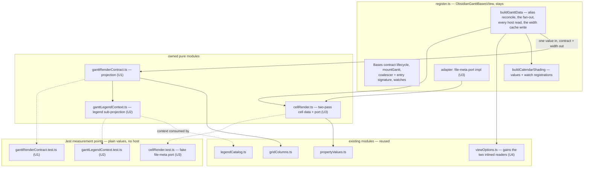
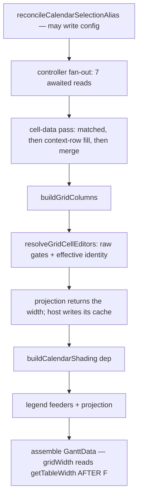

# register.ts Render-Contract Projection Extraction - Plan

## Goal Capsule

- **Objective:** a maintainer can change how the Gantt's render contract is projected (a legend fact, a cell-data field, a view option) with a Jest test telling them within seconds whether the projection still holds — today that answer exists only in a WDIO run against real Obsidian. Means: cut the essential complexity (projecting `GanttData` from values) away from the accidental (Obsidian and Bases reads, the width cache, the calendar-watch registrations) so the projection is a **pure function tested through its own public signature**, with the host keeping every read, in its current order, and passing values in. Behavior preserved exactly. This opens the campaign's rank-2 file, which no campaign slice has touched; `mountGantt` remains after this plan (§ Ranked-defect review contract).
- **Authority hierarchy:** AGENTS.md and the engineering charter bind; this plan operationalizes them for this slice. Where this plan and current code disagree on an anchor, re-derive from code — baseline anchors in cited reports are stale by design, and § Measurement below records what was re-derived at HEAD `90b2470`.
- **Execution profile:** one PR per unit (U1 → U2 → U3 → U4, dependency-ordered: the projection first, then its legend sub-projection, then the cell-data port, then the readers and the closing report), squash-merged on green; a session ends at its first merged PR. Test-first: each unit's module tests are written against current behavior before the register-side original is deleted — red/green brackets each move.
- **Provenance:** supersedes `docs/plans/2026-08-29-001-refactor-register-render-data-extraction-plan.md`, which is unchanged on main apart from its forward pointer. **Why it changed direction:** the maintainer ruled on 2026-09-03 that this campaign's plans must survive the decomposition-balance guidance in the *Modern Software Engineering* book notes (§ Decomposition balance below) or be replanned. Audited against those rules and the current code, the old plan's U3 failed them: it moved the render-data assembly behind a nineteen-getter view-options port, a ten-member dependency object and a two-member live-accessor bridge to observe five decisions — a fixture set larger than the logic it watched, and a change surface that widened from seven places to ten for every new view option (§ Measurement, re-audit). Its U4 was blocked outright: the perf harness cannot import the view class at all. A first replan then over-corrected: it kept the two sound extractions but left the assembly in place and proposed to *characterize* it through the registration-factory seam, calling a private method through a cast and writing private fields. The hosted gate and peer round 17 both refused that, and correctly — charter E4 requires tests to assert behavior through public interfaces and to survive reimplementation, and no recorded divergence covers testing through private members. **The maintainer ruled on 2026-09-03 to take the course *Modern Software Engineering* prescribes rather than seek an exception:** a test that is hard to write is reporting a design defect, so fix the design (Ch. 9, Ch. 11 § Using TDD to Drive Separation of Concerns, Ch. 12 § Picking Appropriate Abstractions — "if the test is fragile in the face of change, then my abstraction is fragile"). The error in the first replan was comparing one bad extraction (a nineteen-getter port plus a ten-member deps object plus a two-member bridge) against no extraction, and rejecting extraction itself. The abstraction Ch. 12 asks for is neither: the projection takes **a value**, not a port of getters. This plan extracts it as a pure function, and records the perf-harness duplication as a measured trade instead of a unit.
- **Stop conditions:** a red armed-spec CI run (`gantt-column-sort`, `gantt-calendar-items-sources`, `gantt-legend`) outranks this work — download the `og-lifecycle` envelope from the run's `e2e-artifacts` before any rerun, then follow `docs/reports/2026-08-26-001-reliability-column-sort-diagnosis.md`. A unit exceeding ~4 hours to shippable triggers re-slicing. Abort to the nearest green checkpoint on context compaction or state-class errors.

---

## Measurement

Re-derived at HEAD `90b2470` on 2026-08-29, before choosing the target. The campaign's rule is that cited baselines are stale by design; these numbers supersede the expectations carried into this session.

**Instrument output** (`node scripts/maintainability-trend.mjs --at-ceiling`, window `7949fd113..90b2470b2`, 40 commits):

| Ranked file | Lines | Window touches | Complexity band 11–15 |
|---|---|---|---|
| `src/bases/GanttContainer.svelte` (rank 1) | 2,492 | 9 (22.5%) | **2** (was 4) — `resolveRowEditor` 11, `focusOnInstance` 15 |
| `src/bases/register.ts` (rank 2) | 1,931 | 3 (7.5%) | **0** |
| `src/controller/GanttController.ts` (rank 4) | 2,430 | 1 (2.5%) | 4 (12/14/13/13) |

At-ceiling count: **16**, unchanged from the 2026-08-25 report. Pressure band total: 79.

**Finding 1 — the churn instrument is currently saturated and cannot rank these targets.** Every window touch on all three ranked files is a campaign commit (#427, #430, #446, #450, #453, #459, #461, #462, #463). Zero feature or bug-fix commits touched any ranked file in the window. This is the distortion the baseline report predicted ("an extraction commit *touches* the file it shrinks, so the share ticks up on every slice"). Ranking therefore falls back to the full-history baseline (GanttContainer 18.7%, register.ts 14.9%, GanttController 7.3%), concern cohesion, and testability.

**Finding 2 — the `initGantt` weld has dissolved; it is no longer a slice.** The 2026-08-15 report characterizes it as 327 lines / 9 intercept sites / 14 action registrations over 9+ outer mutable bindings. Re-derived, it is **57 lines** (`src/bases/GanttContainer.svelte` `function initGantt`): an api-rebind guard, three `wire*` calls, `applyPersistedGridWidth`, a `dlog` counter, `wireSvarInterceptors`, and one best-effort scroll-reset `setTimeout`. PRs **#427 and #430** dissolved the weld (327 → 166 → 49 lines); **#446** then added 9 lines of diagnostics call hooks and **#453** moved those onto the seam without changing its size. What remains is wiring — the legitimate content of a composition root. Extracting it would be a source-level relocation, which the 2026-08-27 Farley alignment audit's drift-guard rules out as an improvement claim.

**Finding 3 — the report's option-reader candidate is unchanged, not stale, and it is still the weaker slice.** *(Corrected 2026-08-29 after independent re-derivation — see `docs/reports/2026-08-29-001-testing-first-principles-audit.md`.)* `src/bases/viewOptions.ts` (801 lines, 16 exported readers) and `test/unit/viewOptions.test.ts` (842 lines) are **byte-identical between the baseline commit `7949fd113` and HEAD**, and `register.ts` holds the same accessor methods at both commits — so the 2026-08-15 report measured exactly the state measured here, and its entry refers to the ~20 register-side accessor methods, not to unextracted reader implementations. Most of those accessors are 1–3 line adapters over `viewOptions.ts`, so extracting them would be relocation. **Two are not:** `getShowDateIndicators` (`:981`) and `getArrowMode` (`:830`) have no `read*` counterpart — they hardcode their Bases key and inline their default semantics (`!== false`; `=== 'all' ? 'all' : 'primary'`) inside the ranked file, asserted nowhere at the Jest tier, and both are read by `buildGanttData`. Giving them readers is a genuine extraction and rides U4. The two welds the report names — `mountGantt` (**388 lines**, 1092–1479) and `buildGanttData` (**193 lines**, 1482–1674) — are live and confirmed.

**Finding 4 — the decisive signal is testability, and it points at the render-data assembly.** *(Corrected 2026-08-29 — the original claim that no test reached the class was empirically false; see `docs/reports/2026-08-29-001-testing-first-principles-audit.md`.)* `ObsidianGanttBasesView` is a **1,547-line class** (296–1842). It is **not** uncovered: `test/unit/blockingBuilders.test.ts` constructs a real instance under Jest — handing the real `registerBasesGantt` a fake plugin that pockets the view factory, then calling that factory with a fake `App`/`config`/`data` — and drives four private methods (`buildFieldMappings`, `getEffectiveMappings`, `buildDatePolicyConfig`, `collectMarkedCalendarNotes`) through an `as unknown as ViewInternals` cast, reaching `buildEstimateMeaningForTask` transitively through the date-policy builder. Measured: 9 of 59 class-scope functions execute, and three separate one-line mutations to class-body methods turn 8, 14 and 14 of its 19 tests red. That is behavioural coverage.

The correct, narrower statement — which still selects this slice: **the class body's only unit coverage is the field-mapping / date-policy / marked-calendar-notes cluster reached through the registration-factory seam; the render-data assembly (`buildGanttData`, 1482–1674) and `mountGantt` have none.** `grep -rn "legendContext" test/` returns **no match** — `legendCatalog.test.ts` and `test/probe/legend-swatch.probe.ts` both hand-build a context and test the *consumer*, so the projection that produces it is verified only through `test/specs/gantt-legend.e2e.ts`. Farley's instrument is "if our tests are **difficult to write**, our design is poor" (Ch. 9) — difficult, not absent; the difficulty here is that the only Jest-tier path casts past `private`, which pins the internals this campaign exists to free.

**Reproducing this section.** `node scripts/maintainability-trend.mjs --at-ceiling --base 7949fd1135ed32017cb72aafdb92c4f09caf8267 --head HEAD` (the explicit base triggers the sweep, which reads the working tree, not the range — note that `--base` also overrides the merge-base, so this invocation prints 0 window touches for every ranked file and does **not** reproduce the table's Window-touches column); `git log --no-renames --format="%h %s" 7949fd113..90b2470 -- <ranked path>` for Finding 1 and for that column; `npx eslint <the three ranked files> --rule '{"sonarjs/cognitive-complexity": ["warn", 10]}'` for the band counts; `grep -rn "from '.*bases/register'" test/` and `grep -rn "legendContext" test/` for Finding 4. Dispute any number by re-running its command.

**Finding 5 — register.ts's defect is breadth, not depth.** It carries zero functions in the 11–15 complexity band; `buildGanttData` is 193 lines at cognitive complexity ≤ 5 (a threshold-5 sweep does not report it). This slice therefore claims **no complexity relief**, and any PR body claiming one would be inventing a reality to suit the argument (Ch. 7). The claim is cohesion and testability.

**Conclusion.** Rank 1 is at a defensible stopping point: its named slices are done, its remaining pressure is one at-ceiling function, and its concerns have a jest-tier measurement point. The campaign moves to **rank 2**, and testability picks the slice: the render-data assembly, leaves first.

**Recorded observation, parked (not fixed here):** `buildCalendarShading` (1686–1770) is named as a builder but performs three registration side effects — `calendarWatch.syncKnownPaths`, `calendarWatch.syncAssociations`, and the `lastAssociationTaskPaths` write. That is a separation-of-concerns finding for a later slice; this plan crosses the function as a dependency and changes nothing inside it. Entered in `docs/backlogs/backlog.md` at U2.

---

**Re-audit 2026-09-03 (decomposition balance).** `src/bases/register.ts` is byte-identical to the plan's HEAD (no commits touched it since), so every anchor above still holds. `buildGanttData` is 193 lines at cognitive complexity ≤ 5. Its body divides as: the seven-read fan-out (13 lines), the two-pass cell data (20 lines, where the vault and metadata-cache reads live), grid columns and editors (30 lines, calls into pure modules that already have their own tests), the legend feeders (25 lines, pure), and a return literal of roughly 80 lines that reads about thirty-five option and config values and places them on the render contract. The literal is wiring, not logic: it makes five decisions of its own (the alias reconcile first, one `Promise.all`, the width write before the width read, the raw-versus-effective mapping pairing, and the drag-mode supplier crossing as a function). Measured against the balance rules (numbers re-derived on 2026-09-03, and re-read after the 2026-09-03 ruling): a new view option touches **seven** places today — the option definition and its reader in `src/bases/viewOptions.ts`, the reader's test, the adapter method in `register.ts`, the render literal, the `GanttData` field, and the view component that reads it. Under the superseded port design it would have touched **ten**; under this plan it touches the same seven, because the option is still read host-side and simply arrives in the projection's input value.

**What the pure cut buys, measured against what the first replan proposed to test.** `buildGanttData` interleaves three kinds of work: reads of the host (about twenty option values, the visible columns, the user-field types, the display locale), one cache write and one side-effecting call (the name-column width; the calendar-shading builder, whose registrations the render contract never exposes), and the projection itself (about eighty lines assembling `GanttData` from values already in hand). Only the third kind is essential complexity. Separating it retires four whole categories of test the first replan needed:

- **The post-await read contract becomes structural.** A pure projection cannot read anything, so no read can cross the fan-out — enforced by construction rather than by a census that six peer rounds could not state completely.
- **The width work never enters the projection.** `buildGridColumns` and `firstColumnWidth` are already pure helpers the host calls, and the cache write must stay ahead of the calendar-shading call, which can throw; the host keeps both in place and passes the columns in. (The cache has a second consumer — the grid-width persist path during a user drag — so it stays a host field.)
- **The cast and the private writes disappear.** The projection is exported and called with values, so its tests need no view instance, no factory harness, and no access to private members. Charter E4 is satisfied on its own terms: a full reimplementation passes the suite unchanged.
- **The seam-harness extraction is no longer needed for this plan**, so `test/unit/blockingBuilders.test.ts` is untouched.

## Product Contract

### Summary

Cut the render-contract projection — the essential complexity of `buildGanttData` — out of the Bases view host as a pure function over one input value, then split its legend sub-projection into its own module and move the grid cell-data pass behind a file-meta port; the host keeps every read in its current position, the width cache, and the calendar-shading call, and the two inlined option coercions join the readers module (revised 2026-09-03 under the maintainer's ruling — see § Decomposition balance and the Goal Capsule's provenance). The view host keeps its Bases-contract lifecycle, its config and app access, the assembly literal, and one thin adapter. Derivations that only a real-Obsidian e2e run can observe today become provable in Jest.

### Problem Frame

`src/bases/register.ts` is the maintainability campaign's rank-2 ranked-defect file (`docs/reports/2026-08-15-001-maintainability-rediagnosis.md`, ranked list entry 2: 14.9% churn × 14 concerns in 1,872 lines — "the junction box every view-level feature passes through"). It has never been touched by a campaign slice, and `jest.config.mjs` (lines 54–59) carries a standing commitment about it in the coverage-exclusion comment: "Logic-dense files (register.ts, views) are NOT excluded — their logic is being extracted into tested modules (plan U2/U5), not hidden." For `register.ts` that extraction has not happened.

`buildGanttData` is Farley's `add_to_cart1` (Ch. 10, Listing 10.5): essential complexity — projecting the `GanttData` render contract from derived instances, colors, and view options — fused with accidental complexity: `this.app.vault.getAbstractFileByPath`, `instanceof TFile`, `this.app.metadataCache.getFileCache`, `this.config.get`, and `this.data?.data`. Those are the "alien interloper" lines Ch. 11 names, sitting inside the logic that matters, at a different level of abstraction from everything around them. The consequence is measured in Finding 4: the assembly has no Jest-tier measurement point of its own, and the **legend projection specifically** has exactly one measurement point anywhere — a >5-minute WDIO loop whose owning spec is the reliability campaign's rank-1 flaky spec. Other outputs of the assembly do have e2e owners (U3's verification names `test/specs/gantt-markdown-cells.e2e.ts`); the claim is scoped to the projection, not to the whole render contract.

### Requirements

**Extraction**

- R1. The legend-context projection — the fact-gathering feeders and the `legendContext` literal — lives in an owned module as a pure function; `register.ts` keeps the call.
- R2. The grid cell-data pass — the matched pass, the context-row fill, and their merge — lives beside its existing builders, with the Obsidian file-meta read crossing as an injected port; `register.ts` keeps the adapter that implements the port.
- R3. The render-contract projection lives in an owned module as a **pure function** over a single typed input value and returns the contract together with the first-column width; `register.ts` keeps every host read in its current position, the cache write, the calendar-shading call and its registrations, and the call to the projection. The two option coercions inlined in the assembly move to the readers module beside their siblings.

**Behavior preservation**

- R4. Behavior is preserved exactly. The ordering contracts named in KTD3 hold verbatim, `reconcileCalendarSelectionAlias` keeps its position and its config write, the raw-vs-effective mapping split keeps its two distinct call sites, and no read moves across an `await`.

**Testability**

- R5. Each extracted unit is provable at the Jest tier with no Obsidian host, no mounted component, and **no access to private members**: the render-contract projection and the legend projection by direct call with plain values, the cell-data pass through a fake file-meta port. A full reimplementation of any of them passes its suite unchanged (charter E4).

**Reuse and guards**

- R5a. **The host-side adapter each unit leaves behind is thin by construction — it reads values and passes them — and its composition is covered by the existing behavior-observing specs, not by a new test that reaches into the view.** The risk it carries is a miswire of two same-typed values; each unit names the miswire its extraction makes possible and states which existing spec would show it. Where no spec would, asserting a **distinguishing value for every field the adapter supplies, enumerated from the adapter's own output type**, never a hand-picked subset. Module tests use fakes and spy ports by design, so none of them can see a same-typed miswire in the host literal. Naming members instead of the rule is the failure this plan has already paid for three times: state the rule, derive the list.
- R5b. **The scenario lists in this plan are illustrative; writing each unit's tests against current behavior produces the binding list.** Each listed pin states the contract it proves and the mutation it must turn red; the spy or fixture mechanism named beside it is the plan's best current reading and may be replaced by a stronger one during characterization without a plan change, provided the mutation still goes red. Each unit writes tests against current behavior *before* its original is deleted, and that step must enumerate **every observable decision of the code being moved** — selection and ordering semantics (`.find` is first-match, not any-match), fallback precedence, guard conditions, and the position of side effects. A scenario list maintained by hand in this document cannot be complete, and treating it as complete is the same hand-maintained-list defect R5a and R6a remove, committed one level up. Scenarios named here are the ones easiest to get wrong, never the whole set; a reviewer who finds an unnamed observable decision has found a characterization gap, not a missing bullet. **The same binding covers code that stays.** Where this plan states a requirement about host-side code it does *not* move — a call that must keep its position, a side effect that must still happen, an ordering the assembly depends on — that requirement owes a guard through R5a's registration-factory seam, derived from this plan's own requirement list rather than named ad hoc. A requirement with no test that can fail is a comment. Today's instance: `reconcileCalendarSelectionAlias()` must run **before** the extracted assembler and may write config that `buildCalendarShading` then reads (KTD3.2) — store a `tngantt_displayCalendars` object whose `default` disagrees with `tngantt_highlightWeekends` (the persisted field is `default`; a `defaultRow` key is ignored by the parser, derives agreement, and produces no write, so a recipe naming it could not fail), and fail if reconciliation is omitted or moved after assembly.
- R6. Existing machinery is reused, never duplicated: `src/bases/viewOptions.ts`, `src/bases/cellRender.ts`, `src/bases/propertyValues.ts`, `src/bases/gridColumns.ts`, `src/bases/legendCatalog.ts`, `src/bases/barTreatment.ts` (`isSafeColor`), `src/bases/visualSemantics.ts`, `src/controller/InstanceExpansion.ts`. No second mechanism is introduced for a job one of these already does.
- R6a. **Every extracted entry point takes a single typed input object, not a positional list.** AGENTS.md caps parameters at 3–4, and each unit here crosses that on its own: the legend projection carries five facts, the cell-data pass five inputs. The object is also what makes the complete-field-set pins expressible — a named input set can be asserted whole, a positional list cannot.
- R7. The ranked-defect contract is satisfied: no ranked-file metric regresses, and each PR body states its improvement claim in cohesion/testability terms with metric deltas as bookkeeping (§ Ranked-defect review contract).

### Key decisions

- **Target is rank 2, not rank 1.** Governs the whole plan; argued from § Measurement Findings 1–5. Rank 1's three sequenced slices (interceptors #427/#430, style block #459, diff-sync #461–#463) are merged and its named `initGantt` weld has dissolved into wiring; rank 2 has never been sliced, and among the ranked files it holds the largest mass reachable only through the slowest tier. The recommendation is therefore explicit: **rank 1 is at a defensible stopping point and the campaign moves down the list**, which is a change of target from what the cited reports and session memory carried in.
- **Slice picked by testability: the biggest cut first, then its parts.** *(Amended 2026-09-03 under the ruling.)* The projection is what has no measurement point, and extracting it is what gives every later unit one; the legend sub-projection and the cell-data pass then move out of a module that is already under test. This inverts the leaves-first sequencing the bridge recipe proved for live-accessor extractions, and deliberately: nothing here crosses live, so there is no bridging cost to defer.
- **No new e2e.** Principle 5: the composed behavior is already covered by the existing specs that render the legend, the grid cells, and the chart. The derivations move to the fastest tier; adding an e2e for them would be the "new e2e for behavior already provable at a faster tier" the principle's test names.

### Scope Boundaries

- **Deferred to follow-up work:** `mountGantt` (388 lines — the other named weld, its own plan); the `buildCalendarShading` separation-of-concerns finding recorded in § Measurement; `GanttController.ts`'s `selectSource` mapping block (rank 4's named first slice).
- **Accepted duplication, recorded (revised 2026-09-03):** `test/perf/generator/buildGanttData.ts` exports `assembleGanttData`, a second producer of the render contract that populates only the perf-load-bearing fields. The first pass of this plan required retiring it; the spec-time review measured what driving the production assembly inside that harness costs, and it exceeds the duplication: the harness runs under vitest browser mode with an `obsidian` shim that has no `BasesView` (the view class cannot even be imported there), the assembly is a private method reachable only by constructing the view with its lifetime, watches and DOM stand-ins, the locale is resolved from a debug global rather than config, and keeping columns and cells out of the timed path would mean measuring a configuration production never runs. Ch. 13's rule decides it — the cost of one canonical representation can exceed the cost of duplication — and principle 4's "one mechanism" binds production producers; the harness is a measurement instrument whose partial object is a fixture. The trade is stated here, restated in the closing report, and parked in `docs/backlogs/backlog.md` at plan close with the field-level gap to re-measure when the harness next changes.
- **Stays in `register.ts` (crossed as deps or adapters, not moved):** `buildCalendarShading` and its cache, `computeEntrySignature`, the option-reader adapters over `viewOptions.ts`, `buildFieldMappings` / `getEffectiveMappings`, `getVisiblePropertyIds` / `getDisplayName` / `getColumnSize` / `getTableWidth`, `readExternalCalendarLegendFacts`, `getCalendarItemToggles`, the picker and switcher openers, every watch and lifecycle hook.
- **Outside this slice's identity:** any behavior change; any reliability-campaign work (see below); decomposing `src/bases/ganttSync.ts` (principle 7 "Not debt" endpoint); any feature work (frozen until the quality campaigns end).
- **Reliability-campaign boundary, stated explicitly.** `gantt-legend` is the reliability campaign's rank-1 defect, at a deliberate bounded stop whose stopping rule forbids new windows and speculative fixes. This plan opens no window, adds no probe, changes no behavior the legend spec observes, and does not edit `test/specs/gantt-legend.e2e.ts`. That U2 incidentally gives the legend's *inputs* deterministic Jest coverage is a maintainability consequence, not a reliability fix; no PR in this plan may be described as addressing the legend defect.

---

## Planning Contract

Each decision below cites the instrument it serves — a governing principle, a charter item, or a named *Modern Software Engineering* chapter, consulted via the maintainer’s book notes.

### Decomposition balance (binding, 2026-09-03)

The maintainer's rule for this campaign, drawn from the *Modern Software Engineering* book notes (Ch. 9 designing for testability; Ch. 10 § How to Achieve Cohesive Software and § Costs of Poor Cohesion; Ch. 11 essential versus accidental complexity; Ch. 12 § Fear of Over-Engineering, § Picking Appropriate Abstractions, § Always Prefer to Hide Information; Ch. 13 § Decoupling May Mean More Code and § DRY Is too Simplistic; Ch. 14 § Measurement Points): decomposition has a failure mode on both sides, and the plan must respect it or be replanned.

1. **Cohesion is measured by the cost of change**, never by module count. The naive monolith and the over-dispersed design are the same class of defect (`add_to_cart1` and `add_to_cart3`).
2. **Cut essential from accidental complexity first**; inside the essential side, cut only where "one function, one thing" is actually violated.
3. **A new module or seam needs a present reason** — a second consumer, a distinct rate of change, or a measurement point a test needs now. "We may need it later" is future-proofing (YAGNI).
4. **Testability sets the sweet spot.** A seam earns its place when it is a measurement point that makes a test possible or deterministic. If a test is hard because concerns are conflated, split; if a test is hard because several fakes must be wired to observe one behavior, the split went too far.
5. **Decoupling may cost more code**, judged against the cost of change and one consistent level of abstraction — never against line totals.
6. **DRY within a boundary, not across boundaries** that change for different reasons.
7. **Prefer the more general representation at a boundary, within sensible bounds**; typed option objects over positional lists.

Two guardrails bind every unit's PR, and are review criteria for every gate that reads this plan:

- **Wiring-to-behavior ratio (measured, not felt).** Count the fixture lines a unit adds to exercise the code it moves or pins — adapters, ports, bridges, fakes and spies — against the lines of logic under test; a shared harness counts once, in the unit that extracts it. The bound is 1.0: a unit whose unshared fixture exceeds its logic is ceremony and re-slices or stops. Every PR body reports the two numbers. The extraction recipe's own boundary rule is the same instinct: a bridge wrapped around pure logic is ceremony.
- **Cost-of-change probe (measured against a census, not asserted).** The PR body names one typical change in the moved concern — a new legend fact for U2, a new file-meta field for U3, a new view option for U4 (seven places today, by census: option definition, reader, reader test, adapter method, render literal, `GanttData` field, and the view component that consumes it) — and counts the places it touches before and after by grepping a real member, not by recall. Because feature work is frozen, the body also runs the probe on the change the campaign will actually make next (the deferred `mountGantt` extraction): a design that is cheaper for a new option but dearer for the next extraction has to say so. A count that rises fails the unit — with one stated exception: a rise of exactly one place that is the Jest test the moved concern never had is the measurement point this plan exists to create, and the PR body names it as such; a rise for any other reason, or by more than that one place, fails regardless of line or concern deltas.

Each PR body also answers, in one sentence each: which concern moves and why it is one thing; the present reason for any new module or seam; the measurement point the seam creates.

### Key Technical Decisions

Each decision below cites the instrument it serves — a governing principle, a charter item, or a named *Modern Software Engineering* chapter, consulted via the maintainer's book notes.

- KTD1. **The render-contract projection is a pure function over one value.** `src/bases/ganttRenderContract.ts` (name directional) exports a function from a single typed input to `GanttData` — no `this`, no Obsidian, no Bases config, no clock, no globals. This is Ch. 11's essential-versus-accidental cut applied to the exact shape Ch. 12 asks for: the input is a **value**, not a port of getters. A getter port would have been the same host reads wearing an interface — nineteen members to observe five decisions, a leaky abstraction by Ch. 12's test — and it is what the superseded design proposed. The value is what makes the tests plain: construct an input, call, assert the contract.
- KTD2. **The host keeps every read, in its current position.** `buildGanttData` still reconciles the calendar alias first, still awaits its one fan-out, and still performs each option, app and locale read exactly where it performs it today — after the awaits, in the same order. It then calls the projection with the values it holds, writes its width cache from the return, and returns the contract. Behavior is preserved by construction: no read moves relative to the await because the pure function cannot read at all (R4).
- KTD3. **One ordering contract dissolves; two stay host-side, in place.** (1) The name-column width is written mid-pass and read later through `getTableWidth()`, and it must be written **before** the calendar-shading call, which can throw — so the write cannot move after a projection that consumes shading. It does not need to: `buildGridColumns` and `firstColumnWidth` are already pure helpers in `src/bases/gridColumns.ts` that the host calls today, so the host keeps calling them, keeps its cache write exactly where it is, and passes the resulting columns into the projection. The projection returns the contract alone. The cache keeps its second consumer, the grid-width persist path during a user drag. (2) `reconcileCalendarSelectionAlias()` keeps its position at the head of the pass and its config write; it stays in `register.ts` and is not part of the projection. (3) The raw-versus-effective mapping split stays split and becomes two named parameters of the input value, which is stronger than a comment: a caller cannot pass one where the other belongs without saying so. The recipe's hard-won rule still applies — pin them, never DRY-unify them.
- KTD4. **No live-accessor bridge, and nothing crosses live.** The two mutable fields the superseded design proposed to bridge — the external-loading flag and the width cache — need no bridge: the host reads the flag at the moment it reads it today and passes the value, and the width travels back as a return. A bridge exists to let a moved module observe live host state; nothing is moved that needs to.
- KTD5. **The calendar-shading call and its registrations stay host-side, untouched.** It is a builder that also registers known paths and associations with the calendar watch and updates the association snapshot — side effects the render contract never exposes. The host calls it where it calls it today and passes the resulting shading values into the projection. Its separation-of-concerns defect stays parked (§ Measurement), and the stale-mount registration race this plan's review surfaced stays parked in `docs/backlogs/backlog.md`.
- KTD6. **Test strategy: direct calls with plain values. No harness, no cast, no private access.** Each extracted module is exercised through its own exported signature, which is what charter E4 requires and what makes a full reimplementation pass the suite unchanged. `test/unit/blockingBuilders.test.ts` is not touched by this plan. The host-side adapter each unit leaves behind is thin — it reads values and passes them — and its composition is covered by the existing behavior-observing specs (R5a); each unit names the miswire its extraction makes possible and the spec that would show it.
- KTD7. **Source-shape pin scope, settled in advance.** If an extracted adapter literal (U3's file-meta port adapter, for instance) warrants a source-shape pin, it is a tripwire for accidental drift, sharing its guarding with the compiler's excess-property check over the typed literal — never a parser hardened against crafted evasion. Six escalating hardening rounds on such a pin were deliberately eliminated from history on maintainer direction grounded in Modern Software Engineering's fear-of-over-engineering argument (Ch. 12). Pin-fortification is out of scope **as a design proposal** and is not re-proposed here. That settles the remedy's shape, never a reviewer's duty: a **demonstrated** false pass — a specific miswire the pin and the compiler both accept — is a correctness finding, reported at full severity like any other.
- KTD8. **The completeness rule that survives: the field set, checked at the type level.** `GanttData` has optional fields, so an extraction can silently drop one and keep typecheck, Jest and every behavioral e2e green. The projection's suite asserts the returned contract against a `Record<keyof GanttData, …>` fixture carrying a distinguishing non-default value per field, so a field added to the interface fails typecheck until the fixture covers it, and a dropped field fails the assertion. Function-valued members are pinned by calling them through the returned contract, never by their type — a bare method reference typechecks and loses its receiver. The per-member read censuses the superseded design needed are retired: a pure function has no reads to enumerate.

- KTD9. **The adapter's three miswires are made impossible, not tested.** Extracting the projection moves the risk to the literal that names its inputs, and three miswires there are invisible to a pure unit test *and* to every existing spec — the peer demonstrated each. The plan removes the possibility rather than adding a test that would have to reach into the host to see it (Ch. 12: prefer the design that cannot express the error).
  1. **The refresh-generation closure.** Today the literal writes `refreshGeneration: () => controller.recomputeGeneration()`; the type-correct `controller.recomputeGeneration` loses its receiver and throws after a drag write. Its two siblings in the same literal do not have this problem because the controller hands them out already bound (`buildDeriveEstimate()`, `buildDeriveSpan()`). The refresh generation joins that convention as a controller builder, so the host passes what the controller returns and cannot bind it wrongly. Behavior-preserving; it also makes the three derivation members consistent, which is Ch. 10's reason for putting them together.
  2. **Raw versus effective mappings.** They are the same TypeScript type today, so passing the effective set as both is type-correct, and it opens an editor on a fallback property with no write target. The two become **distinct branded types** at their source — the raw reader returns one, the controller's effective reader the other — and the projection's input names one of each. The compiler then refuses the swap the comment currently only warns about (KTD3.3), which is what "pin them, never DRY-unify them" was always asking for.
  3. **The display locale.** The cell pass formats with a locale and the contract publishes one; nothing today ties them, so formatting in one locale while publishing another passes every gate and leaves the date editor rejecting valid local input. The cell-data result **carries the locale it formatted with**, and the projection publishes that value rather than a separately supplied one. One locale exists in the pass, so the two cannot disagree.

### High-Level Technical Design

Target topology — what moves and what stays *(revised 2026-09-03 under the maintainer's ruling: the projection is extracted as a pure function; the host keeps every read)*:

Host-side pass ordering (behavior — preserve verbatim; KTD2/KTD3):

### Ranked-defect review contract

`src/bases/register.ts` holds ranked-defect entry 2 (`docs/reports/2026-08-15-001-maintainability-rediagnosis.md` § The ranked defect list: 14.9% churn × 14 concerns in 1,872 lines; concern anchors in § Measurement 2, baseline-relative — re-derive from current code). This plan **opens** that entry rather than closing it: the report names `buildGanttData` and `mountGantt` as the file's two welds; this plan characterizes the first and moves two of its sub-concerns out, leaves both welds in place, and defers `mountGantt` to its own plan. § Measurement above retires the report's other named candidate (the option readers, already extracted) as stale.

- **Invariant:** no diagnostics or instrumentation concern moves into a ranked-defect file except through its seam module; a PR that grows a ranked file's line or concern count states the reason in its description, read against the trend measurement's output; a shrink states its improvement claim — metric deltas are bookkeeping, never the claim itself, and a source-level relocation is not a seam extraction (2026-08-27 Farley alignment audit).
- **Placement rule:** instrumentation and diagnostics live behind the seam (`src/bases/ganttLifecycleDiagnostics.ts`); views and junction files keep only call hooks; the lifecycle-capture names of the debug-log module are imported only by the seam. `register.ts` keeps its existing `createMountLifecycleCapture` seam usage untouched — no unit in this plan adds, removes, or relocates a diagnostics call site, and no new module in this plan imports a lifecycle-capture name. The new modules fall under the source-tree boundary closure automatically.
- **Improvement claim (the genuine seam-extraction argument, revised 2026-09-03):** the cell-data pass's coupling to the Obsidian host — today direct vault and metadata-cache reads interleaved with the assembly — becomes one explicit, named, injectable file-meta port; the legend projection, whose only measurement point today is a WDIO run against real Obsidian (its sole owner a spec at a bounded reliability stop), gains direct unit coverage as a pure function; and the render-contract projection — today fused with the host reads that feed it — becomes a pure function whose measurement point is its own signature, so a full reimplementation passes its suite unchanged (charter E4). The host keeps every read, so the change surface for a new option is the seven places it is today (§ Measurement, re-audit). **The expected concern count after this plan is 14, unchanged** — in the report's enumeration the legend projection is a sub-concern of the render-data assembly and the cell-data pass belongs to the grid columns, cells and width-persistence concern, and neither of those concerns is emptied by moving one of its parts — and the closing report says so rather than claiming a shrink the enumeration does not support; the line delta (about 75 lines out, a port adapter in) is bookkeeping. That is the cohesion cut and the testability gain. **This slice claims no complexity relief** — `register.ts` carries zero functions in the 11–15 band (§ Measurement Finding 5). Line and concern deltas are bookkeeping; any part of a move that is mere relocation is annotated as such.
- **Definition of Done carries:** no ranked-file metric regresses (see Definition of Done), and the plan closes with a dated trend report re-enumerating the entry's metrics.

---

## Implementation Units

### U1. Extract the render-contract projection as a pure function

- **Goal:** `src/bases/ganttRenderContract.ts` exports a pure projection from one typed input value to `GanttData`; `buildGanttData` keeps its alias reconcile, its fan-out, every host read in its current position, the grid-column build and its width-cache write, the calendar-shading call, and calls the projection with the values it holds.
- **Requirements:** R3, R4, R5, R5a, R6, R6a (per KTD1, KTD2, KTD3, KTD6, KTD8).
- **Dependencies:** none.
- **Present reason (rule 3):** the projection has no measurement point today — its only observation is a WDIO run against real Obsidian — and three later units change code around it. The seam is what makes the tests possible, which is rule 4's definition of a seam that earns its place.
- **Files:** `src/bases/ganttRenderContract.ts` (new), `src/bases/register.ts`, `test/unit/ganttRenderContract.test.ts` (new), `src/controller/GanttController.ts` and `test/unit/` its owning suite (the refresh-generation builder, KTD9.1), `src/bases/types/field-mapping.ts` and the two readers (branded mapping types, KTD9.2), `src/bases/cellRender.ts` (the result carries its locale, KTD9.3), `docs/backlogs/backlog.md` (park the `buildCalendarShading` separation-of-concerns finding).
- **Approach:**
  1. Define the input type from the values the assembly holds when it builds the literal: the seven awaited values, the visible property ids, the resolved render-type function, the display locale, the cell-data maps, the shading result, the grid columns' inputs, the raw and effective mappings with their writability flags, the drag-mode supplier, the derive closures, and each option value the literal places. One typed object (R6a); no getters, no `this`.
  2. Move the literal and the derivations that feed it — the cell editors, the legend feeders and the legend literal — into the module. Everything that reads the host stays behind, and so does the grid-column build with its cache write: those are already pure helpers the host calls, and the write must precede the calendar-shading call, which can throw (KTD3.1).
  3. Pass the built columns and the shading result into the projection; the host keeps `lastFirstColumnWidth` written from `firstColumnWidth(gridColumns)` at its current position, before shading.
  4. Make the three adapter miswires impossible before the literal moves (KTD9): add the controller's refresh-generation builder beside its two derivation builders and take the closure from it; brand the raw and effective mapping types at their readers so the projection's input can name one of each; and have the cell-data result carry the locale it formatted with, so the contract publishes that value. Each is behavior-preserving and each is covered by its own test at the tier that owns it.
  5. Write the module's tests first, against current behavior, then delete the register-side original.
- **Test scenarios (plain values in, contract out — no view, no harness, no cast):**
  - Complete field set (KTD8): a `Record<keyof GanttData, …>` fixture with a distinguishing non-default value per field; the returned contract's key set and values match it. Red: drop a field, or add one to the interface without covering it (the second fails typecheck).
  - Function-valued members are pinned by call, not by type: each of the three derivation members and the drag-mode supplier answers correctly when invoked detached from the contract. The refresh generation is additionally safe by construction (KTD9.1) — the controller hands out a bound closure, so the host has nothing to bind wrongly, and the controller's own test covers that builder. Red at the controller: return the unbound method.
  - Width: the contract's grid width is the persisted value when one is supplied and the host-supplied fallback when none is. Red: ignore the persisted value. (The cache write itself stays host-side and keeps its position ahead of the shading call, which can throw — KTD3.1; a projection that consumed shading and then reported the width would leave the cache stale on that path.)
  - Derived key: the grid-columns key equals the key derived from the returned columns, across two inputs whose column order differs. Red: return a constant.
  - Mapping split (KTD3.3): with the effective mappings naming a start property the raw set leaves unset, and raw and effective progress and estimate mappings whose writability outcomes are opposite, the date column's editor identity comes from the effective set and the progress and estimate editors follow the raw set. Red: derive either half from the other set. Passing one set where the other belongs no longer typechecks (KTD9.2), so this pin guards the derivation, not the wiring.
  - Legend context: the projected legend fields carry through from their inputs, with both colour fallback chains preserved and the external-occurrence scan filtered to the external-event family. (U2 moves this into its own module and inherits these scenarios.)
  - Locale: the contract publishes the locale carried on the cell-data input, so there is one locale in the pass and no pair to disagree (KTD9.3). Red at the cell pass: format with a locale it does not report.
  - Mutation checks: each "Red:" above is run, observed red, reverted, and the applied change printed as evidence.
- **Host-side miswire (R5a), with its two residuals named.** The adapter now names about twenty values into one object; the three miswires no tier could observe are made impossible by KTD9. Two gaps remain, and the plan states them rather than claiming cover:
  1. **Same-typed boolean swaps are not detectable by any tier this plan uses.** The legend spec cannot discriminate the TaskNotes-present / date-indicators pair in particular: its fixture waits for TaskNotes and enables date indicators, so a swap leaves both values true and the spec green. A discriminating case would need TaskNotes available with date indicators disabled — which means editing `test/specs/gantt-legend.e2e.ts`, and this plan's reliability boundary forbids that (§ Scope Boundaries). The PR body names every same-typed pair the adapter carries, and the residual is recorded rather than papered over.
  2. **The calendar-shading registrations stay unguarded.** Deleting one of them would keep `GanttData` identical and every gate green, while a renamed or deleted calendar note stopped refreshing the chart. No unit here moves or edits those lines — the host calls the builder exactly where it does today — so this plan adds no regression risk to them, but it closes none either. The fix belongs with the parked separation-of-concerns finding (§ Measurement): split the registrations out of the builder, and they become testable at the unit tier.
- **Cost-of-change probe (guardrail):** a new view option touches the same seven places as today — the reader and its test, the option definition, the host read, the projection's input type, the literal, and the `GanttData` field — with the host read and the literal now in different files. No rise. Wiring ratio: one input fixture against about eighty lines of projection, under 1.0.
- **Verification:** `npm run lint`, `npm run typecheck`, full `npx jest` bare; `npm run e2e:local -- --spec test/specs/gantt-legend.e2e.ts` run unchanged as the composition check (a red run is triaged under the reliability campaign's existing procedure, never "fixed" here).

---

### U2. Split the legend sub-projection into its own module

- **Goal:** the legend feeders and the `legendContext` literal leave `ganttRenderContract.ts` for `src/bases/ganttLegendContext.ts`, a pure function the projection calls.
- **Requirements:** R1, R4, R5, R5a, R6, R6a (per KTD1, KTD6).
- **Dependencies:** U1.
- **Present reason (rule 3):** two rates of change — the producer changes when the legend's *facts* change, the catalog when its *rows* do (Ch. 10's "and" test). It lands as its own module rather than inside `legendCatalog.ts` (734 lines) for that reason.
- **Files:** `src/bases/ganttLegendContext.ts` (new), `src/bases/ganttRenderContract.ts`, `test/unit/ganttLegendContext.test.ts` (new).
- **Approach:** define the input from the facts the literal consumes; move `hasRecordedRecurringOccurrences`, `hasNonAuthoredEdgeInstance` and the two colour scans, importing them from their existing homes (R6 — no re-implementation); preserve both fallback chains verbatim, including which scan is filtered to the `external-event` family; tests first, then delete the original.
- **Test scenarios:**
  - Event colour falls back to the external representative colour when no visible instance carries a safe one; uses the instance colour when one does.
  - External-occurrence colour is drawn only from instances whose calendar-item family is external-event; a safe colour on a non-external instance does not supply it.
  - An unsafe colour value is skipped by both scans and the fallback applies (assert the resulting colour, not the absence of the rejected one).
  - Empty instance list yields both colours from the external facts, with the recurring and non-authored-edge flags false.
  - A recorded recurring occurrence with no torn edge sets its flag and leaves the other false; a torn edge with no recorded occurrence does the inverse — the asymmetry is the point, since facts carrying both cannot tell them apart.
  - Ordered multi-match, both scans: with two visible instances carrying safe colours the selection is the **first**, and an unsafe colour ahead of a safe one is skipped rather than ending the scan. An extraction taking the *last* safe colour passes every other scenario and silently repaints the legend from the second bar.
  - Complete field set at this seam: one call with every input field carrying a distinguishing value, asserting the returned context's full key set and each value — it guards the fields the module merely passes through, where a swap is type-correct.
  - Mutation check: invert one fallback chain on purpose, observe red, revert.
- **Host-side miswire (R5a):** the projection names the legend's inputs; the same-typed booleans among them (TaskNotes presence and the date-indicator flag) would swap invisibly at the unit tier. `test/specs/gantt-legend.e2e.ts` is the composition check, run unchanged; the PR body states what it can and cannot discriminate.
- **Cost-of-change probe (guardrail):** a new legend fact touches the input type, the projection, and its test — three places; today it touches the feeder block and the literal, two places whose only test is a WDIO spec. The one extra place is the Jest test the projection never had — the stated exception in § Decomposition balance.
- **Verification:** `npm run lint`, `npm run typecheck`, full `npx jest` bare; `npm run e2e:local -- --spec test/specs/gantt-legend.e2e.ts` unchanged.

---

### U3. Move the two-pass cell-data assembly behind a file-meta port

- **Goal:** the matched pass, the context-row fill, and their merge (1497–1534) live in `src/bases/cellRender.ts`; the vault/`TFile`/metadata-cache read becomes a port implemented by an adapter in `register.ts`.
- **Requirements:** R2, R4, R5, R5a, R6, R6a (per KTD2, KTD6).
- **Dependencies:** U1 (the projection consumes the cell-data maps) and U2 (sequencing — keeps each PR's diff to one concern).
- **Files:** `src/bases/cellRender.ts`, `src/bases/register.ts`, `test/unit/cellRender.test.ts`.
- **Approach:**
  1. Add the pass function beside `buildCellData` / `buildFetchedCellData`, taking **a single typed options object** with the entries, visible property ids, cell-data context, instances and file-meta port (R6a — five positional parameters would breach AGENTS.md's cap and make the pass costly to evolve).
  2. `resolveUserFieldTypes` and `getObsidianPropertyWidget` read the Obsidian app; keep them host-side and pass the composed `ResolveRenderType` in, so the module stays free of Obsidian imports.
  3. Keep the single `resolveDateLocale()` snapshot shared by both passes — the comment at 1507–1508 states why it is taken once per pass.
  4. Preserve the `visiblePropIds.length > 0` guard and the `seen` set verbatim.
  5. Write the tests against current behavior first, then delete the register-side original.
- **Test scenarios:**
  - A matched row's record is not overwritten by a fetched record for the same path (assert the surviving record's value).
  - A context row absent from the Bases result is filled from the port, for both `cellRenders` and `propertyValues`.
  - Empty visible property ids: the port is never called (call-log census) and both maps come back as the matched pass left them.
  - A path the port answers with null is skipped, and the remaining paths still fill.
  - A path whose lookup **throws** propagates: the assembly rejects rather than publishing partial cell data, so a refresh keeps the last good timeline on screen. Red: catch the exception and answer null, which every other scenario here accepts while the affected context rows render blank.
  - Both passes format through the same locale value (assert the formatted output agrees across a matched and a fetched row) **and that value is the one the render contract publishes**: pinned at U1's seam, the locale the cell pass formatted with equals the assembled result's locale field. Without the linkage the extracted pass can be handed a hardcoded locale while the contract reports another, and every cell renders in the wrong order with both unit checks green. Red: pass the pass a different locale than the one the result carries.
  - Liveness: change the port's backing metadata between two calls and assert the second call's records carry the new values.
  - **Every adapter output exercised through a real context row (R5a)**, not only through the fake port: a Show-all row resolved via the real `TFile`/metadata adapter carries a distinguishing value for **every field the port's output type declares** — `basename`, `extension` and `frontmatter` at today's shape, and whatever the type gains later. `frontmatter` is load-bearing and was missing from an earlier draft of this list: `buildFetchedCellData` builds each synthetic entry's frontmatter from the port (`src/bases/cellRender.ts:150`), so an adapter returning it empty leaves `note.*` cells blank on fetched rows while every other gate in this unit passes. The fake-port tests cannot catch swapped adapter fields, and the selected e2e covers matched rows that bypass the adapter entirely.
  - Mutation check: remove the "matched wins" ordering on purpose, observe red, revert.
- **Cost-of-change probe (guardrail):** a new file-meta field touches the port type, the adapter, and the pass's test — three places; today it touches the inline adapter and the pass in `register.ts` — two places with no unit test. The one extra place is the Jest test the pass never had — the stated exception in § Decomposition balance — and the PR body names it as such. Wiring ratio: one fake port with a call log against the pass, well under 1.0.
- **Verification:** `npm run lint`, `npm run typecheck`, full `npx jest` bare; `npm run e2e:local -- --spec test/specs/gantt-markdown-cells.e2e.ts` and `npm run e2e:local -- --spec test/specs/gantt-locale-dates.e2e.ts` green locally — the cell-rendering-owning spec and the locale-formatting spec, both run unchanged as regression checks (the second is the composed proof that the pass and the contract still agree on the locale).

### U4. Lift the two inlined readers, and close the plan

*(Replanned 2026-09-03; supersedes both "Move the remaining assembly behind the view-options port and the bridge" and "Retire the second render-contract producer".)*

- **Goal:** the two option coercions still inlined in `buildGanttData` (`showDateIndicators` and the `arrowMode` coercion) move to `src/bases/viewOptions.ts` beside their sixteen siblings and gain the direct reader tests the siblings have; the closing trend report lands; the accepted duplication and the deferred `mountGantt` slice are parked.
- **Requirements:** R3, R4, R6, R7.
- **Dependencies:** U1, U2, U3 (so the closing report measures the finished shape).
- **Present reason (rule 3):** the readers module already owns every other option coercion (Ch. 10, concepts that change together); the two inlined ones are the Measurement Finding 3 gap.
- **Files:** `src/bases/viewOptions.ts` and `test/unit/viewOptions.test.ts` (`readShowDateIndicators`, `readArrowMode`), `src/bases/register.ts` (the two call sites; nothing else), `docs/reports/<date>-register-render-data-closing-trend-report.md` (new; the charter's dated-report obligation), `docs/backlogs/backlog.md` (park the perf-harness duplication with its measured reason, and the `mountGantt` slice).
- **Approach:**
  1. Add the two readers with the exact coercions the assembly inlines today and test them against the real config adapter; switch the two call sites. `readArrowMode` returns the controller's link-rewrite mode type, a type-only import the readers module already has precedent for; name it in the PR body.
  2. Run the trend measurement at the finished shape and write the closing report: line delta as bookkeeping, concern count re-enumerated (expected 14), the measurement points gained, the two guardrails' numbers per unit, the accepted duplication and its reason.
- **Test scenarios:**
  - `readShowDateIndicators` defaults to true and is false only on an explicit `false`; `readArrowMode` returns `all` only for `'all'` and `primary` for every other value, invalid ones included — tested directly, not through a spy (a widened coercion would otherwise pass every other gate).
  - The projection's suite stays green unchanged.
  - Mutation check: widen the arrow coercion on purpose, observe red, revert.
- **Cost-of-change probe (guardrail):** a new view option touches the same seven places before and after; the two lifted coercions now touch the reader and its test where they touched the literal — no rise. Wiring ratio: none added.
- **Verification:** `npm run lint`, `npm run typecheck`, full `npx jest` bare; `npm run e2e:local -- --spec test/specs/gantt-legend.e2e.ts` run locally as an unchanged regression check (`showDateIndicators` feeds the legend; a red run is triaged under the reliability campaign's existing procedure, never "fixed" here); trend output attached to the PR body and the closing report.

## Verification Contract

| Gate | Command / check | Applies |
|---|---|---|
| Lint (boundary closure + complexity ≤ 15, new modules included) | `npm run lint` | every unit |
| Typecheck | `npm run typecheck` | every unit |
| Full unit suite, bare (never piped — a pipeline exits with the last command's status) | `npx jest` | every unit, before every push |
| Behavior-observing e2e (composition check, not the proof tier) | `npm run e2e:local -- --spec <the unit's owning spec>` (park any `_local-*.e2e.ts` probes first) — U1 and U2 `gantt-legend`, U3 `gantt-markdown-cells` **and** `gantt-locale-dates`, U4 `gantt-legend` | every unit |
| Guard tests | `test/unit/ganttLifecycleSeam.test.ts`, `test/unit/maintainabilityBoundaryConfig.test.ts`, and the boundary mutation harness pass unchanged | every unit |
| Review receipts | `PATH="/c/ProgramData/PowerShell7:$PATH" bash scripts/cross-model-peer-review.sh main <out> --record` (layer 2 records itself), then `node scripts/check-review-receipts.mjs record ce-code-review` after the layer-1 review — both run from the repository root | every push |
| Trend measurement | read `maintainability-trend.mjs` per-PR output; PR body answers its ranked-file prompt and cites rank 2 | every PR |
| Hosted gate | `@codex review`; read inline threads **and** issue comments; zero unresolved threads before merge | every PR |

No new e2e spec or assertion is added by this plan (§ Key decisions). No screenshot gate applies — the slice has no visual change; an unexpected visual difference is a behavior-preservation failure, not a screenshot task. A red armed-spec CI run is ambiguous by default: download the `og-lifecycle` envelope before any rerun, and never attribute it to this refactor, or dismiss it as flake, without the trace.

---

## Definition of Done

*(Amended 2026-09-03, second pass.)*

- U1–U4 merged via per-unit PRs, each on green gates (CI + both local receipts + zero unresolved hosted-review threads).
- `src/bases/register.ts` no longer holds the render-contract projection, its legend sub-projection, or the two-pass cell-data assembly; `buildGanttData` keeps the alias reconcile, the fan-out, every host read in its current position, the calendar-shading call, the width-cache write, the two coercions now replaced by readers, and the call to the projection. The class keeps its Bases-contract lifecycle, `mountGantt`, the watches, and the file-meta port adapter. `test/unit/blockingBuilders.test.ts` is untouched.
- **No ranked-file metric regresses, and the concern count is stated honestly:** `register.ts`'s line count does not grow (about 75 lines leave, a port adapter enters); the concern count is **expected to remain 14** — the moved sub-concerns belong to the render-data weld in the report's enumeration — and the closing report re-enumerates it and says so; both welds remain, with `mountGantt` deferred to its own plan. Every function in every new or edited module is at or under cognitive complexity 15. The other ranked files are untouched.
- Each PR body states the improvement claim per the drift-guard — the measurement points gained and the host coupling cut into a named port — with metric deltas as bookkeeping, any pure relocation annotated as such, **no complexity-relief claim** (§ Measurement Finding 5), and the two decomposition-balance guardrails answered with their measured numbers (§ Decomposition balance).
- Every extracted module is exercised through its own exported signature, with no view instance, no factory harness and no access to private members (charter E4); the new and edited unit suites carry the behavior pins listed per unit; the complete-field-set pin is a `Record<keyof GanttData, …>` fixture and its function-valued members are pinned by call; the mutation checks named per unit have been run — break the guarded behavior on purpose, observe red, revert, and print the applied change as the evidence.
- Any pre-existing defect surfaced while writing a unit's tests is recorded in `docs/backlogs/backlog.md` and parked, not silently fixed. The `buildCalendarShading` separation-of-concerns finding is parked at U2.
- **The render contract's second producer is a recorded, reasoned trade**, not an open violation: the perf harness keeps its partial object, § Scope Boundaries states the measured reason, and U4 parks it with the field-level gap to re-measure when the harness next changes.
- The dated closing trend report lands under `docs/reports/` in U4's PR, re-enumerating rank 2's metrics (charter dated-report obligation).
- No abandoned experimental code in any diff; volatile-ref comment fragments reworded, not carried.

---

## Appendix — Sources & Research

- `docs/reports/2026-08-15-001-maintainability-rediagnosis.md` — rank-2 entry (§ The ranked defect list), the measurement method this plan's § Measurement reproduces, and the concern inventory whose option-reader candidate Finding 3 retires.
- `docs/reports/2026-08-27-001-farley-alignment-audit.md` — the relocation-vs-seam-extraction drift-guard binding the improvement claim.
- `docs/solutions/architecture-patterns/live-accessor-bridge-extraction-recipe.md` — the four-times-proven bridge mechanics, the pure-logic boundary (KTD1), the sequencing rule, and the liveness and characterization pitfalls this plan inherits.
- `docs/solutions/workflow-issues/run-behavior-neutral-refactoring-as-releasable-reviewed-slices.md` — the campaign playbook (slicing, landing cadence, characterization-first).
- `docs/solutions/workflow-issues/plan-is-the-single-point-of-failure-for-plan-reviewing-gates.md` — why this plan carries the ranked-defect contract in full.
- `docs/architecture/principles.md` — principle 4 (reuse the owner's mechanism), principle 5 (fastest reliable level; testability is design feedback), principle 7 (semantic cohesion, falsifiable).
- `docs/engineering/practices.md` — E1/E11 campaign rule and plan contract, E4/E5 (a test's name is a claim), E8/E2 (complexity ceiling), session cadence.
- CONCEPTS.md § Extraction seams (live accessor bridge, read census, liveness pin, source-shape pin), § Pillar measurement (ranked-defect file, placement boundary).
- Dave Farley, *Modern Software Engineering: Doing What Works to Build Better Software Faster* (Addison-Wesley, 2021), consulted for this plan via the maintainer’s book notes: Ch. 7 (Inventing a Reality to Suit Our Argument — Finding 5's honesty constraint), Ch. 8 (Scope of an Experiment — the predict-the-failure discipline behind the mutation checks), Ch. 9 (The Importance of Testability; Designing for Testability Improves Modularity — measurement points and the calipers), Ch. 10 (How to Achieve Cohesive Software; Costs of Poor Cohesion — cohesion as cost of change, and Listing 10.5's `add_to_cart1`), Ch. 11 (Separating Essential and Accidental Complexity; Ports & Adapters — the alien-interloper line and the port), Ch. 12 (Fear of Over-Engineering; Picking Appropriate Abstractions; Always Prefer to Hide Information — YAGNI and KTD7), Ch. 13 (Decoupling May Mean More Code; DRY Is too Simplistic — KTD4's accepted cost and KTD3.3's preserved split), Ch. 14 (Measurement Points; How to Improve Testability).
- Current-code anchors verified at HEAD `90b2470`, span ends corrected 2026-08-29 by independent re-derivation: `register.ts` 1,931 lines; `ObsidianGanttBasesView` **296–1842** (1,547 lines; 1844–1849 is the JSDoc of the free function `isTaskNotesPresent`); `mountGantt` **1092–1479** (388 lines); `buildGanttData` **1482–1674** (193 lines; 1676 is the next member's JSDoc); cell-data pass 1497–1534; `lastFirstColumnWidth` write 1568; legend feeders 1579–1594; `gridWidth` read 1635; legend feeders **1580–1592**; `legendContext` literal **1646–1666**; `buildCalendarShading` 1686–1770. Start anchors were all exact; six span *ends* were over-stated by 1–7 lines in the first draft. All baseline spans in cited reports are stale relative to these.
- `docs/reports/2026-08-29-001-testing-first-principles-audit.md` — the audit that corrected Findings 2/3/4 and the anchors above, established the factory-seam comparison in KTD6, and recorded the perf-harness rival producer.
