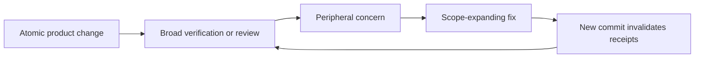

# Atomic changes are becoming production-path campaigns

**Status:** Deferred follow-up. This report is not part of PR #393 and records no decision.

## Problem statement

A one-pixel, reversible CSS correction became a development exercise lasting many hours and several review/fix cycles. This is not an isolated incident: the same pattern has repeatedly turned atomic changes into long-running campaigns.

The immediate agent failure was treating “follow the process” as “resolve every imaginable concern within this change.” That substituted process activity for the user-visible outcome and repeatedly expanded the scope from a CSS correction into test-harness design and review-mechanism work.

The repository already says to ship small, focused, independently valuable changes and to use the fastest reliable evidence first. It also requires real-Obsidian verification for observable UI behavior and two exact-tip review receipts before push. The failure is therefore not a lack of guidance; it is the absence of an operational stopping rule that keeps those requirements proportional for atomic work.

## Recurring structural failures

1. **No up-front change classification.** A one-line reversible presentation adjustment enters the same open-ended workflow as a risky behavioral change.
2. **No scope, time, or iteration ceiling.** There is no mechanism that stops a one-file change from acquiring new abstractions, test infrastructure, and repeated review rounds.
3. **Review findings become automatic work orders.** Low-confidence, pre-existing, or harness-level concerns are absorbed into the feature PR instead of being assessed against the change's actual risk and scope.
4. **CI-harness failures are charged to the product change.** When a focused assertion exposes unrelated or pre-existing test instability, the PR becomes responsible for redesigning the harness.
5. **Every corrective commit restarts the exact-tip review loop.** This is intentional and useful for trust, but it creates a positive feedback loop when review-driven scope expansion is unconstrained.
6. **Compliance becomes the objective.** Passing every conceivable gate and eliminating every theoretical concern displaces the original objective: deliver a verified one-pixel correction safely.

The repository has already documented a similar failure mode: a review campaign grew one case per review round, consumed roughly 24 hours across about 30 rounds, and increasingly found defects introduced by the fixes themselves. It also records that a verification loop over five minutes should be treated as a design defect rather than accepted as the normal inner loop.

## Candidate mechanism for later evaluation: Atomic Change Contract

This is a proposal to evaluate in a separate production-path project, not a decision made here.

### Eligibility

Use an atomic path only when the change:

- has one narrow, reversible user-visible outcome;
- changes no data model, public API, dependency, security boundary, concurrency behavior, or migration;
- can name its intended files and verification before editing; and
- can be reverted independently.

### Declared contract

Before implementation, record:

- the single intended outcome;
- the allowed files;
- the narrowest existing verification that proves it; and
- explicit non-goals.

Candidate budget: 30 minutes, two implementation attempts, two changed files, no new abstraction, and no new test infrastructure. Crossing any limit triggers a hard stop or a separately scoped follow-up rather than silently expanding the atomic PR.

### Proportional evidence

- Use the fastest reliable existing test at the changed boundary.
- For a pixel-level presentation correction, treat maintainer visual approval in the real product as first-class evidence, supported by the smallest stable automated regression that already exists.
- Reproduce a CI failure against the base branch before assigning it to the feature change when the failure appears harness-related.
- Freeze the diff before review, then perform the required local review and one independent Claude review against that exact candidate.

### Finding triage

A review finding blocks the atomic PR only when it is:

- introduced by the candidate diff;
- reproducible or supported by concrete evidence;
- relevant to the promised outcome or a material regression risk; and
- high-confidence enough to justify invalidating the reviewed candidate.

Pre-existing issues, speculative hardening, general harness improvements, and unrelated cleanup are recorded separately. They are not silently absorbed into the PR.

Candidate stopping rule: permit one review/fix cycle. If another finding would expand the declared contract, stop and ask for explicit re-scoping or park it as a follow-up.

## Questions for the later production-path review

- Should crossing the atomic budget force a hard stop, or automatically split residual work into a separate tracked item?
- What evidence is sufficient for each risk class while preserving the mandatory real-Obsidian and review-receipt rules?
- How should pre-existing CI flakes be proven and separated without weakening CI?
- Where should the Atomic Change Contract live so agents and maintainers must acknowledge it before work begins?
- Which metrics should expose process regressions: elapsed time, review rounds, changed files, diff growth, or time-to-first-validating-signal?

## Existing evidence and constraints

- [AGENTS.md](../../AGENTS.md) requires relevant real-Obsidian e2e for observable UI behavior and atomic branches/commits.
- [Git workflow conventions](../conventions/git-workflow.md) require small, focused PRs and define a plan unit as a scope ceiling, not a floor.
- [Layered pre-push review gate](../solutions/tooling-decisions/layered-pre-push-review-gate.md) explains why both exact-tip review receipts are mandatory and why every new commit invalidates prior receipts.
- [Behavior-neutral refactoring as reviewed slices](../solutions/workflow-issues/run-behavior-neutral-refactoring-as-releasable-reviewed-slices.md) recommends standard tools, fastest reliable evidence first, and independently releasable slices.
- [Test at the fastest level](../solutions/tooling-decisions/test-at-the-fastest-level-not-redundant-e2e.md) states the governing verification question: use the fastest reliable test that already proves the behavior.
- [Drag e2e smoke-shrink plan](../plans/2026-07-28-001-refactor-drag-e2e-smoke-shrink-plan.md) documents the prior one-case-per-review-round expansion and the operational costs of slow feedback.
- [Inferred-drag campaign handover](2026-07-27-001-inferred-drag-campaign-handover.md) records the roughly 24-hour, 30-round review loop.
- [Rebuild vs refactor gap analysis](2026-07-27-002-rebuild-vs-refactor-gap-analysis.md) treats verification loops over five minutes as design defects.

## Intended next step

After PR #393 is complete, open a separate, explicitly scoped project to review the full path to production. Use this report as input, validate the recurring failure with workflow data, decide the stopping mechanism, and then change the process independently of any product PR.
