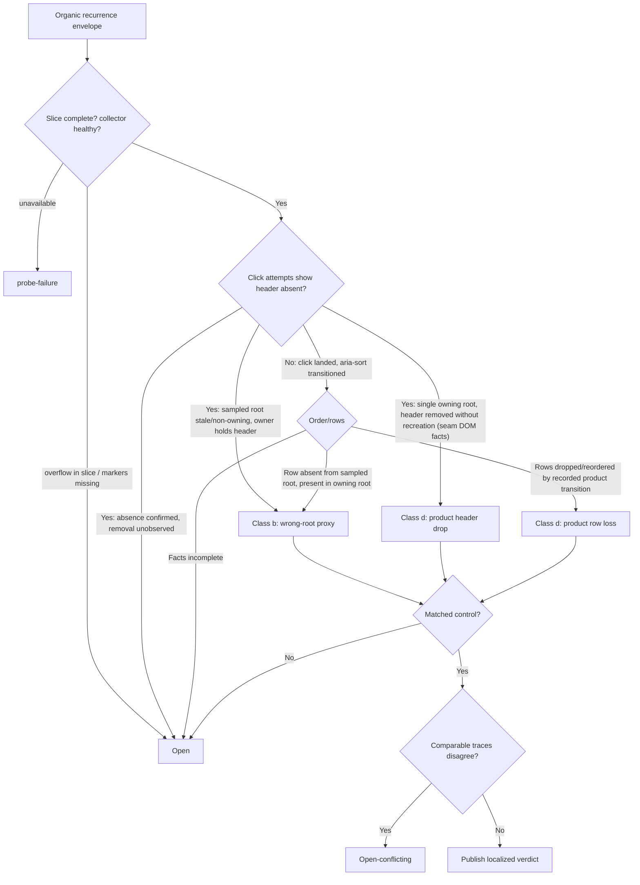

# Column-sort reliability diagnosis — capability armed, no traced recurrence yet

**Date:** 2026-08-26
**Measured at:** spec-side probe `6833a691` (U1 squash merge, PR #457); the seam DOM lifecycle observation (U2) and this report land together in the same PR
**Commission:** U4 of [the column-sort diagnosis plan](../plans/2026-08-25-001-chore-reliability-column-sort-diagnosis-plan.md), following the rank-3 entry of [the reliability re-diagnosis](2026-08-19-001-reliability-rediagnosis.md)

The diagnostic capability for the `gantt-column-sort.e2e.ts` flake is built, verified, and armed in every ordinary CI execution of the spec. No organic recurrence has produced a trace since the probe armed, so the outcome is **`open — no traced recurrence`**: the rank-3 entry stays open, no cause class is excluded, and no fix is commissioned. This outcome is non-terminal — the probe stays armed and the pre-registered on-recurrence procedure below turns the next organic failure into a classifiable trace.

---

## The historical record (incorporated by reference, unedited)

The record holds **eight instances across three symptom shapes in two tests**. Every instance, run id, denominator, and symptom text lives in its source of record and is not edited, rerun, replaced, or topped up by this report:

- **Shape 1 — `Column header "note.due" did not become clickable`** (first-mount sort test; six instances): runs `31909561031`, `32000640719`, `32204158681` attempt 1, baseline leg 6 of [the re-diagnosis](2026-08-19-001-reliability-rediagnosis.md), `32795673512` attempt 1, and legend-window run `32483108735` dispatch 2 leg 1 (a 1/48 window rate per [the legend diagnosis](2026-08-22-001-reliability-legend-diagnosis.md)).
- **Shape 2 — `Expected B before A on due-desc; saw A@0 B@-1`** (first-mount sort test; one instance): run `32113805668` attempt 1.
- **Shape 3 — `Did not reach the descending sorted state before reopen`** (session-only test; one instance): run `32797728173` attempt 1.

The first-mount concentration (shapes 1 and 2 both live in the spec's first test) is a preserved fact the classification must respect. No historical instance carries a lifecycle trace — that absence is what this plan's capability removes for future instances.

### Folded incident window (per ruling R3, PR #455)

The 2026-08-25 incident-record window folds into this report at plan close, verbatim from the backlog entry it retires:

| Window | Runs (ids) | Executions (`run_attempt` sum) | Failed | Failing specs |
|---|---|---|---|---|
| Guard-mechanisms closeout PRs #454–#456 (2026-08-25, all docs-only diffs) | 32795673512 (2), 32797728173 (2) — both PR #454's branch, SHAs `7f1fa5a` / `19786dc`; 32803282786 (1), 32804736666 (1) — PR #455; 32805925264 (1) — PR #456 | 2+2+1+1+1 = **7** | **2** | run 32795673512 attempt 1: `gantt-column-sort` AE1 — `Column header "note.due" did not become clickable` (the record's symptom shape 1). Run 32797728173 attempt 1 — a **two-spec execution**: `gantt-column-sort` AE3/R4 ("is session-only: reopening the view returns to the Base sort") — `Did not reach the descending sorted state before reopen`, a test new to the record, sort-outcome-never-materialised family; and `gantt-default-field-mappings` ("opens the configured-statuses picker on the unmapped status cell") — `doubleClickCell(TASK_ROW, STATUS_COL)` returned false (spec line 343), click-never-landed family. Both runs green on attempt 2 |

Window observations preserved with the fold: the diffs in this window were docs-only, so the product code at both failing SHAs is byte-identical to main — the diff is provably uninvolved, which per the record's method never means "environmental" (R6 of the governing report keeps every cause class open). Within-execution clustering of two ranked specs recurred in ordinary CI. The record's measurement cutoff is run `32797728173` attempt 1; later CI belongs to the instrumented era below.

## Pre-registered binding rules

These rules were registered in the plan before any instrumented evidence existed and are copied here as the binding text a future verdict must satisfy. They are implemented and unit-proven by the fail-closed classifier in `test/specs/helpers/columnSortDiagnosis.ts` — the classifier refuses every verdict its completeness rules disallow.

### Classification algorithm

### Aggregation rule

The first contradictory boundary owns the localization; later missing states are consequences. The earliest click attempt whose facts contradict passed readiness owns the classification; a trace mixing absent-header and later landed attempts classifies by that earliest causal attempt, with the recovery recorded as a fact, never re-litigated by later attempts. The leaf-steal window (markdown leaf present, active leaf not the Base, no heal inside the click loop) is positive class-(b) evidence only when the owning root is simultaneously observed correct.

### Phase vocabulary

`suite-before`, `before-each:<n>:<title>`, `test:<title>`, `readiness-passed:<n>`, `reopen-detach-start`, `reopen-detached`, `terminal-failure`, `teardown`. The reopen markers bracket the deliberate remount of the session-only test, so any mount sequence outside them is product-initiated. A verdict consumes only the failing test's slice between its own phase markers: boundary markers present, no in-slice overflow, no `collectorFailure`. `diagnosticOutcome: unavailable` classifies as `probe-failure` — a distinct trended bucket, never `open`.

### Certified facts

`domRemovalObserved`, `productTransitionRecorded`, and `sortStateObservedAfterClicks` are operator-certified facts: the operator verifies ordering and mount conditions from the ring's raw facts before asserting them to the classifier. The mechanical control-matching helpers are operator tools; nothing wires raw presence into a certified fact.

## The armed capability

- **Spec-side probe (U1, PR #457):** every ordinary execution arms the default-off collector (ring capacity 4096); every header click records a per-attempt all-roots census (mount token, connected, visible, owns-Base, header set, sampled-root identity); every order/state wait records per-tick all-roots bar censuses; reset boundaries and readiness/reopen phase markers bracket the slices; failure paths (test, hook, hook timeout) emit an `[OG-LIFECYCLE]` envelope via bounded after-failure CDP retrieval with the original error always primary; a green suite emits a compact control digest. Envelopes persist under `og-lifecycle/` inside the ordinary `e2e-artifacts` upload.
- **Seam DOM lifecycle observation (U2, this PR):** the seam's `attachRoot` now holds a childList-only, capture-active-gated MutationObserver recording `[data-header-id]` and `.wx-bar[data-id]` adds/removes — element kind, stripped id, add/remove, per-mount sequence, all bounded scalars, capped per mount with the cap recorded as a fact. These records join the click censuses by mount token and sequence and are what upgrade `domRemovalObserved` from `null`: a removal-without-recreation observed after `readiness-passed` on the failing mount is the fact the class-(d) header-drop verdict requires. Unarmed, no observer exists at all. Zero junction hook sites and zero seam public exports were added; the pinned seam budgets are unchanged.
- **Control digest (schema `column-sort-diagnosis/v2`):** identity stamp (build SHA, spec schema, Chromium, TaskNotes, platform, Node, Obsidian, Electron), per-site click summaries, root-census aggregates, readiness-gate count, collector health, and the bounded DOM lifecycle summary (`headerAdded`/`headerRemoved`/`barAdded`/`barRemoved`/`cappedMounts`/`observedMounts`). Control equivalence is mechanical (`areColumnSortControlsEquivalent`); DOM-lifecycle **count** differences never block equivalence — a failing run's drop versus a control's survival is the classification content itself — but the two health facts do fail-closed: a control whose observation was capped (`cappedMounts > 0`) or whose observer never attached (`observedMounts === 0`, the seam's per-mount health marker) is rejected by both equivalence and boundary coverage, because a zeroed summary from an unobserved mount is absence of observation, not evidence of survival.

## Instrumented baseline (pre-registered probe-effect declaration)

The instrumented spec is the new comparison baseline. Pre-instrumentation executions are never controls; a matched control must come from an instrumented execution at the same full build SHA per the plan's matched-control contract.

| Execution | Environment | Result | Sort-spec time | Notes |
|---|---|---|---|---|
| Run [32908333382](https://github.com/renatomen/tasknotes-gantt/actions/runs/32908333382) (PR #457, `2bc947e`) | ordinary CI, windows-2025 runner | green, 5/5 | 4.3s reporter / 6.6s worker wall-clock | first instrumented ordinary-CI execution; control digest present in `e2e-artifacts` |
| Run [32805925264](https://github.com/renatomen/tasknotes-gantt/actions/runs/32805925264) (PR #456, `0038c2d`) | ordinary CI, windows-2025 runner | green, 5/5 | 4.1s reporter / 6.4s worker wall-clock | last pre-instrumentation execution, for the overhead measurement only — never a control |
| Local focused run, 2026-08-26 (U1+U2 instrumented working tree) | `e2e:local`, win32 dev machine | green, 5/5 | 4.4s | first seam-DOM-instrumented execution; digest `domLifecycle` = `{headerAdded: 4, headerRemoved: 0, barAdded: 32, barRemoved: 24, cappedMounts: 0, observedMounts: 2}` (both mounts — initial and reopen — carry the observer health marker) |

**Measured observation overhead:** +0.2s on the reporter suite time (4.1s → 4.3s, ~5%) and +0.26s on the worker wall-clock (6.38s → 6.64s), within run-to-run noise on the same runner class. Both figures recompute from the two runs' job logs (the `» test\specs\gantt-column-sort.e2e.ts` reporter block; the worker's RUNNING→PASSED timestamps). No wait, timeout, retry, assertion, action order, readiness decision, or product behavior changed — the overhead is recording-only and sanctioned by the plan.

The local U2 digest is the shape of a healthy control: on a green journey **no within-mount header removal is ever observed** (`headerRemoved: 0` across all five tests), while bars churn normally under sort reseeds. The scope of that claim is the observer's field of view by construction: a whole-root teardown (the reopen's detach) removes the root from its parent, which a subtree observer on the root never sees — so only removals inside a living mount can register, and that is exactly the class-(d) evidence shape. A future failing trace showing a post-readiness header removal without recreation, joined by mount token, is precisely the evidence AE2 requires.

## Suppression check (not yet assessable)

The historical per-execution failure frequency band is roughly 2–7% (window-specific denominators; the 2026-08-25 window measured 2/7). Instrumented ordinary-CI executions to date: **1** (green). One execution cannot assess suppression. Per the pre-registered rule: a sustained zero across 40 instrumented ordinary-CI executions publishes as **"no recurrence — probe suppression not excluded"**, never as plain improvement. The count continues in ordinary CI at zero marginal cost.

**Contingency (pre-registered, not yet triggered):** if no complete organic trace lands within 40 instrumented ordinary-CI executions or six weeks of U2's merge, whichever comes first, a single `e2e-repeat.yml` dispatch (`executions=24`) at a pinned instrumented SHA is authorized under the window-cutoff convention. That window would follow the same fixed-window and attempt rules as [the legend diagnosis](2026-08-22-001-reliability-legend-diagnosis.md).

## On-recurrence procedure (pre-registered; standing backlog entry)

On any red `gantt-column-sort.e2e.ts` CI run:

1. **Download the `og-lifecycle` envelope from the run's `e2e-artifacts` upload BEFORE any rerun** — a rerun replaces nothing, but the evidence must be secured first.
2. Trigger exactly one same-commit `gh run rerun --failed` as the pre-registered control supply. Verify the rerun checked out the identical merge SHA; if the base moved, the rerun does not qualify as a control. The rerun is control supply — never a denominator entry, never a historical-evidence edit.
3. Harvest the green rerun's control digest; check equivalence mechanically (`areColumnSortControlsEquivalent`, boundary coverage via `columnSortControlCoversBoundary`).
4. Certify the operator facts from the ring slice (ordering, mount continuity, direction), classify per the binding rules above, and fold the verdict into the incident record per ruling R3.

A `probe-failure` outcome (retrieval-failure line, `unarmed-failure` artifact, or `diagnosticOutcome: unavailable`) is trended in its own bucket and prompts a probe-health fix, not a cause verdict.

## Rank-4 transfer observation

`gantt-default-field-mappings` (rank 4) recurred on 2026-08-25 (third instance, click-never-landed family — the same family as rank 3's shape 1) and is incident-tracked, per the folded window above. No dedicated diagnosis unit exists for it; if rank 3's next traced recurrence localizes the click-never-landed mechanism (wrong-root sampling, leaf steal, or header lifecycle), that verdict likely transfers to rank 4's symptom shape and should be tested against it before any rank-4 capability is commissioned.

## Standing of the prior resolution

The 2026-06-29 resolution in [`column-sort-e2e-first-mount-header-race`](../solutions/developer-experience/column-sort-e2e-first-mount-header-race.md) — gating readiness on the specific clicked header — remains a standing mitigation and is still in the spec. The 2026-08-17 and later recurrences supersede its finality: the recorded symptom is that no click lands after that gate passes, so its deferred post-click hardening is not the fix and remains ungoverned by evidence. The entry is annotated to point here.

## Conclusion and stopping rule

U1 and U2 are the whole authorized capability; U3 (junction cause hooks) activates only on a traced recurrence the existing records cannot attribute. The plan's stopping condition is met: the capability is armed, the rules are pre-registered, and no organic trace exists to classify. The rank-3 entry stays **open** with the probe armed; the next organic recurrence in ordinary CI is the evidence supply. No fix ships from this diagnosis.
